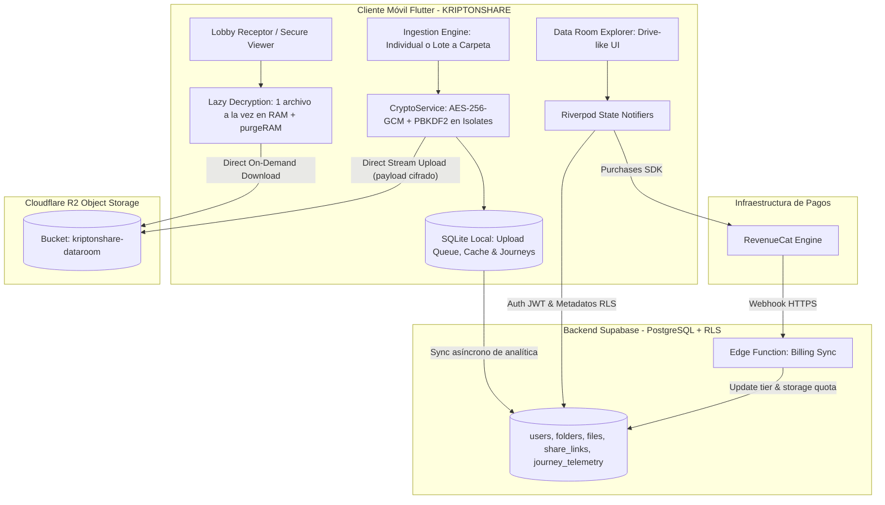
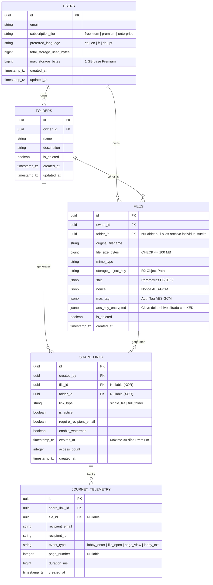
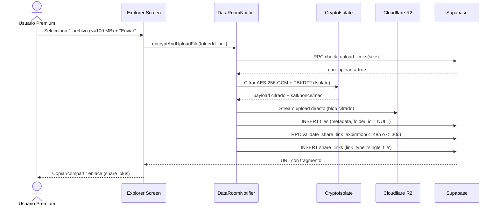
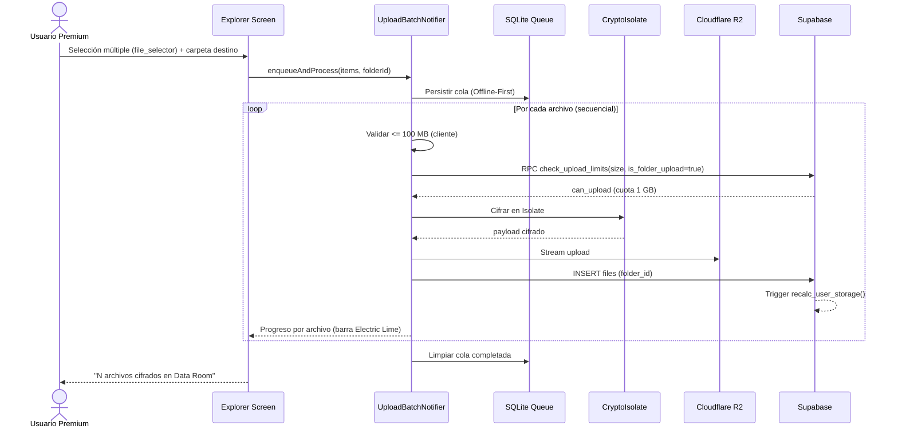
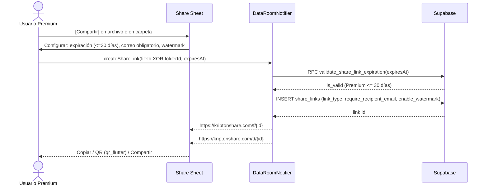
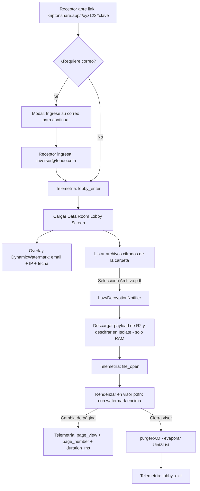

# KRIPTONSHARE — ACTUALIZACIÓN DE LA ARQUITECTURA DEL VIRTUAL DATA ROOM

**Documento:** Especificación Arquitectónica Integral — Módulo Suscripción Premium y Virtual Data Room (Carpeta Virtual de 1 GB)
**Repositorio:** [github.com/horaciomartinez-svg/kriptonshare](https://github.com/horaciomartinez-svg/kriptonshare) (rama `main`, commit `b9b6bdb`)
**Fecha:** 29 de julio de 2026
**Versión:** 2.0 (integra y reemplaza la especificación `KRIPTONSHARE_Premium_DataRoom_Especificacion_Tecnica.md`)
**Propósito:** Documento fuente único para codificar y actualizar la app con **KIMI CODE CLI**.

---

## TABLA DE CONTENIDO

1. [Resumen Ejecutivo](#1-resumen-ejecutivo)
2. [Estado Actual del Repositorio y Análisis de Brechas (Gap Analysis)](#2-estado-actual-del-repositorio-y-análisis-de-brechas-gap-analysis)
3. [Reglas de Negocio Institucionales (Matriz Freemium vs. Premium)](#3-reglas-de-negocio-institucionales-matriz-freemium-vs-premium)
4. [Arquitectura General del Sistema](#4-arquitectura-general-del-sistema)
5. [Diseño de Datos: Modelo Relacional y Migración SQL](#5-diseño-de-datos-modelo-relacional-y-migración-sql)
6. [Lógica de Aplicación: Clean Architecture y Contratos Dart](#6-lógica-de-aplicación-clean-architecture-y-contratos-dart)
7. [Flujos Funcionales de Extremo a Extremo](#7-flujos-funcionales-de-extremo-a-extremo)
8. [Sistema de Diseño UI/UX (Look & Feel Google Drive con identidad KRIPTONSHARE)](#8-sistema-de-diseño-uiux-look--feel-google-drive-con-identidad-kriptonshare)
9. [Contratos de API y Webhooks (JSON Schema)](#9-contratos-de-api-y-webhooks-json-schema)
10. [Plan de Implementación para KIMI CODE CLI](#10-plan-de-implementación-para-kimi-code-cli)
11. [Criterios de Aceptación y Dictamen de Conformidad](#11-criterios-de-aceptación-y-dictamen-de-conformidad)

---

## 1. RESUMEN EJECUTIVO

Esta actualización define la arquitectura completa del **Virtual Data Room (VDR)** de KRIPTONSHARE para el usuario **Premium** ($19/mes o $189/año), manteniendo la coexistencia con el flujo Freemium de envío efímero 1 a 1.

**Capacidades objetivo del usuario Premium:**

| Capacidad | Especificación |
| :--- | :--- |
| **Carpeta Virtual (Data Room)** | 1 GB de capacidad base, expandible en bloques de +1 GB por $5/mes (add-on IAP vía RevenueCat). |
| **Archivos por carpeta** | Ilimitados en cantidad; cada archivo individual debe ser **≤ 100 MB**. |
| **Modos de carga** | (a) Cifrar y enviar archivos **de 1 en 1** (flujo individual), y (b) **carga múltiple en lote** directo a la carpeta virtual. |
| **Experiencia visual** | Explorador con *look & feel* de carpeta de **Google Drive** (cuadrícula/lista, tarjetas, medidor de capacidad), con los colores, fondos y fuentes de la identidad KRIPTONSHARE (Dark-first, Charcoal Black + Electric Lime). |
| **Almacenamiento** | Archivos cifrados con AES-256-GCM **en el cliente** y persistidos en Cloudflare R2; metadatos en Supabase. |
| **Enlaces de compartición** | Links con expiración configurable de **hasta 30 días**, para compartir **un solo archivo** o **la carpeta completa**. Enlaces ilimitados. |
| **Funciones Data Room** | Auditoría de lectura (Journey Analytics tipo PaperMark/BriefLink), captura obligatoria de correo del receptor, marca de agua dinámica y descifrado perezoso en RAM (*Lazy Decryption*). |

**Decisiones arquitectónicas clave:**

1. **Cifrado Zero-Knowledge en cliente:** AES-256-GCM + PBKDF2 ejecutados en *Isolates* de Dart para no bloquear el hilo de UI; el backend nunca ve contenido en claro.
2. **Separación binario/metadatos:** payloads cifrados en **Cloudflare R2** ($0 egress); metadatos relacionales en **Supabase PostgreSQL** con Row Level Security.
3. **Lazy Decryption:** en el lobby receptor se descarga y descifra **un solo archivo a la vez en RAM**, evaporando el buffer (`Uint8List`) al cerrar el visor — garantiza *Zero RAM Leaks* incluso explorando carpetas de 1 GB.
4. **Offline-First:** SQLite local como cola de cargas, caché de Data Rooms y buffer de telemetría con sincronización diferida.
5. **Monetización:** RevenueCat sincroniza tier y add-ons de almacenamiento hacia Supabase mediante webhooks procesados por Edge Functions.

---

## 2. ESTADO ACTUAL DEL REPOSITORIO Y ANÁLISIS DE BRECHAS (GAP ANALYSIS)

### 2.1 Inventario del estado actual (rama `main`, commit `b9b6bdb`)

El repositorio ya implementa parcialmente la base del módulo. Inventario verificado:

**Cliente Flutter (`lib/`):**

- `lib/features/` con módulos: `analytics`, `data_room`, `links`, `qna`, `telemetry`, `upload`.
- `lib/features/data_room/` ya sigue Clean Architecture (`data/`, `domain/`, `presentation/`, `utils/`) e incluye:
  - Pantallas: `data_room_lobby_screen.dart`, `storage_management_screen.dart`.
  - Notifiers: `data_room_notifier.dart` (Offline-First + Zero-Knowledge), `folder_notifier.dart`, `storage_upsell_notifier.dart`.
  - `folder_providers.dart`.
- `lib/core/`: `error/`, `network/`, `services/`, `utils/`.
- Dependencias ya declaradas en `pubspec.yaml`: `flutter_riverpod`, `dartz`, `equatable`, `purchases_flutter` (RevenueCat), `dio`, `sqflite`, `supabase_flutter`, `pointycastle` + `encrypt` (AES-256-GCM), `pdfrx` (visor PDF), `video_player`, `file_selector`, `go_router`, `flutter_secure_storage`, `google_mobile_ads`.
- Branding confirmado: splash e ícono con fondo `#0A0A0F` (Charcoal Black).

**Backend Supabase (`supabase/`):**

- Migraciones existentes:
  - `20260623000000_update_freemium_limits.sql`
  - `20260625000000_cloudflare_r2_and_freemium_limits.sql`
  - `20260712000000_must_have_and_premium.sql`
  - `20260725000000_premium_dataroom.sql` — ya crea `folders`, `journey_telemetry`, columnas `total_storage_used_bytes` / `max_storage_bytes` (1 GB default), `files.folder_id`, `share_links.folder_id`, constraint XOR `chk_share_link_target`, políticas RLS y la función `check_upload_limits()` multi-tier (100 MB Premium / 10 MB Freemium / 20 enlaces-mes / 3 enlaces activos).
- `supabase/functions/` (Edge Functions) y `schema.sql` de referencia.

### 2.2 Brechas detectadas (lo que esta actualización debe construir)

| # | Brecha | Impacto | Acción requerida |
| :-: | :--- | :--- | :--- |
| G-01 | **No existe el explorador "Drive-like" del emisor.** Solo hay lobby receptor y gestión de almacenamiento. | El usuario Premium no puede ver su carpeta virtual estilo Google Drive. | Crear `data_room_explorer_screen.dart` con Grid/List toggle, tarjetas de carpeta/archivo y medidor de 1 GB. |
| G-02 | **No existe carga múltiple en lote (batch).** La ingesta actual es individual. | No se cumple "subir varios archivos a su carpeta virtual". | Crear `upload_batch_notifier.dart` con cola secuencial en SQLite y progreso por archivo. |
| G-03 | **No existe Lazy Decryption aislado.** El descifrado está acoplado al `DataRoomNotifier`. | Riesgo de OOM al explorar carpetas grandes. | Crear `lazy_decryption_notifier.dart` con `autoDispose` + `purgeRAM()`. |
| G-04 | `share_links` carece de `link_type`, `require_recipient_email`, `enable_watermark` y validación de **30 días máximo**. | No se puede compartir "carpeta completa" con funciones Data Room ni limitar expiración. | Nueva migración `20260729000000_vdr_architecture_update.sql`. |
| G-05 | No existe el componente de **marca de agua dinámica** (email + IP + fecha) ni el modal de captura de correo receptor. | Sin paridad PaperMark/BriefLink. | Crear `dynamic_watermark_widget.dart` y `recipient_email_modal.dart`. |
| G-06 | Falta el widget de **telemetría de lectura** (`page_view` por página en el visor). | Auditoría incompleta. | Instrumentar visor `pdfrx` con eventos `page_view` hacia `journey_telemetry`. |
| G-07 | Falta el **Design System formal** (tokens WCAG, escala tipográfica, Atomic Design). | UI inconsistente con la identidad KRIPTONSHARE. | Crear `app_theme.dart` con tokens y reorganizar widgets en atoms/molecules/organisms/templates. |
| G-08 | `folders` y `files` carecen de `updated_at`; `users` carece de `preferred_language` (5 idiomas: es/en/fr/de/pt). | Internacionalización y ordenamiento por modificación. | Incluir en la migración de actualización. |

> **Nota de continuidad:** toda la lógica ya existente (RLS, `check_upload_limits`, Zero-Knowledge con fragmento `#` en URL, Offline-First) **se conserva**; esta actualización es aditiva y no destructiva.

---

## 3. REGLAS DE NEGOCIO INSTITUCIONALES (MATRIZ FREEMIUM VS. PREMIUM)

| Parámetro / Funcionalidad | Plan Freemium (Gratis) | Plan Premium ($19/mes — $189/año) |
| :--- | :--- | :--- |
| **Tamaño máximo por archivo** | 10 MB | **100 MB** |
| **Capacidad de Bóveda / Data Room** | Sin espacio persistente (solo envío efímero 1 a 1) | **1 GB base** (expandible +1 GB por $5/mes) |
| **Cantidad de archivos en carpeta** | N/A | **Ilimitados** (restricción = cuota total de 1 GB) |
| **Tipo de ingesta** | Archivo individual (1 por 1) | **Individual o carga múltiple en lote a carpeta** |
| **Duración máxima del enlace** | 48 horas (2 días) | **Hasta 30 días (configurable)** |
| **Enlaces activos simultáneos** | Máximo 3 | **Ilimitados** |
| **Generación mensual de enlaces** | 20 enlaces/mes | Ilimitado |
| **Compartir carpeta completa** | No disponible | **Sí (`link_type = 'full_folder'`)** |
| **Funciones Data Room (PaperMark/BriefLink)** | Deshabilitadas | **Auditoría por página, Watermark dinámico, correo receptor obligatorio** |
| **Anuncios en pantalla de carga** | Sí (Native Ads) | No (Zero Ads) |

**Constantes de negocio (fuente única en `lib/app/constants/storage_constants.dart`):**

```dart
// lib/app/constants/storage_constants.dart
abstract class StorageConstants {
  // Límites de archivo
  static const int freemiumMaxFileBytes = 10 * 1024 * 1024;    // 10 MB
  static const int premiumMaxFileBytes  = 100 * 1024 * 1024;   // 100 MB

  // Cuota de bóveda Premium
  static const int premiumBaseStorageBytes = 1073741824;       // 1 GB
  static const int storageAddonBytes       = 1073741824;       // +1 GB por add-on

  // Expiración de enlaces
  static const int freemiumMaxLinkHours = 48;                  // 2 días
  static const int premiumMaxLinkDays   = 30;                  // 30 días

  // Límites Freemium
  static const int freemiumMaxActiveLinks = 3;
  static const int freemiumMaxMonthlyLinks = 20;
}
```

---

## 4. ARQUITECTURA GENERAL DEL SISTEMA

### 4.1 Stack tecnológico

| Capa | Tecnología | Justificación técnica |
| :--- | :--- | :--- |
| **Frontend Mobile** | Flutter 3.x (Dart 3.x) | Compilación AOT nativa ARM64; criptografía pesada en *Isolates* desacoplados del hilo UI. |
| **State Management** | Riverpod 2.x (`flutter_riverpod`) | Estado inmutable y reactivo; `autoDispose` evita fugas de memoria en visores. |
| **Monetización & IAP** | RevenueCat (`purchases_flutter`) | Suscripciones ($19/mes, $189/año) y add-ons de almacenamiento ($5/GB); webhooks hacia Supabase. |
| **Storage binario cifrado** | Cloudflare R2 (S3-Compatible) | Object Storage perimetral con **$0 egress fees**; los blobs cifrados van directo del cliente a R2 sin saturar Supabase. |
| **Metadata, Auth & DB** | Supabase (PostgreSQL 15+ + RLS) | Base relacional con Row Level Security, JWT y funciones PL/pgSQL. |
| **Persistencia local** | SQLite (`sqflite`) | Offline-First: cola de cargas, caché de Data Rooms y buffer de telemetría. |
| **Visor de documentos** | `pdfrx` + `video_player` | Renderizado en memoria de PDFs/video descifrados, sin persistencia en disco del receptor. |

### 4.2 Diagrama de arquitectura (Mermaid.js)



### 4.3 Principios no negociables

1. **Zero-Knowledge:** la clave viaja en el fragmento `#` de la URL (nunca llega al servidor) o se deriva de contraseña vía PBKDF2 en cliente.
2. **Zero RAM Leaks:** todo visor consume `LazyDecryptionNotifier` con `autoDispose` y `purgeRAM()` al salir.
3. **Validación doble de límites:** cliente (UX inmediata) **y** servidor (función `check_upload_limits` + CHECK constraints) — el servidor siempre manda.
4. **Offline-First:** ninguna operación se pierde sin conexión; SQLite encola y sincroniza.

---

## 5. DISEÑO DE DATOS: MODELO RELACIONAL Y MIGRACIÓN SQL

### 5.1 Modelo Entidad-Relación (Mermaid.js)



### 5.2 Migración de actualización (aditiva sobre el esquema existente)

Archivo a crear: `supabase/migrations/20260729000000_vdr_architecture_update.sql`. Es **idempotente** y complementa la migración `20260725000000_premium_dataroom.sql` ya aplicada.

```sql
-- =============================================================================
-- KRIPTONSHARE: ACTUALIZACIÓN ARQUITECTURA VIRTUAL DATA ROOM (VDR)
-- Fecha: 2026-07-29 — Aditiva e idempotente. NO destructiva.
-- Cubre brechas G-04, G-08: link_type, flags Data Room, límite 30 días,
-- preferred_language, updated_at y expiración máxima por tier.
-- =============================================================================

-- -----------------------------------------------------------------------------
-- 1. USERS: idioma preferido (internacionalización 5 idiomas) y updated_at
-- -----------------------------------------------------------------------------
ALTER TABLE public.users
  ADD COLUMN IF NOT EXISTS preferred_language VARCHAR(5) DEFAULT 'en'
    CHECK (preferred_language IN ('es', 'en', 'fr', 'de', 'pt')),
  ADD COLUMN IF NOT EXISTS updated_at TIMESTAMPTZ DEFAULT NOW();

-- -----------------------------------------------------------------------------
-- 2. FOLDERS: updated_at para ordenamiento Drive-like ("Última modificación")
-- -----------------------------------------------------------------------------
ALTER TABLE public.folders
  ADD COLUMN IF NOT EXISTS updated_at TIMESTAMPTZ DEFAULT NOW();

CREATE OR REPLACE FUNCTION touch_updated_at()
RETURNS TRIGGER AS $$
BEGIN
  NEW.updated_at = NOW();
  RETURN NEW;
END;
$$ LANGUAGE plpgsql;

DROP TRIGGER IF EXISTS trg_folders_touch ON public.folders;
CREATE TRIGGER trg_folders_touch
  BEFORE UPDATE ON public.folders
  FOR EACH ROW EXECUTE FUNCTION touch_updated_at();

DROP TRIGGER IF EXISTS trg_users_touch ON public.users;
CREATE TRIGGER trg_users_touch
  BEFORE UPDATE ON public.users
  FOR EACH ROW EXECUTE FUNCTION touch_updated_at();

-- -----------------------------------------------------------------------------
-- 3. SHARE_LINKS: tipo de enlace, funciones Data Room y tope de 30 días
-- -----------------------------------------------------------------------------
ALTER TABLE public.share_links
  ADD COLUMN IF NOT EXISTS link_type TEXT NOT NULL DEFAULT 'single_file'
    CHECK (link_type IN ('single_file', 'full_folder')),
  ADD COLUMN IF NOT EXISTS require_recipient_email BOOLEAN DEFAULT TRUE,
  ADD COLUMN IF NOT EXISTS enable_watermark BOOLEAN DEFAULT TRUE;

-- Coherencia link_type <-> destino (refuerza el XOR existente chk_share_link_target)
DO $$
BEGIN
  IF NOT EXISTS (
    SELECT 1 FROM information_schema.table_constraints
    WHERE table_schema = 'public' AND table_name = 'share_links'
      AND constraint_name = 'chk_share_link_type_coherence'
  ) THEN
    ALTER TABLE public.share_links
      ADD CONSTRAINT chk_share_link_type_coherence CHECK (
        (file_id IS NOT NULL AND link_type = 'single_file') OR
        (folder_id IS NOT NULL AND link_type = 'full_folder')
      );
  END IF;
END $$;

CREATE INDEX IF NOT EXISTS idx_share_links_folder
  ON public.share_links(folder_id) WHERE is_active = TRUE;

-- -----------------------------------------------------------------------------
-- 4. FUNCIÓN: validación de expiración de enlaces por tier (30 días Premium)
-- -----------------------------------------------------------------------------
CREATE OR REPLACE FUNCTION validate_share_link_expiration(
  p_user_id UUID,
  p_expires_at TIMESTAMPTZ
)
RETURNS TABLE (is_valid BOOLEAN, message TEXT) AS $$
DECLARE
  v_tier TEXT;
  v_max_freemium TIMESTAMPTZ := NOW() + INTERVAL '48 hours';
  v_max_premium  TIMESTAMPTZ := NOW() + INTERVAL '30 days';
BEGIN
  SELECT subscription_tier INTO v_tier FROM public.users WHERE id = p_user_id;

  IF p_expires_at <= NOW() THEN
    RETURN QUERY SELECT FALSE, 'La fecha de expiración debe ser futura.'::TEXT;
    RETURN;
  END IF;

  IF v_tier IN ('premium', 'enterprise') THEN
    IF p_expires_at > v_max_premium THEN
      RETURN QUERY SELECT FALSE,
        'Premium: La expiración máxima de un enlace es de 30 días.'::TEXT;
      RETURN;
    END IF;
    RETURN QUERY SELECT TRUE, 'Expiración Premium válida (<= 30 días).'::TEXT;
    RETURN;
  END IF;

  IF p_expires_at > v_max_freemium THEN
    RETURN QUERY SELECT FALSE,
      'Plan Gratis: La expiración máxima de un enlace es de 48 horas.'::TEXT;
    RETURN;
  END IF;

  RETURN QUERY SELECT TRUE, 'Expiración Freemium válida (<= 48 h).'::TEXT;
END;
$$ LANGUAGE plpgsql SECURITY DEFINER;

-- -----------------------------------------------------------------------------
-- 5. TRIGGER: actualización automática de cuota de almacenamiento del usuario
-- -----------------------------------------------------------------------------
CREATE OR REPLACE FUNCTION recalc_user_storage()
RETURNS TRIGGER AS $$
DECLARE
  v_owner UUID;
BEGIN
  v_owner := COALESCE(NEW.owner_id, OLD.owner_id);
  UPDATE public.users u
     SET total_storage_used_bytes = COALESCE((
       SELECT SUM(f.file_size_bytes)
         FROM public.files f
        WHERE f.owner_id = v_owner AND f.is_deleted = FALSE
     ), 0)
   WHERE u.id = v_owner;
  RETURN COALESCE(NEW, OLD);
END;
$$ LANGUAGE plpgsql SECURITY DEFINER;

DROP TRIGGER IF EXISTS trg_files_recalc_storage ON public.files;
CREATE TRIGGER trg_files_recalc_storage
  AFTER INSERT OR UPDATE OF file_size_bytes, is_deleted OR DELETE
  ON public.files
  FOR EACH ROW EXECUTE FUNCTION recalc_user_storage();

-- -----------------------------------------------------------------------------
-- 6. RLS: acceso de LECTURA pública controlada a metadatos de un enlace activo
--    (el receptor anónimo del lobby solo ve metadatos, nunca las claves KEK)
-- -----------------------------------------------------------------------------
DO $$
BEGIN
  IF NOT EXISTS (
    SELECT 1 FROM pg_policies
    WHERE schemaname = 'public' AND tablename = 'share_links'
      AND policyname = 'share_links_public_read_active'
  ) THEN
    CREATE POLICY share_links_public_read_active ON public.share_links
      FOR SELECT USING (is_active = TRUE AND expires_at > NOW());
  END IF;
END $$;

-- Nota de seguridad: los campos criptográficos (salt, nonce, mac_tag,
-- aes_key_encrypted) de public.files NO se exponen al rol anon; el receptor
-- los obtiene únicamente vía Edge Function con validación de enlace activo.
```

> **Compatibilidad:** la función `check_upload_limits()` de la migración `20260725000000` permanece vigente y se invoca antes de cada carga (individual o por lote). La nueva `validate_share_link_expiration()` se invoca al crear/renovar enlaces.

---

## 6. LÓGICA DE APLICACIÓN: CLEAN ARCHITECTURE Y CONTRATOS DART

### 6.1 Estructura de directorios objetivo del módulo `data_room`

Estructura **Feature-First + Clean Architecture**, mapeada contra lo que ya existe en el repo (✅ existe / 🆕 por crear):

```plaintext
lib/
 ├── app/
 │    ├── config/
 │    │    ├── router/
 │    │    │    └── app_router.dart                  # ✅ GoRouter (agregar rutas VDR)
 │    │    └── theme/
 │    │         └── app_theme.dart                   # 🆕 Tokens de diseño KRIPTONSHARE (§8)
 │    └── constants/
 │         └── storage_constants.dart                # 🆕 Límites: 100 MB, 1 GB, 30 días (§3)
 │
 ├── core/                                           # ✅ existente (error, network, services, utils)
 │    ├── crypto/
 │    │    ├── crypto_isolate_engine.dart            # 🆕 AES-GCM pesado en Isolate Dart
 │    │    └── crypto_service.dart                   # 🆕 Abstracción criptográfica unificada
 │    └── network/
 │         ├── r2_client.dart                        # 🆕 Cliente Dio para stream a Cloudflare R2
 │         └── supabase_client.dart                  # ✅/🆕 Inyección de cliente Supabase
 │
 └── features/
      └── data_room/
           ├── data/
           │    ├── datasources/
           │    │    ├── folder_remote_datasource.dart     # ✅/🆕 Consultas REST/RLS a Supabase
           │    │    └── r2_storage_datasource.dart        # 🆕 Stream direct upload/download R2
           │    ├── models/
           │    │    ├── file_model.dart                   # 🆕 Mapeo JSON/DB -> FileModel
           │    │    ├── folder_model.dart                 # 🆕 Mapeo JSON/DB -> FolderModel
           │    │    └── journey_telemetry_model.dart      # 🆕
           │    └── repositories/
           │         └── data_room_repository_impl.dart    # ✅/🆕 Implementación del contrato
           ├── domain/
           │    ├── entities/
           │    │    ├── file_entity.dart                  # 🆕
           │    │    ├── folder_entity.dart                # 🆕
           │    │    ├── share_link_entity.dart            # 🆕
           │    │    └── data_room_entity.dart             # ✅ existente
           │    ├── repositories/
           │    │    ├── i_data_room_repository.dart       # ✅ existente (extender)
           │    │    └── i_crypto_repository.dart          # ✅ existente
           │    └── usecases/
           │         ├── create_folder_usecase.dart                # 🆕
           │         ├── encrypt_and_upload_file_usecase.dart      # 🆕 (individual)
           │         ├── batch_upload_to_folder_usecase.dart       # 🆕 (lote multi-archivo)
           │         ├── fetch_data_room_contents_usecase.dart     # 🆕
           │         ├── create_share_link_usecase.dart            # 🆕 (archivo o carpeta, <=30 d)
           │         └── lazy_decrypt_file_usecase.dart            # 🆕
           └── presentation/
                ├── notifiers/
                │    ├── data_room_notifier.dart            # ✅ existente
                │    ├── folder_notifier.dart               # ✅ existente
                │    ├── storage_upsell_notifier.dart       # ✅ existente
                │    ├── lazy_decryption_notifier.dart      # 🆕 (§6.4)
                │    └── upload_batch_notifier.dart         # 🆕 (§6.5)
                ├── screens/
                │    ├── data_room_explorer_screen.dart     # 🆕 Vista Drive-like del emisor (§8.3)
                │    ├── data_room_lobby_screen.dart        # ✅ existente (agregar watermark + email)
                │    └── storage_management_screen.dart     # ✅ existente
                └── widgets/
                     ├── atoms/
                     │    ├── encryption_badge.dart         # 🆕 Badge AES-256 (Muted Green)
                     │    ├── storage_progress_bar.dart     # 🆕 Barra verde/roja según uso
                     │    └── dynamic_watermark_text.dart   # 🆕 Email + IP en diagonal
                     ├── molecules/
                     │    ├── file_list_tile.dart           # 🆕 Ícono, nombre, tamaño, menú :::
                     │    ├── folder_grid_card.dart         # 🆕 Tarjeta estilo Google Drive
                     │    └── storage_gauge_card.dart       # 🆕 Medidor MB/GB consumido
                     ├── organisms/
                     │    ├── drive_explorer_view.dart      # 🆕 Grid/List de carpetas y archivos
                     │    └── recipient_email_modal.dart    # 🆕 Captura correo receptor
                     └── templates/
                          ├── data_room_layout.dart         # 🆕 AppBar + Storage Meter + FAB
                          └── viewer_secure_layout.dart     # 🆕 Layout receptor con watermark overlay
```

### 6.2 Entidades de dominio (contratos inmutables)

**`folder_entity.dart`**

```dart
import 'package:flutter/foundation.dart';
import 'file_entity.dart';

@immutable
class FolderEntity {
  final String id;
  final String ownerId;
  final String name;
  final String? description;
  final List<FileEntity> files;
  final int totalSizeBytes;
  final bool isDeleted;
  final DateTime createdAt;
  final DateTime updatedAt;

  const FolderEntity({
    required this.id,
    required this.ownerId,
    required this.name,
    this.description,
    this.files = const [],
    required this.totalSizeBytes,
    this.isDeleted = false,
    required this.createdAt,
    required this.updatedAt,
  });

  /// Capacidad usada en megabytes
  double get totalSizeInMB => totalSizeBytes / (1024 * 1024);

  /// Porcentaje consumido respecto al límite base de 1 GB
  double get storagePercentage =>
      (totalSizeBytes / 1073741824).clamp(0.0, 1.0);

  FolderEntity copyWith({
    String? id,
    String? ownerId,
    String? name,
    String? description,
    List<FileEntity>? files,
    int? totalSizeBytes,
    bool? isDeleted,
    DateTime? createdAt,
    DateTime? updatedAt,
  }) {
    return FolderEntity(
      id: id ?? this.id,
      ownerId: ownerId ?? this.ownerId,
      name: name ?? this.name,
      description: description ?? this.description,
      files: files ?? this.files,
      totalSizeBytes: totalSizeBytes ?? this.totalSizeBytes,
      isDeleted: isDeleted ?? this.isDeleted,
      createdAt: createdAt ?? this.createdAt,
      updatedAt: updatedAt ?? this.updatedAt,
    );
  }
}
```

**`file_entity.dart`**

```dart
import 'package:flutter/foundation.dart';

@immutable
class FileEntity {
  final String id;
  final String ownerId;
  final String? folderId; // null = archivo individual suelto
  final String originalFilename;
  final int fileSizeBytes;
  final String mimeType;
  final String storageObjectKey;
  final Map<String, dynamic> salt;
  final Map<String, dynamic> nonce;
  final Map<String, dynamic> macTag;
  final Map<String, dynamic> aesKeyEncrypted;
  final DateTime createdAt;

  const FileEntity({
    required this.id,
    required this.ownerId,
    this.folderId,
    required this.originalFilename,
    required this.fileSizeBytes,
    required this.mimeType,
    required this.storageObjectKey,
    required this.salt,
    required this.nonce,
    required this.macTag,
    required this.aesKeyEncrypted,
    required this.createdAt,
  });

  /// Validación cliente del límite por archivo Premium (100 MB)
  bool get isWithinPremiumLimit => fileSizeBytes <= (100 * 1024 * 1024);

  double get sizeInMB => fileSizeBytes / (1024 * 1024);
}
```

**`share_link_entity.dart`**

```dart
import 'package:flutter/foundation.dart';

enum ShareLinkType { singleFile, fullFolder }

@immutable
class ShareLinkEntity {
  final String id;
  final String createdBy;
  final String? fileId;    // XOR con folderId
  final String? folderId;  // XOR con fileId
  final ShareLinkType linkType;
  final bool isActive;
  final bool requireRecipientEmail;
  final bool enableWatermark;
  final DateTime expiresAt; // Premium: máximo now + 30 días
  final int accessCount;
  final DateTime createdAt;

  const ShareLinkEntity({
    required this.id,
    required this.createdBy,
    this.fileId,
    this.folderId,
    required this.linkType,
    required this.isActive,
    required this.requireRecipientEmail,
    required this.enableWatermark,
    required this.expiresAt,
    required this.accessCount,
    required this.createdAt,
  });

  bool get isExpired => DateTime.now().isAfter(expiresAt);

  /// URL pública del enlace (la clave viaja en el fragmento #, nunca al servidor)
  String publicUrl(String secureFragment) =>
      linkType == ShareLinkType.fullFolder
          ? 'https://kriptonshare.com/f/$id#$secureFragment'
          : 'https://kriptonshare.com/d/$id#$secureFragment';
}
```

### 6.3 Contrato del repositorio de dominio (extensión de `i_data_room_repository.dart`)

```dart
import 'dart:typed_data';
import 'package:dartz/dartz.dart';
import '../entities/file_entity.dart';
import '../entities/folder_entity.dart';
import '../entities/share_link_entity.dart';

abstract class IDataRoomRepository {
  /// Estructura completa de carpetas + archivos sueltos del usuario (Drive-like)
  Future<Either<Failure, List<FolderEntity>>> getUserFolders(String userId);
  Future<Either<Failure, List<FileEntity>>> getUnfiledDocuments(String userId);

  /// Crear carpeta Virtual Data Room (solo Premium — validado en servidor)
  Future<Either<Failure, FolderEntity>> createFolder({
    required String ownerId,
    required String name,
    String? description,
  });

  /// Carga INDIVIDUAL: cifra en Isolate y sube directo a R2
  Future<Either<Failure, FileEntity>> encryptAndUploadFile({
    required String ownerId,
    required String? folderId, // null = envío individual 1 a 1
    required String filename,
    required Uint8List fileBytes,
    required String mimeType,
    required String userPassword,
  });

  /// Enlace compartido para UN ARCHIVO o UNA CARPETA (máximo 30 días Premium)
  Future<Either<Failure, ShareLinkEntity>> createShareLink({
    required String createdBy,
    String? fileId,
    String? folderId,
    required ShareLinkType linkType,
    required bool requireRecipientEmail,
    required bool enableWatermark,
    required DateTime expiresAt,
  });

  /// Lazy Decryption: descarga de R2 y descifra UN solo archivo en RAM
  Future<Either<Failure, Uint8List>> downloadAndDecryptFile({
    required FileEntity file,
    required String userPassword,
  });

  /// Telemetría de lectura (Journey Analytics)
  Future<Either<Failure, void>> recordJourneyEvent({
    required String shareLinkId,
    String? fileId,
    required String recipientEmail,
    required String eventType, // lobby_enter | file_open | page_view | lobby_exit
    int? pageNumber,
    int durationMs = 0,
  });
}
```

### 6.4 Motor de descifrado perezoso y evaporación de RAM (`lazy_decryption_notifier.dart`)

Garantiza que al explorar una carpeta de hasta 1 GB, **solo el archivo activo** ocupa memoria, y que el buffer se destruye al cerrar el visor.

```dart
import 'dart:typed_data';
import 'package:flutter_riverpod/flutter_riverpod.dart';
import '../../domain/entities/file_entity.dart';
import '../../domain/usecases/lazy_decrypt_file_usecase.dart';

/// Provider del archivo activo en RAM. autoDispose => liberación al salir del visor.
final lazyDecryptionProvider =
    StateNotifierProvider.autoDispose<LazyDecryptionNotifier, AsyncValue<Uint8List?>>((ref) {
  final useCase = ref.watch(lazyDecryptFileUseCaseProvider);
  return LazyDecryptionNotifier(useCase);
});

class LazyDecryptionNotifier extends StateNotifier<AsyncValue<Uint8List?>> {
  final LazyDecryptFileUseCase _lazyDecryptUseCase;

  LazyDecryptionNotifier(this._lazyDecryptUseCase)
      : super(const AsyncValue.data(null));

  /// Descarga y descifra ÚNICAMENTE el archivo seleccionado por el usuario.
  /// 1) Stream HTTP del payload cifrado desde R2 (Dio, ResponseType.bytes)
  /// 2) Descifrado AES-256-GCM en Isolate secundario (no congela la UI)
  /// 3) Inyección en estado volátil
  Future<void> decryptSingleFile({
    required FileEntity file,
    required String password,
  }) async {
    state = const AsyncValue.loading();

    final result = await _lazyDecryptUseCase.execute(
      file: file,
      userPassword: password,
    );

    result.fold(
      (failure) => state = AsyncValue.error(failure, StackTrace.current),
      (decryptedBytes) => state = AsyncValue.data(decryptedBytes),
    );
  }

  /// PURGA EXPLÍCITA DE RAM: evapora el buffer Uint8List.
  /// Obligatorio al cerrar el visor o salir del lobby de lectura.
  void purgeRAM() {
    state = const AsyncValue.data(null); // El Garbage Collector libera de inmediato
  }
}
```

### 6.5 Cola de carga múltiple (`upload_batch_notifier.dart`)

Procesa la selección múltiple **secuencialmente** (evita saturar RAM con varios blobs de hasta 100 MB), validando cada archivo contra el límite de 100 MB y la cuota restante de 1 GB **antes** de cifrar.

```dart
import 'dart:typed_data';
import 'package:flutter_riverpod/flutter_riverpod.dart';
import '../../domain/usecases/batch_upload_to_folder_usecase.dart';

class BatchUploadItem {
  final String filename;
  final Uint8List bytes;
  final String mimeType;
  final double progress; // 0.0 - 1.0
  final String? error;

  const BatchUploadItem({
    required this.filename,
    required this.bytes,
    required this.mimeType,
    this.progress = 0.0,
    this.error,
  });

  bool get exceedsLimit => bytes.length > 100 * 1024 * 1024; // 100 MB
}

class UploadBatchState {
  final List<BatchUploadItem> queue;
  final bool isProcessing;
  final int completedCount;

  const UploadBatchState({
    this.queue = const [],
    this.isProcessing = false,
    this.completedCount = 0,
  });
}

final uploadBatchProvider =
    StateNotifierProvider<UploadBatchNotifier, UploadBatchState>((ref) {
  return UploadBatchNotifier(ref.watch(batchUploadToFolderUseCaseProvider));
});

class UploadBatchNotifier extends StateNotifier<UploadBatchState> {
  final BatchUploadToFolderUseCase _batchUseCase;

  UploadBatchNotifier(this._batchUseCase) : super(const UploadBatchState());

  /// Encola N archivos y los procesa DE UNO EN UNO:
  /// por cada archivo => check_upload_limits (RPC) -> cifrar en Isolate -> stream a R2
  /// -> registrar metadata en Supabase -> actualizar progreso.
  /// Si la app pierde conexión, la cola persiste en SQLite y se reanuda.
  Future<void> enqueueAndProcess({
    required String ownerId,
    required String folderId,
    required List<BatchUploadItem> items,
    required String userPassword,
  }) async {
    // Rechazo inmediato en cliente de archivos > 100 MB
    final valid = items.where((i) => !i.exceedsLimit).toList();
    state = UploadBatchState(queue: valid, isProcessing: true);

    for (final item in valid) {
      await _batchUseCase.execute(
        ownerId: ownerId,
        folderId: folderId,
        item: item,
        userPassword: userPassword,
        onProgress: (p) => _updateItemProgress(item.filename, p),
      );
    }

    state = UploadBatchState(
      queue: state.queue,
      isProcessing: false,
      completedCount: valid.where((i) => i.error == null).length,
    );
  }

  void _updateItemProgress(String filename, double progress) {
    state = UploadBatchState(
      queue: [
        for (final i in state.queue)
          i.filename == filename
              ? BatchUploadItem(
                  filename: i.filename,
                  bytes: i.bytes,
                  mimeType: i.mimeType,
                  progress: progress,
                  error: i.error,
                )
              : i,
      ],
      isProcessing: state.isProcessing,
      completedCount: state.completedCount,
    );
  }
}
```

---

## 7. FLUJOS FUNCIONALES DE EXTREMO A EXTREMO

### 7.1 Flujo A — Cifrar y enviar archivo individual (1 por 1)



### 7.2 Flujo B — Carga múltiple en lote a la carpeta virtual (Data Room)



### 7.3 Flujo C — Compartir archivo individual o carpeta completa (máx. 30 días)



### 7.4 Flujo D — Receptor en el Lobby del Data Room (PaperMark/BriefLink parity)



---

## 8. SISTEMA DE DISEÑO UI/UX (LOOK & FEEL GOOGLE DRIVE CON IDENTIDAD KRIPTONSHARE)

### 8.1 Tokens cromáticos (cumplimiento WCAG 2.1 AA/AAA)

Estética **Dark-first** profesional orientada a privacidad: fondos carbón con acentos neón para CTA y estados cifrados.

| Token Visual | Nombre | HEX | RGB | Propósito / Jerarquía UI | Contraste (s/ base) | WCAG |
| :--- | :--- | :--- | :--- | :--- | :--- | :--- |
| `--color-bg-app` | **Charcoal Deep** | `#0A0A0F` | 10, 10, 15 | Fondo raíz de la app (splash, scaffold base — ya en uso en el repo). | N/A | Base |
| `--color-bg-base` | **Charcoal Black** | `#121212` | 18, 18, 18 | Fondo estructural de pantallas. | N/A | Base |
| `--color-surface` | **Ink** | `#2B2B2B` | 43, 43, 43 | Tarjetas de archivos/carpetas y contenedores. | 6.1:1 | AA |
| `--color-surface-elevated` | **Ink Deep** | `#1A1A2E` | 26, 26, 46 | Cabeceras, modales y bottom sheets. | 8.5:1 | AAA |
| `--color-primary` | **Electric Lime** | `#39FF14` | 57, 255, 20 | CTA primarios, switches activos, barra de progreso de almacenamiento. | 11.2:1 | AAA |
| `--color-status-encrypted` | **Muted Green** | `#4E9B47` | 78, 155, 71 | Badges de cifrado AES-256 y barra de capacidad < 90%. | 4.8:1 | AA |
| `--color-text-primary` | **Platinum** | `#E8E8E8` | 232, 232, 232 | Títulos, nombres de archivo e íconos activos. | 15.1:1 | AAA |
| `--color-text-secondary` | **Silver / Graphite** | `#A0A0A0` | 160, 160, 160 | Metadatos, fechas, pesos en bytes. | 7.3:1 | AAA |
| `--color-error-alert` | **Crimson Red** | `#FF3B30` | 255, 59, 48 | Almacenamiento > 90%, revocación de links y errores. | 5.2:1 | AA |

**Implementación en `lib/app/config/theme/app_theme.dart`:** definir estos tokens como `ColorScheme` de Material 3 sobre `Brightness.dark`, con `scaffoldBackgroundColor: Color(0xFF0A0A0F)` y `cardColor: Color(0xFF2B2B2B)`.

### 8.2 Sistema tipográfico

- **Primaria:** Inter / Roboto (sans-serif, legible en móvil).
- **Monoespaciada:** JetBrains Mono (hashes, IPs, marcas de agua).

| Estilo | Fuente | Tamaño (pt/sp) | Peso | Line Height | Uso |
| :--- | :--- | :--- | :--- | :--- | :--- |
| Heading 1 | Inter | 24 | Bold (700) | 32 pt | Títulos de pantalla (Data Room, Storage) |
| Heading 2 | Inter | 18 | SemiBold (600) | 24 pt | Nombres de carpetas, secciones de modales |
| Body Bold | Inter | 14 | SemiBold (600) | 20 pt | Nombres de archivos, botones CTA |
| Body Regular | Inter | 14 | Regular (400) | 20 pt | Descripciones e informativos |
| Caption | Inter | 12 | Medium (500) | 16 pt | Metadatos (340 MB / 1 GB, expiración) |
| Monospace | JetBrains Mono | 11 | Regular (400) | 14 pt | Watermark (email/IP), hashes AES |

### 8.3 Espaciados y radios

- **Grid base:** 8 pt (unidades 4, 8, 16, 24, 32, 48).
- **Border radius:** cards/badges 8 pt · inputs y contenedores 12 pt · bottom sheets/modales 20 pt.

### 8.4 Pantalla 1 — Data Room Explorer (Emisor, estilo Google Drive)

**Descripción:** pantalla principal del usuario Premium. Administra su carpeta virtual de 1 GB con vista cuadrícula/lista conmutable, medidor de capacidad, ordenamiento (nombre / fecha / tamaño) y acciones de subida individual o en lote.

**Jerarquía UI (Mermaid.js):**

```mermaid
graph TD
    DataRoomScreen[DataRoomExplorerScreen - Fondo Charcoal Deep #0A0A0F]
    DataRoomScreen --> AppBar[AppBar: 'Mi Bóveda Data Room' + idioma + Grid/List toggle]
    DataRoomScreen --> StorageHeader[Molécula: StorageGaugeCard]
    StorageHeader --> ProgressBar[Átomo: StorageProgressBar - Electric Lime #39FF14]
    StorageHeader --> UpgradeCTA[Botón texto: 'Expandir +1 GB - $5/mes']

    DataRoomScreen --> ActionToolbar[Barra de acciones: + Subir Archivo <=100MB | + Nueva Carpeta | Subida múltiple]
    DataRoomScreen --> ExplorerView[Órgano: DriveExplorerView - Grid/List]

    ExplorerView --> FolderCards[Moléculas: FolderGridCard - Ink #2B2B2B]
    ExplorerView --> FileTiles[Moléculas: FileListTile - Ink #2B2B2B]
    FileTiles --> EncBadge[Átomo: EncryptionBadge AES-256 - Muted Green #4E9B47]
```

**Wireframe estructural:**

```plaintext
+-----------------------------------------------------------------+
| [<-]  MI BÓVEDA DATA ROOM (1 GB)                [ES] [Grid/List]|
+-----------------------------------------------------------------+
|                                                                 |
|  CAPACIDAD DATA ROOM PREMIUM                                    |
|  340 MB de 1.00 GB usados (34%)                                 |
|  [=====================---------------------------------]       |
|  Color: Electric Lime (#39FF14) — cambia a Crimson Red > 90%    |
|  [ Expandir Bóveda (+1 GB por $5/mes) ]                         |
|                                                                 |
|  +---------------------------+  +----------------------------+  |
|  | [^] SUBIR ARCHIVO (<=100MB)|  | [+] NUEVA CARPETA VIRTUAL  |  |
|  +---------------------------+  +----------------------------+  |
|  [ ^^ SUBIDA MÚLTIPLE A CARPETA (selección en lote) ]           |
|                                                                 |
|  CARPETAS VIRTUALES                                             |
|  +-----------------------------------------------------------+  |
|  | [DIR] Ronda_Inversion_Serie_A (3 archivos, 180 MB)         |  |
|  | Enlace: Activo (expira en 18 días)         [Compartir] [:] |  |
|  +-----------------------------------------------------------+  |
|                                                                 |
|  ARCHIVOS INDIVIDUALES EN BÓVEDA                                |
|  +-----------------------------------------------------------+  |
|  | [PDF] PitchDeck_Confidencial_2026.pdf                      |  |
|  | 45.2 MB | [AES-256-GCM]                    [Enviar] [:]    |  |
|  +-----------------------------------------------------------+  |
|  | [XLS] CapTable_Auditado_v2.xlsx                            |  |
|  | 12.8 MB | [AES-256-GCM]                    [Enviar] [:]    |  |
|  +-----------------------------------------------------------+  |
+-----------------------------------------------------------------+
```

### 8.5 Pantalla 2 — Receiver Lobby & Secure Viewer (receptor)

**Descripción:** al abrir el enlace de archivo o carpeta. Exige correo si `require_recipient_email = true`, estampa watermark dinámico si `enable_watermark = true`, y descifra en RAM únicamente el archivo seleccionado.

**Wireframe estructural:**

```plaintext
+-----------------------------------------------------------------+
|  DATA ROOM: RONDA INVERSIÓN SERIE A                             |
|  3 Archivos Cifrados | Enlace expira en: 18 días                |
+-----------------------------------------------------------------+
| \ \ \ \ \ \ \ \ \ \ \ \ \ \ \ \ \ \ \ \ \ \ \ \ \ \ \ \ \ \ \ \ \ |
| \ \  WATERMARK DINÁMICO: inversor@fondo.com | IP: 192.168.1.45 \ |
| \ \ \ \ \ \ \ \ \ \ \ \ \ \ \ \ \ \ \ \ \ \ \ \ \ \ \ \ \ \ \ \ \ |
|                                                                 |
|  [!] Ingrese su correo para acceder a los documentos            |
|  [ Correo: inversor@fondo.com            ] [ Acceder ]          |
|                                                                 |
|  DOCUMENTOS DISPONIBLES EN LA CARPETA                           |
|  +-----------------------------------------------------------+  |
|  | [PDF] 01_Estado_Financiero_Auditado.pdf                    |  |
|  | 48.5 MB | [Cifrado en Origen]                              |  |
|  | [ Abrir y descifrar en memoria RAM ]                       |  |
|  +-----------------------------------------------------------+  |
|  | [XLS] 02_Modelo_Financiero_Proyectado.xlsx                 |  |
|  | 15.2 MB | [Cifrado en Origen]                              |  |
|  | [ Abrir y descifrar en memoria RAM ]                       |  |
|  +-----------------------------------------------------------+  |
|  | [PDF] 03_Escritura_Constituitiva_Firmada.pdf               |  |
|  | 88.0 MB | [Cifrado en Origen]                              |  |
|  | [ Abrir y descifrar en memoria RAM ]                       |  |
|  +-----------------------------------------------------------+  |
|                                                                 |
|  [i] Los documentos se descifran exclusivamente en RAM volátil  |
|      y cuentan con auditoría de lectura activa.                 |
+-----------------------------------------------------------------+
```

### 8.6 Componente de marca de agua dinámica (`dynamic_watermark_widget.dart`)

Capa de protección visual en diagonal sobre el contenido descifrado, disuasoria de capturas no autorizadas (estándar PaperMark/BriefLink).

```dart
import 'dart:math' as math;
import 'package:flutter/material.dart';

class DynamicWatermarkWidget extends StatelessWidget {
  final String recipientEmail;
  final String recipientIp;
  final Widget child;

  const DynamicWatermarkWidget({
    Key? key,
    required this.recipientEmail,
    required this.recipientIp,
    required this.child,
  }) : super(key: key);

  @override
  Widget build(BuildContext context) {
    final String watermarkText =
        '$recipientEmail  •  $recipientIp  •  ${DateTime.now().toIso8601String().substring(0, 10)}';

    return Stack(
      children: [
        // 1. Contenido principal (documento PDF/imagen descifrado en RAM)
        child,

        // 2. Capa transparente e inalterable de watermark
        Positioned.fill(
          child: IgnorePointer(
            child: Transform.rotate(
              angle: -math.pi / 6, // inclinación -30 grados
              child: Center(
                child: Column(
                  mainAxisAlignment: MainAxisAlignment.spaceEvenly,
                  children: List.generate(
                    5,
                    (index) => Text(
                      watermarkText,
                      style: TextStyle(
                        fontFamily: 'JetBrains Mono',
                        fontSize: 14,
                        fontWeight: FontWeight.bold,
                        color: Colors.white.withOpacity(0.12), // sutil pero visible
                        decoration: TextDecoration.none,
                      ),
                    ),
                  ),
                ),
              ),
            ),
          ),
        ),
      ],
    );
  }
}
```

---

## 9. CONTRATOS DE API Y WEBHOOKS (JSON SCHEMA)

### 9.1 Payload de telemetría del receptor (Journey Analytics)

Enviado desde el dispositivo del receptor al navegar el lobby (buffer local en SQLite + sync asíncrona):

```json
{
  "$schema": "http://json-schema.org/draft-07/schema#",
  "title": "JourneyTelemetryPayload",
  "type": "object",
  "properties": {
    "share_link_id": { "type": "string", "format": "uuid" },
    "file_id": { "type": ["string", "null"], "format": "uuid" },
    "recipient_email": { "type": "string", "format": "email" },
    "recipient_ip": { "type": "string" },
    "event_type": {
      "type": "string",
      "enum": ["lobby_enter", "file_open", "page_view", "lobby_exit"]
    },
    "page_number": { "type": ["integer", "null"], "minimum": 1 },
    "duration_ms": { "type": "integer", "minimum": 0 }
  },
  "required": ["share_link_id", "event_type", "recipient_email"]
}
```

### 9.2 Payload del webhook de pagos (RevenueCat → Supabase Edge Function)

Actualiza `subscription_tier` y `max_storage_bytes` tras suscripción o compra de add-on ($5/GB):

```json
{
  "$schema": "http://json-schema.org/draft-07/schema#",
  "title": "RevenueCatWebhookPayload",
  "type": "object",
  "properties": {
    "event": {
      "type": "object",
      "properties": {
        "app_user_id": { "type": "string", "format": "uuid" },
        "type": {
          "type": "string",
          "enum": ["INITIAL_PURCHASE", "RENEWAL", "NON_RENEWING_PURCHASE", "CANCELLATION"]
        },
        "product_id": { "type": "string" },
        "purchased_storage_bytes_addon": { "type": "integer", "default": 1073741824 }
      },
      "required": ["app_user_id", "type", "product_id"]
    }
  },
  "required": ["event"]
}
```

**Regla de la Edge Function `billing-sync`:** al recibir `INITIAL_PURCHASE`/`RENEWAL` de la suscripción Premium ⇒ `subscription_tier = 'premium'` y `max_storage_bytes = 1073741824`; por cada add-on ⇒ `max_storage_bytes = max_storage_bytes + 1073741824`; en `CANCELLATION` ⇒ revertir a `freemium` conservando datos en modo solo-lectura hasta depuración.

---

## 10. PLAN DE IMPLEMENTACIÓN PARA KIMI CODE CLI

Secuencia de trabajo sugerida (cada fase es compilable y verificable de forma independiente):

### Fase 1 — Backend (Supabase)

| Paso | Tarea | Archivo |
| :-: | :--- | :--- |
| 1.1 | Aplicar migración aditiva VDR | `supabase/migrations/20260729000000_vdr_architecture_update.sql` (§5.2) |
| 1.2 | Verificar RLS y función `validate_share_link_expiration()` con casos: 31 días (rechazo Premium), 49 h (rechazo Freemium) | SQL Editor / tests |
| 1.3 | Crear/actualizar Edge Function `billing-sync` (webhook RevenueCat) | `supabase/functions/billing-sync/index.ts` |

### Fase 2 — Núcleo cliente (core + constants)

| Paso | Tarea | Archivo |
| :-: | :--- | :--- |
| 2.1 | Constantes de negocio (100 MB / 1 GB / 30 días) | `lib/app/constants/storage_constants.dart` (§3) |
| 2.2 | Tokens de tema KRIPTONSHARE (§8.1–8.3) | `lib/app/config/theme/app_theme.dart` |
| 2.3 | Motor de cifrado en Isolate | `lib/core/crypto/crypto_isolate_engine.dart`, `crypto_service.dart` |
| 2.4 | Cliente R2 con streams | `lib/core/network/r2_client.dart` |

### Fase 3 — Dominio y datos del Data Room

| Paso | Tarea | Archivo |
| :-: | :--- | :--- |
| 3.1 | Entidades inmutables | `folder_entity.dart`, `file_entity.dart`, `share_link_entity.dart` (§6.2) |
| 3.2 | Extender contrato de repositorio | `i_data_room_repository.dart` (§6.3) |
| 3.3 | Modelos + datasources (Supabase + R2) | `data/models/*`, `data/datasources/*` |
| 3.4 | Implementación de repositorio | `data_room_repository_impl.dart` |
| 3.5 | Casos de uso | `create_folder`, `encrypt_and_upload_file`, `batch_upload_to_folder`, `fetch_data_room_contents`, `create_share_link`, `lazy_decrypt_file` |

### Fase 4 — Estado y lógica de presentación

| Paso | Tarea | Archivo |
| :-: | :--- | :--- |
| 4.1 | Lazy Decryption con purga de RAM | `lazy_decryption_notifier.dart` (§6.4) |
| 4.2 | Cola de carga múltiple secuencial + persistencia SQLite | `upload_batch_notifier.dart` (§6.5) |
| 4.3 | Integrar notifiers existentes (`data_room`, `folder`, `storage_upsell`) con los nuevos casos de uso | `presentation/notifiers/` |

### Fase 5 — UI/UX

| Paso | Tarea | Archivo |
| :-: | :--- | :--- |
| 5.1 | Widgets atómicos y moleculares (Atomic Design) | `widgets/atoms/*`, `widgets/molecules/*` (§6.1) |
| 5.2 | Explorer Drive-like del emisor | `data_room_explorer_screen.dart` (§8.4) |
| 5.3 | Actualizar lobby receptor: modal de correo + watermark + eventos `page_view` | `data_room_lobby_screen.dart`, `recipient_email_modal.dart`, `dynamic_watermark_widget.dart` |
| 5.4 | Rutas GoRouter: `/data-room`, `/f/:linkId`, `/d/:linkId` | `app_router.dart` |

### Fase 6 — Calidad

| Paso | Tarea |
| :-: | :--- |
| 6.1 | Unit tests de entidades, casos de uso y validadores de límites (`mocktail`) |
| 6.2 | Widget tests del Explorer y del watermark |
| 6.3 | Prueba E2E guiada por `E2E_TEST_GUIDE.md`: subir 3 archivos en lote a carpeta → compartir carpeta 30 días → abrir como receptor → verificar telemetría y purga de RAM |

---

## 11. CRITERIOS DE ACEPTACIÓN Y DICTAMEN DE CONFORMIDAD

### 11.1 Criterios de aceptación (Definition of Done)

| # | Criterio | Verificación |
| :-: | :--- | :--- |
| CA-01 | El usuario Premium puede crear carpetas virtuales y subir **N archivos** (lote) o **1 archivo** (individual), rechazando cualquier archivo **> 100 MB** en cliente y servidor. | `check_upload_limits` + validación `BatchUploadItem.exceedsLimit` |
| CA-02 | La cuota de **1 GB** se calcula automáticamente (`recalc_user_storage`) y bloquea cargas que la excedan, ofreciendo el add-on +1 GB/$5. | Trigger + `storage_upsell_notifier` |
| CA-03 | El explorador muestra carpetas y archivos con **look & feel Google Drive** (Grid/List, tarjetas Ink, medidor Electric Lime) sobre fondo Charcoal (`#0A0A0F`/`#121212`) y tipografía Inter/JetBrains Mono. | Revisión visual vs. §8 |
| CA-04 | Se puede generar enlace de **un archivo** (`/d/`) o de **carpeta completa** (`/f/`) con expiración **≤ 30 días**; el servidor rechaza expiraciones mayores. | `validate_share_link_expiration` + XOR `chk_share_link_target` |
| CA-05 | El receptor que abre un enlace de carpeta con `require_recipient_email` debe ingresar su correo; con `enable_watermark` ve el watermark email + IP + fecha. | Flujo D (§7.4) |
| CA-06 | El visor descifra **un solo archivo a la vez en RAM** y `purgeRAM()` se invoca al salir (sin OOM en carpetas de 1 GB). | `lazyDecryptionProvider.autoDispose` |
| CA-07 | Toda lectura queda auditada en `journey_telemetry` (`lobby_enter`, `file_open`, `page_view`, `lobby_exit`). | Consulta SQL post-E2E |
| CA-08 | Las reglas Freemium permanecen intactas (10 MB, 48 h, 3 enlaces activos, 20/mes, sin carpetas). | Regresión de migraciones previas |

### 11.2 Dictamen de conformidad arquitectónica

> 1. **Límites estrictos:** control de 100 MB por archivo y 1 GB acumulado en Bóveda, con validación doble cliente-servidor y triggers PostgreSQL.
> 2. **Sharing flexible:** cifrado/envío 1 a 1 **o** carga múltiple a carpeta, con enlaces de hasta 30 días para archivo individual o carpeta completa.
> 3. **PaperMark/BriefLink parity:** analítica de lectura por página, captura de correo receptor y marca de agua dinámica en la capa del receptor.
> 4. **Memory safety:** visor con descifrado perezoso (un archivo en RAM) y evaporación explícita del buffer al cerrar.
> 5. **Identidad visual garantizada:** paleta Dark-first con contraste WCAG 2.1 AA/AAA y experiencia Drive-like consistente con la marca KRIPTONSHARE.

---

**Fin del documento.** Este archivo es la fuente única de verdad arquitectónica para la actualización del Virtual Data Room; alimenta directamente las sesiones de codificación con KIMI CODE CLI siguiendo el plan de fases de la sección 10.
