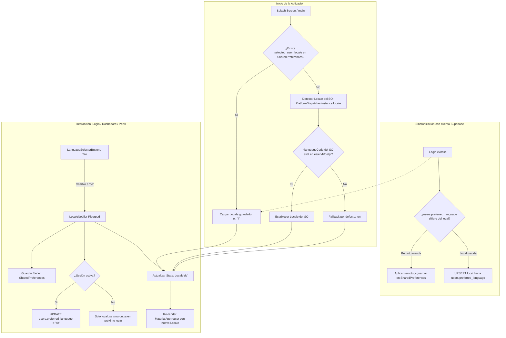
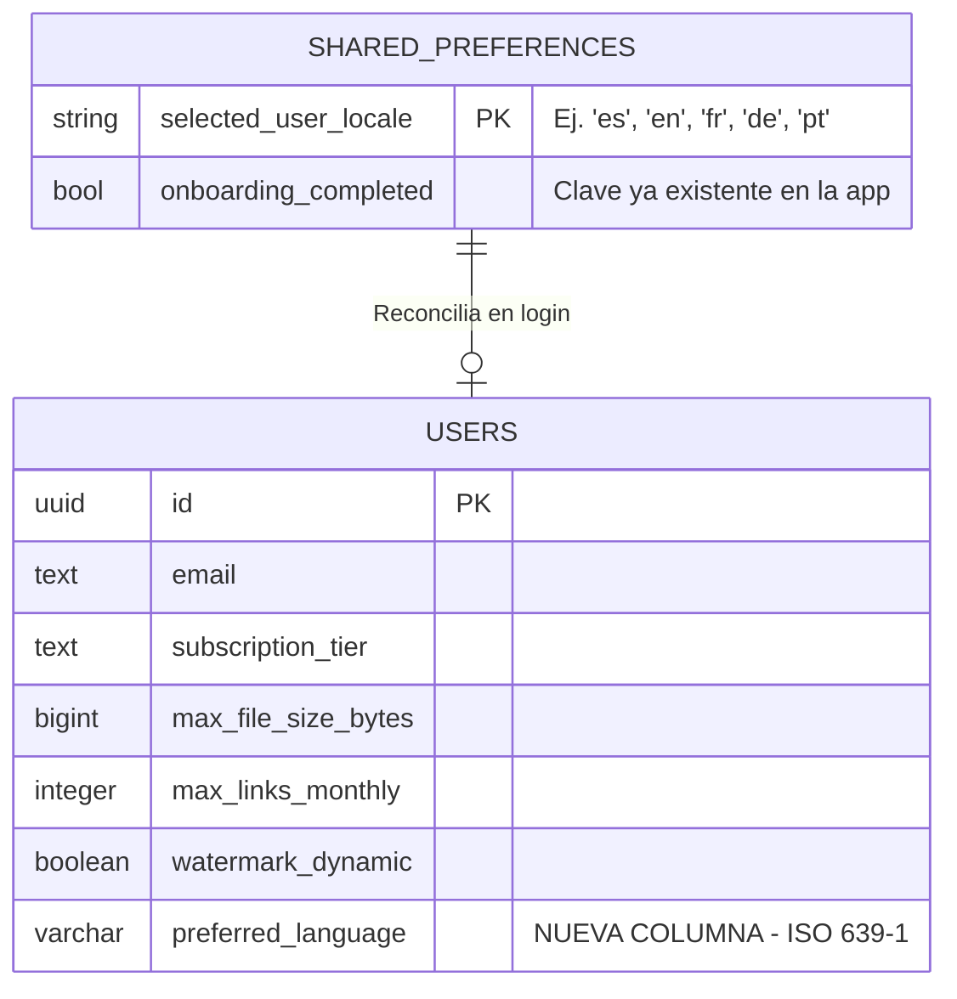

# PLAN DE ARQUITECTURA DE SOFTWARE E INTERNACIONALIZACIÓN (i18n/l10n) — KRIPTONSHARE

## Módulo: Detección, Configuración y Selección de Idioma Dinámico — Versión 2.1 (Actualización Integral + Virtual Data Room)

| Campo | Detalle |
|---|---|
| **Documento** | Plan de Arquitectura de Software e Internacionalización (i18n/l10n) |
| **Versión** | 2.1 — Integra las cadenas del Virtual Data Room (VDR) a la v2.0 auditada |
| **Repositorio** | `github.com/horaciomartinez-svg/kriptonshare` |
| **Stack verificado** | Flutter 3.x / Dart 3.x (`sdk: '>=3.0.0 <4.0.0'`), Riverpod 2.5, GoRouter 14, Supabase Flutter 2.8, Cloudflare R2 |
| **Idiomas objetivo** | Español (es) · Inglés (en) · Francés (fr) · Alemán (de) · Portugués (pt) |
| **Fecha** | 29 de julio de 2026 |
| **Documento base** | Plan de Arquitectura KRIPTONSHARE e Internacionalización (i18n_l10n) 27Jul26 (v1.0, PDF) |
| **Actualización integrada** | `KRIPTONSHARE Actualización Arquitectura Virtual Data Room 29Jul26.md` (v2.0) — ya implementada en el repositorio vía KIMI CODE CLI; sus textos de UI se incorporan a los 5 archivos ARB (Módulo 5) |
| **Cobertura de cadenas** | **317 claves ARB** (261 de la v2.0 + 56 nuevas del VDR) en los 5 idiomas |

---

## TABLA DE CONTENIDO

1. [Resumen Ejecutivo](#resumen-ejecutivo)
2. [Módulo 0 — Auditoría del Estado Actual del Repositorio](#módulo-0--auditoría-del-estado-actual-del-repositorio)
3. [Módulo 1 — Descubrimiento y Arquitectura General](#módulo-1--descubrimiento-y-arquitectura-general)
4. [Módulo 2 — Diseño de Datos y Persistencia (Local & Remote)](#módulo-2--diseño-de-datos-y-persistencia-local--remote)
5. [Módulo 3 — Configuración del Proyecto y Estructura de Archivos](#módulo-3--configuración-del-proyecto-y-estructura-de-archivos)
6. [Módulo 4 — Integración Global en la Aplicación](#módulo-4--integración-global-en-la-aplicación)
7. [Módulo 5 — Inventario Maestro de Cadenas y Archivos ARB (5 idiomas)](#módulo-5--inventario-maestro-de-cadenas-y-archivos-arb-5-idiomas)
8. [Módulo 6 — Diseño de Interfaz (UI/UX) y Componentes Reutilizables](#módulo-6--diseño-de-interfaz-uiux-y-componentes-reutilizables)
9. [Módulo 7 — Plan de Refactorización Archivo por Archivo](#módulo-7--plan-de-refactorización-archivo-por-archivo)
10. [Módulo 8 — Formatos Regionales: Fechas, Números y Pluralización](#módulo-8--formatos-regionales-fechas-números-y-pluralización)
11. [Módulo 9 — Estrategia de Testing i18n/l10n](#módulo-9--estrategia-de-testing-i18nl10n)
12. [Módulo 10 — Roadmap de Implementación por Fases](#módulo-10--roadmap-de-implementación-por-fases)
13. [Módulo 11 — Riesgos, Mitigaciones y Consideraciones Especiales](#módulo-11--riesgos-mitigaciones-y-consideraciones-especiales)
14. [Dictamen de Conformidad Arquitectónica](#dictamen-de-conformidad-arquitectónica)

---

## RESUMEN EJECUTIVO

KRIPTONSHARE es un **Data Room efímero con soberanía de datos** (cifrado AES-256-GCM del lado del cliente, almacenamiento en Cloudflare R2, backend Supabase). La versión 1.0 de este plan (PDF, 27Jul26) definió la arquitectura teórica de internacionalización. Esta **versión 2.0 actualiza el plan tras auditar el código fuente real del repositorio**, con tres hallazgos críticos:

1. **La aplicación no tiene hoy ninguna infraestructura de i18n**: no existe `flutter_localizations` en `pubspec.yaml`, no existe `l10n.yaml`, no existe el directorio `lib/l10n/` y `MaterialApp.router` (en `lib/main.dart`) no declara `locale`, `supportedLocales` ni `localizationsDelegates`.
2. **Existen ~250 cadenas de texto visibles al usuario, hardcodeadas en 20 archivos Dart**, predominantemente en español con residuos en inglés (`'Failed to create room'`, `'Expires: ...'`, `'ACTIVE'`, `'EXPIRED'`). Este documento entrega el **inventario completo y los 5 archivos ARB listos para copiar al repositorio** (Módulo 5).
3. **La tabla `public.users` de Supabase no tiene la columna `preferred_language`**: se entrega la migración SQL lista para ejecutar (Módulo 2), alineada con las migraciones existentes en `supabase/migrations/`. **Nota v2.1:** la migración `20260729000000_vdr_architecture_update.sql` (ya aplicada con la actualización del VDR) también crea `preferred_language` de forma idempotente; ambas rutas convergen sin conflicto.
4. **Nuevo en v2.1 — Textos del Virtual Data Room (VDR):** la actualización arquitectónica del 29Jul26 (ya codificada en el repositorio) incorporó nuevas secciones con texto visible: el **Data Room Explorer** estilo Google Drive del emisor, la **carga múltiple en lote**, el **share sheet** (archivo individual / carpeta completa, correo obligatorio, watermark, expiración ≤ 30 días), el **lobby receptor** con modal de captura de correo y descifrado perezoso en RAM, los **mensajes de validación de expiración** de la función SQL `validate_share_link_expiration()` y los **nuevos eventos de telemetría** (`lobby_enter`, `file_open`, `lobby_exit`). Esta v2.1 agrega las **56 claves ARB correspondientes, traducidas a los 5 idiomas**, elevando el inventario maestro a **317 claves por idioma**.

El resultado es una arquitectura **offline-first**: detección automática del idioma del SO, persistencia local en `SharedPreferences`, sincronización remota opcional con Supabase (`users.preferred_language`) para consistencia entre dispositivos, y reconstrucción reactiva de toda la UI vía Riverpod sin reiniciar la app.

---

## MÓDULO 0 — AUDITORÍA DEL ESTADO ACTUAL DEL REPOSITORIO

### 0.1 Arquitectura real detectada

El repositorio presenta una **arquitectura híbrida en transición** hacia Clean Architecture:

```
lib/
├── main.dart                    # Entry point: MaterialApp.router + ProviderScope + deep links
├── core/                        # NÚCLEO (Clean Architecture)
│   ├── error/failures.dart
│   ├── network/network_info.dart
│   ├── services/                # revenue_cat_service, thumbnail_cache_service
│   └── utils/                   # constants.dart, theme.dart (duplicado de lib/utils)
├── features/                    # FEATURES (Clean Architecture por dominio)
│   ├── analytics/               # data / domain / presentation
│   ├── data_room/               # lobby, storage management, notifiers, widgets
│   ├── links/                   # links screen, expired links, link cards
│   ├── qna/                     # chat Q&A (data/domain/presentation)
│   ├── telemetry/               # eventos forenses
│   └── upload/                  # upload_screen (cifrado + R2)
├── models/                      # LEGACY: kripton_file.dart, user_model.dart
├── providers/                   # LEGACY: auth_provider, file_provider, router_provider
├── screens/                     # LEGACY: auth, biometric, dashboard, profile, viewer, splash, onboarding
├── services/                    # LEGACY: crypto, biometric, r2_signature, screenshot, secure_credential
├── utils/                       # LEGACY: constants.dart, theme.dart
└── widgets/                     # LEGACY: data_room_card, link_gauge, video_player_screen
```

> **Implicación para i18n:** el módulo de localización debe ubicarse en `lib/core/localization/` (alineado con la arquitectura destino), y los widgets del selector de idioma deben ser **reutilizables desde ambas capas** (legacy `screens/` y nueva `features/`), porque ambas coexisten y comparten el `MaterialApp.router` raíz.

### 0.2 Estado de internacionalización (diagnóstico)

| Aspecto | Estado actual | Brecha |
|---|---|---|
| Dependencia `flutter_localizations` | ❌ Ausente en `pubspec.yaml` | Agregar SDK bundle |
| Dependencia `intl` | ✅ Presente (`^0.19.0`) | Fijar/actualizar a `^0.20.2` según Flutter estable |
| `generate: true` en pubspec | ❌ Ausente | Requerido para gen-l10n |
| `l10n.yaml` | ❌ No existe | Crear en raíz |
| Archivos ARB | ❌ No existen | Crear 5 archivos (Módulo 5) |
| `shared_preferences` | ✅ Presente (`^2.3.0`) | Reutilizar para `selected_user_locale` |
| Riverpod | ✅ Presente (`flutter_riverpod ^2.5.1`) | Crear `LocaleNotifier` |
| Cadenas hardcodeadas | ⚠️ ~250 cadenas en 20 archivos + ~60 cadenas nuevas del VDR (29Jul26) | Refactor completo (Módulo 7) |
| Columna `users.preferred_language` | ✅ Creada por la migración VDR `20260729000000` (idempotente) | Migración SQL (Módulo 2) converge sin conflicto |

### 0.3 Mapa de rutas y puntos de integración del selector de idioma

Rutas registradas en `lib/providers/router_provider.dart` (GoRouter):

| Ruta | Pantalla | ¿Selector de idioma? |
|---|---|---|
| `/` | `SplashScreen` | No (sin textos traducibles salvo tagline) |
| `/auth` | `AuthScreen` (Login/Registro con `TabController`) | **SÍ — obligatorio** (punto de entrada de usuarios nuevos) |
| `/onboarding` | `OnboardingScreen` | Opcional (hereda locale del SO) |
| `/dashboard` | `DashboardScreen` (AppBar con actions) | **SÍ — obligatorio** (icono en AppBar) |
| `/upload` | `UploadScreen` | No (hereda) |
| `/links` | `LinksScreen` | No (hereda) |
| `/viewer`, `/room/:id` | `ViewerScreen` | No (flujo de receptor, hereda) |
| `/profile` | `ProfileScreen` | **SÍ — recomendado** (tile en sección de configuración) |
| `/analytics` | `AnalyticsDashboardScreen` | No (hereda) |
| `/expired-links` | `ExpiredLinksScreen` | No (hereda) |
| `/biometric` | `BiometricSettingsScreen` | No (hereda) |
| `/storage-management` | `StorageManagementScreen` | No (hereda) |
| `/folder-room/:folderLinkId` | `DataRoomLobbyScreen` | No (flujo de receptor, hereda) |
| `/data-room` | `DataRoomExplorerScreen` (VDR 29Jul26) | **SÍ — recomendado** (icono en AppBar, ya previsto en el wireframe del Explorer) |
| `/f/:linkId` | `DataRoomLobbyScreen` (carpeta completa) | No (flujo de receptor, hereda locale del dispositivo receptor) |
| `/d/:linkId` | `ViewerScreen` (archivo individual) | No (flujo de receptor, hereda) |

### 0.4 Tokens visuales reales (verificados en `lib/utils/theme.dart`)

La v1.0 del plan citaba `Charcoal Black #121212`; el código real usa `#0A0A0F`. **Este documento corrige los tokens a los valores reales del repositorio**, que el selector de idioma debe respetar:

| Token | HEX real | Uso en el selector de idioma |
|---|---|---|
| `KriptonTheme.charcoalBlack` | `#0A0A0F` | Fondo del modal/bottom sheet |
| `KriptonTheme.inkDeep` | `#1A1A2E` | Superficie interna |
| `KriptonTheme.surfaceElevated` | `#16213E` | Superficie de ListTiles / estados pressed |
| `KriptonTheme.ink` | `#2B2B2B` | Divisores |
| `KriptonTheme.electricLime` | `#39FF14` | Idioma activo, check, acento neón |
| `KriptonTheme.neonGreen` | `#C7F000` | Acento secundario |
| `KriptonTheme.platinum` | `#E8E8E8` | Texto principal |
| `KriptonTheme.silver` | `#A0A0A0` | Texto secundario / iconos |

---

## MÓDULO 1 — DESCUBRIMIENTO Y ARQUITECTURA GENERAL

### 1.1 Idiomas soportados y justificación técnica de negocio

Se confirman los **5 idiomas** de la v1.0, con esquema de códigos ISO 639-1:

| Idioma | Código | Rol | Justificación |
|---|---|---|---|
| Español | `es` | Idioma nativo del equipo y del mercado base (Latam) | Idioma de origen de las cadenas actuales del código |
| Inglés | `en` | **Fallback internacional** | Estándar B2B obligatorio (Data Rooms, Due Diligence, Legal, Financiero) |
| Francés | `fr` | Expansión | Cumplimiento normativo Quebec/Canadá; UE y África francófona |
| Alemán | `de` | Expansión | Mercado DACH de alta privacidad; sensibilidad GDPR crítica para un producto de soberanía de datos |
| Portugués | `pt` | Expansión | Brasil (mayor mercado emergente de Latam) y Portugal/África |

**Decisión arquitectónica clave:** el archivo ARB plantilla (template) será **`app_en.arb`** (inglés = fallback global), no el español. Motivo: si una clave falta en un idioma secundario, el sistema debe degradar hacia el idioma de mayor cobertura internacional. El español pasa a ser un ARB más (`app_es.arb`), aunque sea el idioma de origen de las cadenas hardcodeadas actuales.

### 1.2 Stack tecnológico seleccionado

| Capa | Tecnología | Justificación técnica |
|---|---|---|
| Motor de localización | `flutter_localizations` (SDK) + `intl` | Solución oficial Flutter; delegados Material/Widgets/Cupertino localizados (fechas, diálogos, tooltips del framework) |
| Generación de código | `gen-l10n` (synthetic package `flutter_gen`) | Clases `AppLocalizations` estáticamente tipadas generadas desde ARB; errores de clave en tiempo de compilación |
| Estado reactivo | Riverpod `StateNotifierProvider<LocaleNotifier, Locale>` | Ya es el estándar del proyecto; reconstruye `MaterialApp.router` al cambiar `locale` |
| Persistencia local | `shared_preferences` (^2.3.0, ya instalado) | Guarda `selected_user_locale`; retroceso a `PlatformDispatcher` si no existe |
| Persistencia remota | Supabase `public.users.preferred_language` | Consistencia entre dispositivos del mismo usuario; fuente de verdad para notificaciones backend futuras |
| Formato regional | `intl` `DateFormat` / `NumberFormat` con `locale` activo | Reemplaza el formateo manual actual (`dd/MM/yyyy HH:mm` hardcodeado) |

### 1.3 Diagrama de arquitectura de selección de idioma (Mermaid.js)



**Reglas del flujo:**
1. La preferencia **local explícita** siempre tiene prioridad sobre la detección del SO.
2. La preferencia **remota (Supabase)** solo se consulta tras login y se reconcilia: si el usuario nunca eligió idioma en este dispositivo, se aplica el remoto; si ya eligió localmente, el local se promueve a remoto.
3. El fallback final es siempre **inglés (`en`)**.

---

## MÓDULO 2 — DISEÑO DE DATOS Y PERSISTENCIA (LOCAL & REMOTE)

### 2.1 Modelo Entidad-Relación (Mermaid.js)



### 2.2 Migración SQL (Supabase / PostgreSQL)

La tabla `public.users` actual (verificada en `supabase/schema.sql`) contiene: `id`, `email`, `subscription_tier`, `created_at`, `updated_at`, `monthly_links_generated`, `monthly_links_reset_at`, `max_file_size_bytes`, `max_links_monthly`, `watermark_dynamic`. **No existe `preferred_language`.**

Crear el archivo `supabase/migrations/20260728000000_add_preferred_language.sql`:

```sql
-- =============================================================================
-- KRIPTONSHARE — MIGRACIÓN i18n/l10n
-- Archivo: supabase/migrations/20260728000000_add_preferred_language.sql
-- Propósito: persistir la preferencia lingüística del usuario (5 idiomas)
-- =============================================================================

ALTER TABLE public.users
ADD COLUMN IF NOT EXISTS preferred_language VARCHAR(5) NOT NULL DEFAULT 'en'
CHECK (preferred_language IN ('es', 'en', 'fr', 'de', 'pt'));

COMMENT ON COLUMN public.users.preferred_language IS
  'Código ISO 639-1 del idioma preferido del usuario (es, en, fr, de, pt). Sincronizado desde el cliente móvil; fuente para notificaciones y emails transaccionales futuros.';

-- Índice opcional para campañas/segmentación por idioma
CREATE INDEX IF NOT EXISTS idx_users_preferred_language
  ON public.users (preferred_language);

-- La política RLS existente (user_self_access, FOR ALL USING id = auth.uid())
-- ya cubre la nueva columna: no se requieren políticas adicionales.
```

### 2.3 Contrato de sincronización local ↔ remota

| Evento | Acción local (SharedPreferences) | Acción remota (Supabase) |
|---|---|---|
| Arranque sin sesión | Leer `selected_user_locale`; si falta, detectar SO | — |
| Cambio manual de idioma sin sesión | Escribir clave | — (pendiente de sincronizar) |
| Login exitoso | Leer local | `SELECT preferred_language`; reconciliar según reglas del Módulo 1.3 |
| Cambio manual con sesión | Escribir clave | `UPDATE users SET preferred_language = <code> WHERE id = auth.uid()` |
| Logout | **Conservar** la clave local | — |

> **Nota de diseño:** no se borra la preferencia local al cerrar sesión; el idioma es una propiedad del *dispositivo del usuario*, no de la sesión.

---

## MÓDULO 3 — CONFIGURACIÓN DEL PROYECTO Y ESTRUCTURA DE ARCHIVOS

### 3.1 Cambios en `pubspec.yaml`

```yaml
dependencies:
  flutter:
    sdk: flutter
  flutter_localizations:          # <-- NUEVO: delegados oficiales de localización
    sdk: flutter
  intl: ^0.19.0                   # ya presente; alinear versión con el Flutter estable en uso
  shared_preferences: ^2.3.0      # ya presente
  flutter_riverpod: ^2.5.1        # ya presente
  # ... resto de dependencias sin cambios

flutter:
  uses-material-design: true
  generate: true                  # <-- NUEVO: habilita gen-l10n (flutter_gen)
```

### 3.2 Nuevo archivo `l10n.yaml` (raíz del proyecto)

```yaml
# l10n.yaml — Configuración del generador gen-l10n de Flutter
arb-dir: lib/l10n
template-arb-file: app_en.arb        # Inglés = plantilla y fallback global
output-localization-file: app_localizations.dart
output-class: AppLocalizations
nullable-getter: false               # AppLocalizations.of(context) no nulo
synthetic-package: true              # import 'package:flutter_gen/gen_l10n/app_localizations.dart'
preferred-supported-locales: [es, en, fr, de, pt]
```

### 3.3 Estructura de directorios resultante (integrada a la arquitectura real)

```
lib/
├── l10n/
│   ├── app_en.arb                  # PLANTILLA (fallback internacional)
│   ├── app_es.arb                  # Español
│   ├── app_fr.arb                  # Francés
│   ├── app_de.arb                  # Alemán
│   └── app_pt.arb                  # Portugués
├── core/
│   └── localization/               # <-- NUEVO módulo en la capa core
│       ├── locale_provider.dart            # LocaleNotifier + providers Riverpod
│       ├── supported_locales.dart          # Catálogo de locales + metadatos (nombre nativo, bandera)
│       ├── language_selector_modal.dart    # Bottom sheet reutilizable
│       └── language_sync_service.dart      # Reconciliación SharedPreferences ↔ Supabase
├── providers/
│   └── router_provider.dart        # Sin cambios de rutas; hereda locale vía MaterialApp.router
└── ... (screens/ y features/ refactorizados según Módulo 7)
```

**Decisión de ubicación:** a diferencia de la v1.0 (que proponía widgets bajo `features/auth/presentation/widgets/` y `features/dashboard/`), el selector se centraliza en `core/localization/` porque las pantallas de Login y Dashboard aún viven en la capa legacy (`lib/screens/`). Un solo widget compartido evita duplicación durante la migración a Clean Architecture.

### 3.4 Catálogo de locales soportados

Archivo: `lib/core/localization/supported_locales.dart`

```dart
import 'dart:ui';

/// Descriptor de un idioma soportado por KRIPTONSHARE.
class SupportedLocale {
  final Locale locale;
  final String nativeName;   // Nombre en su propio idioma (siempre igual, sin traducir)
  final String flagEmoji;    // Bandera representativa para el selector

  const SupportedLocale(this.locale, this.nativeName, this.flagEmoji);
}

/// Catálogo único de verdad para los 5 idiomas.
const List<SupportedLocale> kSupportedLocales = [
  SupportedLocale(Locale('es'), 'Español', '🇪🇸'),
  SupportedLocale(Locale('en'), 'English', '🇬🇧'),
  SupportedLocale(Locale('fr'), 'Français', '🇫🇷'),
  SupportedLocale(Locale('de'), 'Deutsch', '🇩🇪'),
  SupportedLocale(Locale('pt'), 'Português', '🇧🇷'),
];

const Locale kFallbackLocale = Locale('en');

bool isSupportedLanguageCode(String code) =>
    kSupportedLocales.any((s) => s.locale.languageCode == code);
```

### 3.5 Controlador de estado: `LocaleNotifier` (versión 2.0 con sincronización)

Archivo: `lib/core/localization/locale_provider.dart`

```dart
import 'dart:ui';
import 'package:flutter_riverpod/flutter_riverpod.dart';
import 'package:shared_preferences/shared_preferences.dart';
import 'package:supabase_flutter/supabase_flutter.dart';

import 'supported_locales.dart';

const String kLocaleStorageKey = 'selected_user_locale';

final localeProvider = StateNotifierProvider<LocaleNotifier, Locale>((ref) {
  return LocaleNotifier();
});

class LocaleNotifier extends StateNotifier<Locale> {
  LocaleNotifier() : super(kFallbackLocale) {
    _initializeLocale();
  }

  static List<Locale> get supportedLocales =>
      kSupportedLocales.map((s) => s.locale).toList();

  /// Prioridad: 1) preferencia local explícita → 2) idioma del SO → 3) fallback 'en'
  Future<void> _initializeLocale() async {
    final prefs = await SharedPreferences.getInstance();
    final saved = prefs.getString(kLocaleStorageKey);

    if (saved != null && isSupportedLanguageCode(saved)) {
      state = Locale(saved);
      return;
    }
    final systemLocale = PlatformDispatcher.instance.locale;
    state = isSupportedLanguageCode(systemLocale.languageCode)
        ? Locale(systemLocale.languageCode)
        : kFallbackLocale;
  }

  /// Cambio manual de idioma: persiste local y, si hay sesión, sincroniza a Supabase.
  Future<void> setLocale(String languageCode) async {
    if (!isSupportedLanguageCode(languageCode)) return;
    state = Locale(languageCode);

    final prefs = await SharedPreferences.getInstance();
    await prefs.setString(kLocaleStorageKey, languageCode);
    await _pushToRemote(languageCode);
  }

  /// Reconciliación tras login: remoto manda si el usuario nunca eligió en este
  /// dispositivo; en caso contrario, el local se promueve a remoto.
  Future<void> reconcileWithRemote() async {
    final user = Supabase.instance.client.auth.currentUser;
    if (user == null) return;

    final prefs = await SharedPreferences.getInstance();
    final localChoice = prefs.getString(kLocaleStorageKey);

    try {
      final row = await Supabase.instance.client
          .from('users')
          .select('preferred_language')
          .eq('id', user.id)
          .single();
      final remote = row['preferred_language'] as String?;

      if (localChoice == null &&
          remote != null &&
          isSupportedLanguageCode(remote)) {
        state = Locale(remote);
        await prefs.setString(kLocaleStorageKey, remote);
      } else if (localChoice != null && localChoice != remote) {
        await _pushToRemote(localChoice);
      }
    } catch (_) {
      // Offline-first: si falla la red, el locale local permanece. Sin crash.
    }
  }

  Future<void> _pushToRemote(String languageCode) async {
    final user = Supabase.instance.client.auth.currentUser;
    if (user == null) return;
    try {
      await Supabase.instance.client
          .from('users')
          .update({'preferred_language': languageCode})
          .eq('id', user.id);
    } catch (_) {
      // Se reintentará en el próximo reconcileWithRemote().
    }
  }
}
```

> **Mejora respecto a v1.0:** el notifier de la v1.0 solo persistía localmente. La v2.0 añade `reconcileWithRemote()` (invocado desde `auth_provider` tras login exitoso) y `_pushToRemote()`, cumpliendo el objetivo del plan de mantener consistencia entre dispositivos vía `users.preferred_language`, sin romper el modo offline.

---

## MÓDULO 4 — INTEGRACIÓN GLOBAL EN LA APLICACIÓN

### 4.1 `lib/main.dart` — Inyección del Locale en `MaterialApp.router`

El `build` actual de `_KriptonShareAppState` solo configura `title`, `theme` y `routerConfig`. Cambio mínimo y quirúrgico:

```dart
import 'package:flutter_localizations/flutter_localizations.dart';
import 'package:flutter_gen/gen_l10n/app_localizations.dart';
import 'core/localization/locale_provider.dart';

// Dentro de _KriptonShareAppState.build:
@override
Widget build(BuildContext context) {
  final router = ref.watch(routerProvider);
  final locale = ref.watch(localeProvider);          // <-- NUEVO
  _router = router;

  WidgetsBinding.instance.addPostFrameCallback((_) {
    _flushPendingDeepLink();
  });

  return MaterialApp.router(
    title: 'KRIPTONSHARE',
    debugShowCheckedModeBanner: false,
    theme: KriptonTheme.darkTheme,
    routerConfig: router,
    locale: locale,                                   // <-- NUEVO
    supportedLocales: LocaleNotifier.supportedLocales, // <-- NUEVO
    localizationsDelegates: const [                   // <-- NUEVO
      AppLocalizations.delegate,
      GlobalMaterialLocalizations.delegate,
      GlobalWidgetsLocalizations.delegate,
      GlobalCupertinoLocalizations.delegate,
    ],
  );
}
```

**Por qué funciona la reactividad:** al observar `localeProvider` en el widget raíz, cualquier `setLocale()` invalida el estado y Flutter reconstruye `MaterialApp.router` con el nuevo `Locale`; `GoRouter` conserva su pila de navegación (no hay reinicio de rutas ni pérdida de estado de pantallas).

### 4.2 Patrón de consumo en pantallas

Todas las pantallas pasan de cadenas literales a:

```dart
import 'package:flutter_gen/gen_l10n/app_localizations.dart';

// En build():
final l10n = AppLocalizations.of(context);

// Antes:  Text('Bienvenido')
// Después:
Text(l10n.welcome)

// Con placeholders:
// Antes:  Text('${link.accessCount} vistas')
// Después:
Text(l10n.viewsCount(link.accessCount))
```

Para widgets sin `BuildContext` (notifiers que emiten mensajes de error), ver **Módulo 7.4**: los errores se migran a **códigos tipados** y la pantalla los traduce.

### 4.3 Puntos de inserción del selector de idioma (verificados contra el código real)

| # | Ubicación | Archivo | Inserción exacta |
|---|---|---|---|
| 1 | **Login** | `lib/screens/auth/auth_screen.dart` | Esquina superior derecha del `Scaffold` (sobre el título "KRIPTONSHARE"): `IconButton` con `Icons.language` que abre `LanguageSelectorModal` |
| 2 | **Dashboard** | `lib/screens/dashboard/dashboard_screen.dart` | Nuevo `IconButton` en `AppBar.actions`, **antes** del icono de Analytics (línea 35-48 del archivo actual) |
| 3 | **Perfil** | `lib/screens/profile/profile_screen.dart` | `ListTile` "Idioma" en la sección de configuración, junto a "Biometría" y "Seguridad" |
| 4 | **Onboarding** | `lib/screens/onboarding_screen.dart` | Opcional: mismo botón en la esquina superior derecha de la primera página |

---

## MÓDULO 5 — INVENTARIO MAESTRO DE CADENAS Y ARCHIVOS ARB (5 IDIOMAS)

### 5.1 Metodología del inventario

Las **317 claves** siguientes cubren la totalidad de las cadenas visibles al usuario detectadas en la auditoría del código fuente (20 archivos Dart: `lib/screens/**`, `lib/widgets/**`, `lib/features/**/presentation/**`, más mensajes de error emitidos por notifiers y providers), **más las 56 claves nuevas del Virtual Data Room** introducidas por la actualización arquitectónica del 29Jul26 (`data_room_explorer_screen.dart`, `upload_batch_notifier.dart`, share sheet de archivo/carpeta, `recipient_email_modal.dart`, `viewer_secure_layout.dart` con watermark dinámico, y los mensajes de la función SQL `validate_share_link_expiration()`). El detalle del incremento VDR se documenta en la sección 5.8. Convenciones:

- **Nombrado:** `camelCase`, prefijo semántico por dominio (`onboarding*`, `biometric*`, `error*`, etc.).
- **Plantilla:** `app_en.arb` (único archivo con metadatos `@key` de placeholders; el resto hereda).
- **No se traducen:** la marca `KRIPTONSHARE`, nombres de fuentes (`Inter`, `SFMono`), algoritmos (`AES-256-GCM`), URLs, esquemas de deep link y precios en USD (se mantienen como cadenas porque son copy comercial, no formato numérico).
- **Claves con placeholders:** usan sintaxis ICU `{nombre}` y sus metadatos se declaran en la plantilla.

### 5.2 `lib/l10n/app_en.arb` — PLANTILLA (fallback internacional)

```json
{
  "@@locale": "en",
  "appName": "KRIPTONSHARE",
  "cancel": "Cancel",
  "retry": "Retry",
  "delete": "Delete",
  "share": "Share",
  "revoke": "Revoke",
  "dataRoom": "Data Room",
  "premium": "Premium",
  "free": "Free",
  "enabled": "Enabled",
  "disabled": "Disabled",
  "language": "Language",
  "selectLanguage": "Select language",
  "errorWithMessage": "Error: {message}",
  "@errorWithMessage": { "placeholders": { "message": { "type": "String" } } },

  "splashTagline": "Ephemeral Data Room",

  "onboardingTitle1": "Zero-Knowledge Encryption",
  "onboardingBody1": "Your files are encrypted locally with AES-256 before uploading to the cloud. No one but you holds the keys.",
  "onboardingTitle2": "Ephemeral Links",
  "onboardingBody2": "Configure the physical self-destruction of your documents. Choose the exact validity duration of the secure access link.",
  "onboardingTitle3": "Forensic Security",
  "onboardingBody3": "Mitigate corporate espionage and physical leaks with dynamic watermarks and screenshot blocking.",
  "onboardingSkip": "SKIP",
  "onboardingStart": "START",
  "onboardingNext": "NEXT",

  "authTagline": "Your device is the sole custodian",
  "loginTab": "Sign In",
  "registerTab": "Create Account",
  "emailLabel": "Email",
  "emailHint": "you@email.com",
  "emailRequired": "Email required",
  "emailInvalid": "Invalid email",
  "passwordLabel": "Password",
  "passwordRequired": "Password required",
  "passwordMinLength": "Minimum {min} characters",
  "@passwordMinLength": { "placeholders": { "min": { "type": "int" } } },
  "confirmPasswordLabel": "Confirm password",
  "confirmPasswordRequired": "Confirmation required",
  "passwordsDoNotMatch": "Passwords do not match",
  "loginButton": "Sign In",
  "registerButton": "Create free account",
  "loginInvalidCredentials": "Invalid credentials. Please try again.",
  "registerError": "Could not create account. Try another email.",
  "biometricLoginReason": "Verify your identity to complete sign-in",
  "biometricAuthCancelled": "Biometric authentication cancelled.",
  "freePlanInfo": "Free plan: {maxMB} MB max · {maxLinks} links/month · {maxHours}h duration",
  "@freePlanInfo": { "placeholders": { "maxMB": { "type": "int" }, "maxLinks": { "type": "int" }, "maxHours": { "type": "int" } } },
  "termsNotice": "By signing up, you accept the data sovereignty terms. KRIPTONSHARE never stores your files in plain text.",

  "lockTitle": "KRIPTONSHARE locked",
  "lockSubtitle": "Use your fingerprint or face to unlock the app.",
  "lockVerifying": "Verifying...",
  "unlockWithBiometrics": "Unlock with biometrics",
  "signOut": "Sign Out",
  "authCancelled": "Authentication cancelled.",
  "noSavedCredentials": "No saved credentials. Please sign in manually.",
  "invalidSavedCredentials": "Saved credentials are no longer valid. Please sign in manually.",

  "biometricSettingsTitle": "Biometrics Settings",
  "biometricIntro": "Protect access to your Data Rooms with your biometric identity.",
  "biometricNotAvailableTitle": "Biometrics not available",
  "biometricNoSensorsBody": "This device has no biometric sensors configured.",
  "testNow": "Test now",
  "verifyAgain": "Verify again",
  "biometricUnlock": "Biometric unlock",
  "dataSovereigntyTitle": "Data sovereignty",
  "dataSovereigntyBody": "Your fingerprint or face never leaves the device. We do not store biometric data.",
  "quickAccessTitle": "Quick access",
  "quickAccessBody": "Unlock KRIPTONSHARE without typing your password every time.",
  "extraProtectionTitle": "Additional protection",
  "extraProtectionBody": "Biometrics complements your password; it does not replace it.",
  "securityTitle": "Security",
  "faceId": "Face ID",
  "iris": "Iris",
  "fingerprint": "Fingerprint",
  "faceIdDescription": "Use Face ID to unlock KRIPTONSHARE securely.",
  "irisDescription": "Use iris recognition to sign in.",
  "fingerprintDescription": "Use your fingerprint to unlock the app quickly.",
  "biometricEnableReason": "Confirm your fingerprint or face to enable biometric unlock",
  "biometricAuthSuccess": "Biometric authentication successful.",
  "biometricEnableCancelled": "Could not enable: authentication cancelled.",
  "biometricUnlockEnabledMsg": "Biometric unlock enabled. It will be requested after sign-in.",
  "biometricUnlockDisabledMsg": "Biometric unlock disabled.",
  "biometricQueryError": "Error checking biometrics: {message}",
  "@biometricQueryError": { "placeholders": { "message": { "type": "String" } } },

  "dashboardTab": "Dashboard",
  "linksTab": "Links",
  "profileTab": "Profile",
  "welcome": "Welcome",
  "capacity": "Capacity",
  "duration": "Duration",
  "plan": "Plan",
  "receivedFiles": "Received files",
  "noReceivedFiles": "You have not received any files",
  "receivedFilesHint": "Links sent to your email will appear here",
  "activeLinks": "Active links",
  "viewAll": "View all",
  "noActiveLinks": "No active links",
  "createFirstDataRoom": "Create your first secure Data Room",
  "expiresLabel": "Expires",
  "expiresInMinutes": "in {minutes}m",
  "@expiresInMinutes": { "placeholders": { "minutes": { "type": "int" } } },
  "expiresInHours": "in {hours}h",
  "@expiresInHours": { "placeholders": { "hours": { "type": "int" } } },
  "expiresInDays": "in {days}d",
  "@expiresInDays": { "placeholders": { "days": { "type": "int" } } },
  "analyticsTooltip": "Analytics",

  "newDataRoom": "New Data Room",
  "attachFile": "Attach File",
  "cameraToVault": "Camera to Vault",
  "noPublicGallery": "No public gallery",
  "encryptionPasswordLabel": "Encryption password",
  "passwordNotStoredHint": "Not stored in the cloud",
  "recipientEmailOptional": "Recipient email (optional)",
  "encryptAndGenerateLink": "Encrypt and generate link",
  "dataRoomReadyBanner": "Data Room ready on Cloudflare",
  "protectingFiles": "Protecting your files...",
  "encryptingAesStep": "> Encrypting with AES-256...",
  "syncingR2Step": "> Syncing to R2...",
  "fileExceedsPlanLimit": "The file exceeds the {maxSize} limit of your plan",
  "@fileExceedsPlanLimit": { "placeholders": { "maxSize": { "type": "String" } } },
  "captureExceedsPlanLimit": "The capture exceeds the {maxSize} limit of your plan",
  "@captureExceedsPlanLimit": { "placeholders": { "maxSize": { "type": "String" } } },
  "cameraAccessCancelled": "Camera access cancelled or denied",
  "enterEncryptionPassword": "Enter an encryption password",
  "sessionExpired": "Session expired",
  "filePickError": "Error selecting file",
  "shareDataRoomTitle": "Confidential Shared Data Room",
  "expirationLabel": "Expiration:",
  "oneHour": "1 hour",
  "default24h": "24h (Default)",
  "max48Hours": "48 hours (Max)",
  "max30Days": "Max 30 days",
  "daysUnit": "{count} Days",
  "@daysUnit": { "placeholders": { "count": { "type": "int" } } },
  "hoursUnit": "{count} Hours",
  "@hoursUnit": { "placeholders": { "count": { "type": "int" } } },
  "upsellTitle": "Sending without pauses?",
  "upsellCta": "> Go Premium",
  "linkExpiresNotice": "This link expires in {hours}h.",
  "@linkExpiresNotice": { "placeholders": { "hours": { "type": "int" } } },
  "adSampleTitle": "IBM Cloud Security",
  "adSampleBody": "Protect your company's infrastructure.",
  "adSampleCta": "LEARN MORE",

  "searchByIdOrEmail": "Search by ID or email",
  "createLink": "Create link",
  "noSearchResults": "No results found",
  "createFirstFromDashboard": "Create your first Data Room from the dashboard",
  "deleteDocumentTitle": "Delete document",
  "deleteDocumentWarning": "This action is irreversible. The document will be permanently deleted.",
  "linkRevoked": "Link revoked",
  "documentDeleted": "Document deleted",
  "shareMessageTemplate": "Secure document via KRIPTONSHARE\n\n{url}\n\nIf the link does not open the app, use:\n{appUrl}\n\nThis link expires in {hours}h.",
  "@shareMessageTemplate": { "placeholders": { "url": { "type": "String" }, "appUrl": { "type": "String" }, "hours": { "type": "int" } } },
  "hoursRemaining": "{hours}h remaining",
  "@hoursRemaining": { "placeholders": { "hours": { "type": "int" } } },
  "daysRemaining": "{days}d remaining",
  "@daysRemaining": { "placeholders": { "days": { "type": "int" } } },
  "viewsCount": "{count} views",
  "@viewsCount": { "placeholders": { "count": { "type": "int" } } },
  "activeTag": "ACTIVE",
  "expiredTag": "EXPIRED",
  "expiresOn": "Expires: {date}",
  "@expiresOn": { "placeholders": { "date": { "type": "String" } } },

  "expiredLinksTitle": "Expired links",
  "noExpiredLinks": "No expired links",
  "allDataRoomsActive": "All your Data Rooms are active",
  "sizeExpiredOn": "{size} · Expired on {date}",
  "@sizeExpiredOn": { "placeholders": { "size": { "type": "String" }, "date": { "type": "String" } } },

  "linkIdMissing": "Link ID not provided",
  "linkInvalidExpiredRevoked": "Invalid, expired or revoked link",
  "recipientOnlyNotice": "This file was sent to {recipient}. Sign in with that account to access it.",
  "@recipientOnlyNotice": { "placeholders": { "recipient": { "type": "String" } } },
  "documentLoadError": "Error loading document: {error}",
  "@documentLoadError": { "placeholders": { "error": { "type": "String" } } },
  "invalidDecryptedFile": "The decrypted file is not valid. Check the password.",
  "incompleteFileData": "Incomplete or corrupt file data.",
  "wrongPasswordOrCorrupt": "Wrong password or corrupt file",
  "secureDocument": "Secure document",
  "encryptedFileReceived": "You have received an encrypted file",
  "senderPasswordPrompt": "Enter the password provided by the sender to decrypt it",
  "decryptionPasswordLabel": "Decryption password",
  "decryptAndView": "Decrypt and view",
  "selfDestructNotice": "This document self-destructs after expiry. It is not stored on your device.",
  "decryptingDocument": "Decrypting document...",
  "unexpectedError": "Unexpected error",
  "pdfOpenError": "Could not open the PDF:\n{error}",
  "@pdfOpenError": { "placeholders": { "error": { "type": "String" } } },
  "pdfViewerFallback": "The native viewer could not display this PDF. For security reasons it cannot be opened outside the app.",
  "decryptedVideo": "Decrypted video",
  "playVideo": "Play video",
  "protectedFormat": "Protected format",
  "officeNotViewable": "Microsoft Office documents and other formats cannot be viewed directly inside the app for security reasons.",
  "convertToPdfAdvice": "To share this content securely, convert it to PDF before uploading.",
  "confidentialBanner": "KRIPTONSHARE | CONFIDENTIAL",
  "secureMode": "SECURE MODE",
  "backToHome": "Back to home",
  "unknownError": "Unknown error",
  "videoPlaybackError": "Could not play the video: {error}",
  "@videoPlaybackError": { "placeholders": { "error": { "type": "String" } } },
  "fileSizeAndType": "{size} · {mimeType}",
  "@fileSizeAndType": { "placeholders": { "size": { "type": "String" }, "mimeType": { "type": "String" } } },

  "profileTitle": "Profile",
  "yourCurrentPlan": "Your current plan",
  "maxFileSize": "Maximum file size",
  "dataRoomStorage": "Data Room storage",
  "notAvailable": "Not available",
  "monthlyLinks": "Monthly links",
  "maxDuration": "Maximum duration",
  "hoursValue": "{count} hours",
  "@hoursValue": { "placeholders": { "count": { "type": "int" } } },
  "encryptionLabel": "Encryption",
  "watermarkLabel": "Watermark",
  "institutionalPassiveWatermark": "Institutional passive",
  "biometricsLabel": "Biometrics",
  "configureBiometrics": "Set up fingerprint or Face ID",
  "unlockFullCapacity": "Unlock full capacity",
  "premiumBenefits": "100 MB per file, unlimited links, custom expiration, dynamic forensic watermark.",
  "managePremiumVault": "Manage Premium Vault",

  "analyticsTitle": "Analytics",
  "noDataAvailable": "No data available",
  "dataRoomsMetrics": "Your Data Rooms metrics",
  "topLinks": "Top Links",
  "linkEvents": "Link events",
  "viewExpiredLinks": "View expired links",
  "totalLinks": "Total links",
  "activeLabel": "Active",
  "expiredLabel": "Expired",
  "totalViews": "Total views",
  "downloadsLabel": "Downloads",
  "avgDuration": "Average duration",
  "events24h": "24h events",
  "storageLabel": "Storage",
  "noActivityYet": "No activity yet",
  "topLinksEmptyHint": "Your most viewed links will appear here",
  "unnamedDocument": "Unnamed document",
  "viewsDownloadsSummary": "{views} views · {downloads} downloads",
  "@viewsDownloadsSummary": { "placeholders": { "views": { "type": "int" }, "downloads": { "type": "int" } } },
  "noEventsForLink": "No events recorded for this link",
  "pageN": "Page {number}",
  "@pageN": { "placeholders": { "number": { "type": "int" } } },
  "eventPageView": "Page view",
  "eventDownloadComplete": "Download completed",
  "eventDownloadStart": "Download started",
  "eventScreenshotBlocked": "Screenshot blocked",

  "enterDataRoomPassword": "Enter the Data Room password",
  "dataRoomNotFound": "Data Room not found",
  "dataRoomPasswordLabel": "Data Room password",
  "selectFileToDecrypt": "Select a file to decrypt it in RAM",
  "encryptedFilesCount": "{count} Encrypted Files · {size}",
  "@encryptedFilesCount": { "placeholders": { "count": { "type": "int" }, "size": { "type": "String" } } },
  "aes256Encrypted": "{size} · AES-256 encrypted",
  "@aes256Encrypted": { "placeholders": { "size": { "type": "String" } } },
  "officeDocsNotViewable": "Office documents cannot be viewed directly for security reasons.",
  "confidentialUserWatermark": "{email} • CONFIDENTIAL",
  "@confidentialUserWatermark": { "placeholders": { "email": { "type": "String" } } },

  "storageManagementTitle": "Vault & Data Room Storage",
  "premiumActive": "PREMIUM ACTIVE",
  "freePlanBadge": "FREE PLAN",
  "dataRoomCapacity": "Data Room capacity",
  "storageUsedOf": "{used} / {max} Used",
  "@storageUsedOf": { "placeholders": { "used": { "type": "String" }, "max": { "type": "String" } } },
  "expandDataRoomAddon": "Expand Data Room (+1 GB for $5/month)",
  "subscriptionOptions": "Subscription Options",
  "monthlyPlan": "Monthly",
  "monthlyPrice": "$19.00 / month",
  "annualPlan": "Annual",
  "annualPrice": "$189.00 / year",
  "annualSavings": "You save $39 USD/year",
  "subscribeToPremium": "Subscribe to Premium",
  "restorePurchases": "Restore Purchases",
  "testModeLabel": "TEST MODE (debug)",
  "testModeDescription": "Enable Premium without RevenueCat or Google Cloud to evaluate the interface.",
  "deactivateTestPremium": "Deactivate test Premium",
  "activateTestPremium": "Activate test Premium",
  "testPremiumActivated": "Test Premium activated",
  "testPremiumDeactivated": "Test Premium deactivated",
  "noOfferingsAvailable": "No offerings available",
  "subscriptionActivated": "Subscription activated",
  "noAddonsAvailable": "No add-ons available",
  "storageExpanded": "Storage expanded",

  "remainingLinks": "{remaining} remaining",
  "@remainingLinks": { "placeholders": { "remaining": { "type": "int" } } },
  "freePlanLabel": "Free plan",

  "errorUserNotAuthenticated": "User not authenticated",
  "errorQuotaExceeded": "Quota limit exceeded",
  "errorUploadNotAllowed": "Upload cannot be completed. Check your plan limits.",
  "errorSignInFailed": "Could not sign in",
  "errorUserRecordMissing": "Authenticated user not found in the users table.",
  "errorCreateRoomFailed": "Could not create the Data Room",
  "errorInvalidLinkFragment": "Invalid link: missing fragment",
  "errorInvalidKey": "Invalid key",
  "errorDecryptionFailed": "Decryption error",
  "errorDecryptionWithDetail": "Decryption error: {error}",
  "@errorDecryptionWithDetail": { "placeholders": { "error": { "type": "String" } } },

  "dataRoomExplorerTitle": "My Data Room Vault",
  "premiumCapacityLabel": "PREMIUM DATA ROOM CAPACITY",
  "storageUsedSummary": "{used} of {max} used ({percent}%)",
  "@storageUsedSummary": { "placeholders": { "used": { "type": "String" }, "max": { "type": "String" }, "percent": { "type": "int" } } },
  "expandVaultAddon": "Expand Vault (+1 GB for $5/month)",
  "uploadFileMax": "Upload file (≤ 100 MB)",
  "newVirtualFolder": "New virtual folder",
  "batchUploadAction": "Batch upload to folder",
  "batchUploadHint": "Multiple selection",
  "virtualFoldersSection": "Virtual folders",
  "unfiledFilesSection": "Individual files in vault",
  "folderCardSummary": "{count} files · {size}",
  "@folderCardSummary": { "placeholders": { "count": { "type": "int" }, "size": { "type": "String" } } },
  "linkStatusActiveExpires": "Link: Active (expires in {days} days)",
  "@linkStatusActiveExpires": { "placeholders": { "days": { "type": "int" } } },
  "sendAction": "Send",
  "sortByName": "Name",
  "sortByLastModified": "Last modified",
  "sortBySize": "Size",
  "gridView": "Grid view",
  "listView": "List view",
  "emptyDataRoomTitle": "Your Data Room is empty",
  "emptyDataRoomHint": "Upload encrypted files or create your first virtual folder",
  "folderNameLabel": "Folder name",
  "folderDescriptionLabel": "Description (optional)",
  "createFolder": "Create folder",
  "folderCreated": "Folder created",
  "batchUploadTitle": "Batch upload",
  "batchProgressSummary": "{completed} of {total} files uploaded",
  "@batchProgressSummary": { "placeholders": { "completed": { "type": "int" }, "total": { "type": "int" } } },
  "batchCompletedMessage": "{count} files encrypted in Data Room",
  "@batchCompletedMessage": { "placeholders": { "count": { "type": "int" } } },
  "batchFileSkippedTooLarge": "{filename} exceeds 100 MB and was skipped",
  "@batchFileSkippedTooLarge": { "placeholders": { "filename": { "type": "String" } } },
  "selectDestinationFolder": "Select destination folder",
  "filesSelected": "{count} files selected",
  "@filesSelected": { "placeholders": { "count": { "type": "int" } } },

  "dataRoomLobbyTitle": "DATA ROOM: {name}",
  "@dataRoomLobbyTitle": { "placeholders": { "name": { "type": "String" } } },
  "linkExpiresInLabel": "Link expires in: {days} days",
  "@linkExpiresInLabel": { "placeholders": { "days": { "type": "int" } } },
  "recipientEmailRequiredTitle": "Enter your email to access the documents",
  "accessAction": "Access",
  "availableDocumentsSection": "Documents available in the folder",
  "encryptedAtOrigin": "Encrypted at source",
  "openAndDecryptInRam": "Open and decrypt in RAM",
  "ramDecryptionNotice": "Documents are decrypted exclusively in volatile RAM and are covered by active read auditing.",

  "shareSheetTitle": "Share securely",
  "shareSingleFile": "Single file",
  "shareFullFolder": "Full folder",
  "requireRecipientEmailLabel": "Require recipient email",
  "requireRecipientEmailSubtitle": "The recipient must enter their email before accessing",
  "enableWatermarkLabel": "Dynamic watermark",
  "enableWatermarkSubtitle": "Overlays recipient email, IP and date on the document",
  "expirationPremiumNotice": "Premium: links can last up to 30 days",
  "copyLink": "Copy link",
  "shareQrCode": "Share QR code",

  "errorExpirationMustBeFuture": "The expiration date must be in the future.",
  "errorExpirationPremiumMax": "Premium: the maximum link expiration is 30 days.",
  "errorExpirationFreemiumMax": "Free plan: the maximum link expiration is 48 hours.",
  "expirationPremiumValid": "Valid Premium expiration (≤ 30 days).",
  "expirationFreemiumValid": "Valid Free expiration (≤ 48 h).",

  "eventLobbyEnter": "Lobby entered",
  "eventFileOpen": "File opened",
  "eventLobbyExit": "Lobby exited"
}
```

### 5.3 `lib/l10n/app_es.arb` — Español

```json
{
  "@@locale": "es",
  "appName": "KRIPTONSHARE",
  "cancel": "Cancelar",
  "retry": "Reintentar",
  "delete": "Eliminar",
  "share": "Compartir",
  "revoke": "Revocar",
  "dataRoom": "Data Room",
  "premium": "Premium",
  "free": "Free",
  "enabled": "Activado",
  "disabled": "Desactivado",
  "language": "Idioma",
  "selectLanguage": "Seleccionar idioma",
  "errorWithMessage": "Error: {message}",

  "splashTagline": "Data Room Efímero",

  "onboardingTitle1": "Cifrado Zero-Knowledge",
  "onboardingBody1": "Tus archivos se encriptan localmente con AES-256 antes de subir a la nube. Nadie más que tú posee el control de las llaves.",
  "onboardingTitle2": "Enlaces Efímeros",
  "onboardingBody2": "Configura la autodestrucción física de tus documentos. Elige la duración exacta de validez del link de acceso seguro.",
  "onboardingTitle3": "Seguridad Forense",
  "onboardingBody3": "Mitiga el espionaje corporativo y las filtraciones físicas con marcas de agua dinámicas y bloqueo de capturas de pantalla.",
  "onboardingSkip": "OMITIR",
  "onboardingStart": "EMPEZAR",
  "onboardingNext": "SIGUIENTE",

  "authTagline": "Tu dispositivo es el único custodio",
  "loginTab": "Iniciar sesión",
  "registerTab": "Crear cuenta",
  "emailLabel": "Email",
  "emailHint": "tu@email.com",
  "emailRequired": "Email requerido",
  "emailInvalid": "Email inválido",
  "passwordLabel": "Contraseña",
  "passwordRequired": "Contraseña requerida",
  "passwordMinLength": "Mínimo {min} caracteres",
  "confirmPasswordLabel": "Confirmar contraseña",
  "confirmPasswordRequired": "Confirmación requerida",
  "passwordsDoNotMatch": "Las contraseñas no coinciden",
  "loginButton": "Iniciar sesión",
  "registerButton": "Crear cuenta gratis",
  "loginInvalidCredentials": "Credenciales inválidas. Intenta de nuevo.",
  "registerError": "Error al crear cuenta. Intenta con otro email.",
  "biometricLoginReason": "Verifica tu identidad para completar el inicio de sesión",
  "biometricAuthCancelled": "Autenticación biométrica cancelada.",
  "freePlanInfo": "Plan gratuito: {maxMB} MB máximo · {maxLinks} links/mes · {maxHours}h de duración",
  "termsNotice": "Al registrarte, aceptas los términos de soberanía de datos. KRIPTONSHARE nunca almacena tus archivos en texto plano.",

  "lockTitle": "KRIPTONSHARE bloqueado",
  "lockSubtitle": "Usa tu huella o rostro para desbloquear la app.",
  "lockVerifying": "Verificando...",
  "unlockWithBiometrics": "Desbloquear con biometría",
  "signOut": "Cerrar sesión",
  "authCancelled": "Autenticación cancelada.",
  "noSavedCredentials": "No hay credenciales guardadas. Inicia sesión manualmente.",
  "invalidSavedCredentials": "Las credenciales guardadas ya no son válidas. Inicia sesión manualmente.",

  "biometricSettingsTitle": "Configuración de Biometría",
  "biometricIntro": "Protege el acceso a tus Data Rooms con tu identidad biométrica.",
  "biometricNotAvailableTitle": "Biometría no disponible",
  "biometricNoSensorsBody": "Este dispositivo no tiene sensores biométricos configurados.",
  "testNow": "Probar ahora",
  "verifyAgain": "Verificar de nuevo",
  "biometricUnlock": "Desbloqueo biométrico",
  "dataSovereigntyTitle": "Soberanía de datos",
  "dataSovereigntyBody": "Tu huella o rostro nunca salen del dispositivo. No almacenamos datos biométricos.",
  "quickAccessTitle": "Acceso rápido",
  "quickAccessBody": "Desbloquea KRIPTONSHARE sin escribir tu contraseña cada vez.",
  "extraProtectionTitle": "Protección adicional",
  "extraProtectionBody": "La biometría complementa tu contraseña; no la reemplaza.",
  "securityTitle": "Seguridad",
  "faceId": "Face ID",
  "iris": "Iris",
  "fingerprint": "Huella digital",
  "faceIdDescription": "Usa Face ID para desbloquear KRIPTONSHARE de forma segura.",
  "irisDescription": "Usa el reconocimiento de iris para acceder.",
  "fingerprintDescription": "Usa tu huella digital para desbloquear la app rápidamente.",
  "biometricEnableReason": "Confirma tu huella o rostro para activar el desbloqueo biométrico",
  "biometricAuthSuccess": "Autenticación biométrica exitosa.",
  "biometricEnableCancelled": "No se pudo activar: autenticación cancelada.",
  "biometricUnlockEnabledMsg": "Desbloqueo biométrico activado. Se pedirá después de iniciar sesión.",
  "biometricUnlockDisabledMsg": "Desbloqueo biométrico desactivado.",
  "biometricQueryError": "Error al consultar biometría: {message}",

  "dashboardTab": "Dashboard",
  "linksTab": "Enlaces",
  "profileTab": "Perfil",
  "welcome": "Bienvenido",
  "capacity": "Capacidad",
  "duration": "Duración",
  "plan": "Plan",
  "receivedFiles": "Archivos recibidos",
  "noReceivedFiles": "No has recibido archivos",
  "receivedFilesHint": "Los enlaces enviados a tu correo aparecerán aquí",
  "activeLinks": "Enlaces activos",
  "viewAll": "Ver todos",
  "noActiveLinks": "Sin enlaces activos",
  "createFirstDataRoom": "Crea tu primer Data Room seguro",
  "expiresLabel": "Expira",
  "expiresInMinutes": "en {minutes}m",
  "expiresInHours": "en {hours}h",
  "expiresInDays": "en {days}d",
  "analyticsTooltip": "Analytics",

  "newDataRoom": "Nuevo Data Room",
  "attachFile": "Adjuntar Archivo",
  "cameraToVault": "Cámara a Vault",
  "noPublicGallery": "Sin galería pública",
  "encryptionPasswordLabel": "Contraseña de cifrado",
  "passwordNotStoredHint": "No se almacena en la nube",
  "recipientEmailOptional": "Email del receptor (opcional)",
  "encryptAndGenerateLink": "Cifrar y generar enlace",
  "dataRoomReadyBanner": "Data Room listo en Cloudflare",
  "protectingFiles": "Protegiendo tus archivos...",
  "encryptingAesStep": "> Cifrando con AES-256...",
  "syncingR2Step": "> Sincronizando en R2...",
  "fileExceedsPlanLimit": "El archivo excede el límite de {maxSize} de tu plan",
  "captureExceedsPlanLimit": "La captura excede el límite de {maxSize} de tu plan",
  "cameraAccessCancelled": "Acceso a la cámara cancelado o denegado",
  "enterEncryptionPassword": "Ingresa una contraseña de cifrado",
  "sessionExpired": "Sesión expirada",
  "filePickError": "Error al seleccionar archivo",
  "shareDataRoomTitle": "Data Room Confidencial Compartido",
  "expirationLabel": "Expiración:",
  "oneHour": "1 hora",
  "default24h": "24h (Defecto)",
  "max48Hours": "48 horas (Máx)",
  "max30Days": "Máx 30 días",
  "daysUnit": "{count} Días",
  "hoursUnit": "{count} Horas",
  "upsellTitle": "¿Envíos sin pausas?",
  "upsellCta": "> Ve a Premium",
  "linkExpiresNotice": "Este enlace expira en {hours}h.",
  "adSampleTitle": "IBM Cloud Security",
  "adSampleBody": "Protege la infraestructura de tu empresa.",
  "adSampleCta": "CONOCER MÁS",

  "searchByIdOrEmail": "Buscar por ID o email",
  "createLink": "Crear enlace",
  "noSearchResults": "No se encontraron resultados",
  "createFirstFromDashboard": "Crea tu primer Data Room desde el dashboard",
  "deleteDocumentTitle": "Eliminar documento",
  "deleteDocumentWarning": "Esta acción es irreversible. El documento será eliminado permanentemente.",
  "linkRevoked": "Enlace revocado",
  "documentDeleted": "Documento eliminado",
  "shareMessageTemplate": "Documento seguro via KRIPTONSHARE\n\n{url}\n\nSi el link no abre la app, usa:\n{appUrl}\n\nEste enlace expira en {hours}h.",
  "hoursRemaining": "{hours}h restantes",
  "daysRemaining": "{days}d restantes",
  "viewsCount": "{count} vistas",
  "activeTag": "ACTIVO",
  "expiredTag": "EXPIRADO",
  "expiresOn": "Expira: {date}",

  "expiredLinksTitle": "Enlaces expirados",
  "noExpiredLinks": "Sin enlaces expirados",
  "allDataRoomsActive": "Todos tus Data Rooms están activos",
  "sizeExpiredOn": "{size} · Expiró el {date}",

  "linkIdMissing": "ID de enlace no proporcionado",
  "linkInvalidExpiredRevoked": "Enlace inválido, expirado o revocado",
  "recipientOnlyNotice": "Este archivo fue enviado a {recipient}. Inicia sesión con esa cuenta para acceder.",
  "documentLoadError": "Error al cargar el documento: {error}",
  "invalidDecryptedFile": "El archivo descifrado no es válido. Verifica la contraseña.",
  "incompleteFileData": "Datos de archivo incompletos o corruptos.",
  "wrongPasswordOrCorrupt": "Contraseña incorrecta o archivo corrupto",
  "secureDocument": "Documento seguro",
  "encryptedFileReceived": "Has recibido un archivo cifrado",
  "senderPasswordPrompt": "Ingresa la contraseña que te proporcionó el emisor para descifrarlo",
  "decryptionPasswordLabel": "Contraseña de descifrado",
  "decryptAndView": "Descifrar y ver",
  "selfDestructNotice": "Este documento se autodestruye tras la caducidad. No se almacena en tu dispositivo.",
  "decryptingDocument": "Descifrando documento...",
  "unexpectedError": "Error inesperado",
  "pdfOpenError": "No se pudo abrir el PDF:\n{error}",
  "pdfViewerFallback": "El visor nativo no pudo mostrar este PDF. Por seguridad no se permite abrirlo fuera de la app.",
  "decryptedVideo": "Video descifrado",
  "playVideo": "Reproducir video",
  "protectedFormat": "Formato protegido",
  "officeNotViewable": "Los documentos de Microsoft Office y otros formatos no se visualizan directamente dentro de la app por seguridad.",
  "convertToPdfAdvice": "Para compartir este contenido de forma segura, conviértelo a PDF antes de subirlo.",
  "confidentialBanner": "KRIPTONSHARE | CONFIDENCIAL",
  "secureMode": "MODO SEGURO",
  "backToHome": "Volver al inicio",
  "unknownError": "Error desconocido",
  "videoPlaybackError": "No se pudo reproducir el video: {error}",
  "fileSizeAndType": "{size} · {mimeType}",

  "profileTitle": "Perfil",
  "yourCurrentPlan": "Tu plan actual",
  "maxFileSize": "Tamaño máximo por archivo",
  "dataRoomStorage": "Almacenamiento Data Room",
  "notAvailable": "No disponible",
  "monthlyLinks": "Enlaces mensuales",
  "maxDuration": "Duración máxima",
  "hoursValue": "{count} horas",
  "encryptionLabel": "Cifrado",
  "watermarkLabel": "Marca de agua",
  "institutionalPassiveWatermark": "Institucional pasiva",
  "biometricsLabel": "Biometría",
  "configureBiometrics": "Configura huella o Face ID",
  "unlockFullCapacity": "Desbloquea capacidad total",
  "premiumBenefits": "100 MB por archivo, enlaces ilimitados, caducidad personalizable, marca de agua forense dinámica.",
  "managePremiumVault": "Gestionar Bóveda Premium",

  "analyticsTitle": "Analytics",
  "noDataAvailable": "No hay datos disponibles",
  "dataRoomsMetrics": "Métricas de tus Data Rooms",
  "topLinks": "Top Links",
  "linkEvents": "Eventos del link",
  "viewExpiredLinks": "Ver enlaces expirados",
  "totalLinks": "Links totales",
  "activeLabel": "Activos",
  "expiredLabel": "Expirados",
  "totalViews": "Vistas totales",
  "downloadsLabel": "Descargas",
  "avgDuration": "Duración promedio",
  "events24h": "Eventos 24h",
  "storageLabel": "Almacenamiento",
  "noActivityYet": "Sin actividad aún",
  "topLinksEmptyHint": "Los links más vistos aparecerán aquí",
  "unnamedDocument": "Documento sin nombre",
  "viewsDownloadsSummary": "{views} vistas · {downloads} descargas",
  "noEventsForLink": "No hay eventos registrados para este link",
  "pageN": "Página {number}",
  "eventPageView": "Vista de página",
  "eventDownloadComplete": "Descarga completada",
  "eventDownloadStart": "Inicio de descarga",
  "eventScreenshotBlocked": "Screenshot bloqueado",

  "enterDataRoomPassword": "Ingresa la contraseña del Data Room",
  "dataRoomNotFound": "No se encontró el Data Room",
  "dataRoomPasswordLabel": "Contraseña del Data Room",
  "selectFileToDecrypt": "Selecciona un archivo para descifrarlo en memoria RAM",
  "encryptedFilesCount": "{count} Archivos Cifrados · {size}",
  "aes256Encrypted": "{size} · Cifrado AES-256",
  "officeDocsNotViewable": "Los documentos Office no se visualizan directamente por seguridad.",
  "confidentialUserWatermark": "{email} • CONFIDENCIAL",

  "storageManagementTitle": "Bóveda y Almacenamiento Data Room",
  "premiumActive": "PREMIUM ACTIVO",
  "freePlanBadge": "PLAN GRATUITO",
  "dataRoomCapacity": "Capacidad del Data Room",
  "storageUsedOf": "{used} / {max} Usados",
  "expandDataRoomAddon": "Expandir Data Room (+1 GB por $5/mes)",
  "subscriptionOptions": "Opciones de Suscripción",
  "monthlyPlan": "Mensual",
  "monthlyPrice": "$19.00 / mes",
  "annualPlan": "Anual",
  "annualPrice": "$189.00 / año",
  "annualSavings": "Ahorras $39 USD/año",
  "subscribeToPremium": "Suscribirse a Premium",
  "restorePurchases": "Restaurar Compras",
  "testModeLabel": "MODO PRUEBA (debug)",
  "testModeDescription": "Activa Premium sin RevenueCat ni Google Cloud para evaluar la interfaz.",
  "deactivateTestPremium": "Desactivar Premium de prueba",
  "activateTestPremium": "Activar Premium de prueba",
  "testPremiumActivated": "Premium de prueba activado",
  "testPremiumDeactivated": "Premium de prueba desactivado",
  "noOfferingsAvailable": "No hay ofertas disponibles",
  "subscriptionActivated": "Suscripción activada",
  "noAddonsAvailable": "No hay add-ons disponibles",
  "storageExpanded": "Almacenamiento ampliado",

  "remainingLinks": "{remaining} restantes",
  "freePlanLabel": "Plan gratuito",

  "errorUserNotAuthenticated": "Usuario no autenticado",
  "errorQuotaExceeded": "Límite de cuotas excedido",
  "errorUploadNotAllowed": "No se puede completar la subida. Verifica los límites de tu plan.",
  "errorSignInFailed": "No se pudo iniciar sesión",
  "errorUserRecordMissing": "Usuario autenticado pero no encontrado en la tabla users.",
  "errorCreateRoomFailed": "No se pudo crear el Data Room",
  "errorInvalidLinkFragment": "Enlace inválido: fragmento ausente",
  "errorInvalidKey": "Clave inválida",
  "errorDecryptionFailed": "Error al descifrar",
  "errorDecryptionWithDetail": "Error descifrando: {error}",

  "dataRoomExplorerTitle": "Mi Bóveda Data Room",
  "premiumCapacityLabel": "CAPACIDAD DATA ROOM PREMIUM",
  "storageUsedSummary": "{used} de {max} usados ({percent}%)",
  "expandVaultAddon": "Expandir Bóveda (+1 GB por $5/mes)",
  "uploadFileMax": "Subir archivo (≤ 100 MB)",
  "newVirtualFolder": "Nueva carpeta virtual",
  "batchUploadAction": "Subida múltiple a carpeta",
  "batchUploadHint": "Selección en lote",
  "virtualFoldersSection": "Carpetas virtuales",
  "unfiledFilesSection": "Archivos individuales en Bóveda",
  "folderCardSummary": "{count} archivos · {size}",
  "linkStatusActiveExpires": "Enlace: Activo (expira en {days} días)",
  "sendAction": "Enviar",
  "sortByName": "Nombre",
  "sortByLastModified": "Última modificación",
  "sortBySize": "Tamaño",
  "gridView": "Vista de cuadrícula",
  "listView": "Vista de lista",
  "emptyDataRoomTitle": "Tu Data Room está vacío",
  "emptyDataRoomHint": "Sube archivos cifrados o crea tu primera carpeta virtual",
  "folderNameLabel": "Nombre de la carpeta",
  "folderDescriptionLabel": "Descripción (opcional)",
  "createFolder": "Crear carpeta",
  "folderCreated": "Carpeta creada",
  "batchUploadTitle": "Subida múltiple",
  "batchProgressSummary": "{completed} de {total} archivos subidos",
  "batchCompletedMessage": "{count} archivos cifrados en Data Room",
  "batchFileSkippedTooLarge": "{filename} excede 100 MB y fue omitido",
  "selectDestinationFolder": "Selecciona la carpeta de destino",
  "filesSelected": "{count} archivos seleccionados",

  "dataRoomLobbyTitle": "DATA ROOM: {name}",
  "linkExpiresInLabel": "Enlace expira en: {days} días",
  "recipientEmailRequiredTitle": "Ingrese su correo para acceder a los documentos",
  "accessAction": "Acceder",
  "availableDocumentsSection": "Documentos disponibles en la carpeta",
  "encryptedAtOrigin": "Cifrado en Origen",
  "openAndDecryptInRam": "Abrir y descifrar en memoria RAM",
  "ramDecryptionNotice": "Los documentos se descifran exclusivamente en RAM volátil y cuentan con auditoría de lectura activa.",

  "shareSheetTitle": "Compartir de forma segura",
  "shareSingleFile": "Archivo individual",
  "shareFullFolder": "Carpeta completa",
  "requireRecipientEmailLabel": "Correo del receptor obligatorio",
  "requireRecipientEmailSubtitle": "El receptor deberá ingresar su correo antes de acceder",
  "enableWatermarkLabel": "Marca de agua dinámica",
  "enableWatermarkSubtitle": "Superpone correo, IP y fecha del receptor sobre el documento",
  "expirationPremiumNotice": "Premium: los enlaces pueden durar hasta 30 días",
  "copyLink": "Copiar enlace",
  "shareQrCode": "Compartir código QR",

  "errorExpirationMustBeFuture": "La fecha de expiración debe ser futura.",
  "errorExpirationPremiumMax": "Premium: La expiración máxima de un enlace es de 30 días.",
  "errorExpirationFreemiumMax": "Plan Gratis: La expiración máxima de un enlace es de 48 horas.",
  "expirationPremiumValid": "Expiración Premium válida (≤ 30 días).",
  "expirationFreemiumValid": "Expiración Freemium válida (≤ 48 h).",

  "eventLobbyEnter": "Ingreso al lobby",
  "eventFileOpen": "Archivo abierto",
  "eventLobbyExit": "Salida del lobby"
}
```

### 5.4 `lib/l10n/app_fr.arb` — Francés

```json
{
  "@@locale": "fr",
  "appName": "KRIPTONSHARE",
  "cancel": "Annuler",
  "retry": "Réessayer",
  "delete": "Supprimer",
  "share": "Partager",
  "revoke": "Révoquer",
  "dataRoom": "Data Room",
  "premium": "Premium",
  "free": "Gratuit",
  "enabled": "Activé",
  "disabled": "Désactivé",
  "language": "Langue",
  "selectLanguage": "Choisir la langue",
  "errorWithMessage": "Erreur : {message}",

  "splashTagline": "Data Room éphémère",

  "onboardingTitle1": "Chiffrement Zero-Knowledge",
  "onboardingBody1": "Vos fichiers sont chiffrés localement avec AES-256 avant leur envoi vers le cloud. Personne d'autre que vous ne détient les clés.",
  "onboardingTitle2": "Liens éphémères",
  "onboardingBody2": "Configurez l'autodestruction physique de vos documents. Choisissez la durée de validité exacte du lien d'accès sécurisé.",
  "onboardingTitle3": "Sécurité forensique",
  "onboardingBody3": "Atténuez l'espionnage industriel et les fuites physiques grâce aux filigranes dynamiques et au blocage des captures d'écran.",
  "onboardingSkip": "IGNORER",
  "onboardingStart": "COMMENCER",
  "onboardingNext": "SUIVANT",

  "authTagline": "Votre appareil est l'unique gardien",
  "loginTab": "Se connecter",
  "registerTab": "Créer un compte",
  "emailLabel": "E-mail",
  "emailHint": "vous@email.com",
  "emailRequired": "E-mail requis",
  "emailInvalid": "E-mail invalide",
  "passwordLabel": "Mot de passe",
  "passwordRequired": "Mot de passe requis",
  "passwordMinLength": "Minimum {min} caractères",
  "confirmPasswordLabel": "Confirmer le mot de passe",
  "confirmPasswordRequired": "Confirmation requise",
  "passwordsDoNotMatch": "Les mots de passe ne correspondent pas",
  "loginButton": "Se connecter",
  "registerButton": "Créer un compte gratuit",
  "loginInvalidCredentials": "Identifiants invalides. Veuillez réessayer.",
  "registerError": "Impossible de créer le compte. Essayez un autre e-mail.",
  "biometricLoginReason": "Vérifiez votre identité pour terminer la connexion",
  "biometricAuthCancelled": "Authentification biométrique annulée.",
  "freePlanInfo": "Plan gratuit : {maxMB} Mo max · {maxLinks} liens/mois · {maxHours} h de durée",
  "termsNotice": "En vous inscrivant, vous acceptez les conditions de souveraineté des données. KRIPTONSHARE ne stocke jamais vos fichiers en clair.",

  "lockTitle": "KRIPTONSHARE verrouillé",
  "lockSubtitle": "Utilisez votre empreinte ou votre visage pour déverrouiller l'application.",
  "lockVerifying": "Vérification...",
  "unlockWithBiometrics": "Déverrouiller avec la biométrie",
  "signOut": "Se déconnecter",
  "authCancelled": "Authentification annulée.",
  "noSavedCredentials": "Aucun identifiant enregistré. Connectez-vous manuellement.",
  "invalidSavedCredentials": "Les identifiants enregistrés ne sont plus valides. Connectez-vous manuellement.",

  "biometricSettingsTitle": "Configuration de la biométrie",
  "biometricIntro": "Protégez l'accès à vos Data Rooms avec votre identité biométrique.",
  "biometricNotAvailableTitle": "Biométrie non disponible",
  "biometricNoSensorsBody": "Cet appareil ne dispose d'aucun capteur biométrique configuré.",
  "testNow": "Tester maintenant",
  "verifyAgain": "Revérifier",
  "biometricUnlock": "Déverrouillage biométrique",
  "dataSovereigntyTitle": "Souveraineté des données",
  "dataSovereigntyBody": "Votre empreinte ou votre visage ne quitte jamais l'appareil. Nous ne stockons aucune donnée biométrique.",
  "quickAccessTitle": "Accès rapide",
  "quickAccessBody": "Déverrouillez KRIPTONSHARE sans saisir votre mot de passe à chaque fois.",
  "extraProtectionTitle": "Protection supplémentaire",
  "extraProtectionBody": "La biométrie complète votre mot de passe ; elle ne le remplace pas.",
  "securityTitle": "Sécurité",
  "faceId": "Face ID",
  "iris": "Iris",
  "fingerprint": "Empreinte digitale",
  "faceIdDescription": "Utilisez Face ID pour déverrouiller KRIPTONSHARE en toute sécurité.",
  "irisDescription": "Utilisez la reconnaissance de l'iris pour accéder.",
  "fingerprintDescription": "Utilisez votre empreinte digitale pour déverrouiller rapidement l'application.",
  "biometricEnableReason": "Confirmez votre empreinte ou votre visage pour activer le déverrouillage biométrique",
  "biometricAuthSuccess": "Authentification biométrique réussie.",
  "biometricEnableCancelled": "Activation impossible : authentification annulée.",
  "biometricUnlockEnabledMsg": "Déverrouillage biométrique activé. Il sera demandé après la connexion.",
  "biometricUnlockDisabledMsg": "Déverrouillage biométrique désactivé.",
  "biometricQueryError": "Erreur lors de la vérification de la biométrie : {message}",

  "dashboardTab": "Tableau de bord",
  "linksTab": "Liens",
  "profileTab": "Profil",
  "welcome": "Bienvenue",
  "capacity": "Capacité",
  "duration": "Durée",
  "plan": "Plan",
  "receivedFiles": "Fichiers reçus",
  "noReceivedFiles": "Vous n'avez reçu aucun fichier",
  "receivedFilesHint": "Les liens envoyés à votre e-mail apparaîtront ici",
  "activeLinks": "Liens actifs",
  "viewAll": "Tout voir",
  "noActiveLinks": "Aucun lien actif",
  "createFirstDataRoom": "Créez votre premier Data Room sécurisé",
  "expiresLabel": "Expire",
  "expiresInMinutes": "dans {minutes} min",
  "expiresInHours": "dans {hours} h",
  "expiresInDays": "dans {days} j",
  "analyticsTooltip": "Analytique",

  "newDataRoom": "Nouveau Data Room",
  "attachFile": "Joindre un fichier",
  "cameraToVault": "Caméra vers le coffre",
  "noPublicGallery": "Aucune galerie publique",
  "encryptionPasswordLabel": "Mot de passe de chiffrement",
  "passwordNotStoredHint": "Non stocké dans le cloud",
  "recipientEmailOptional": "E-mail du destinataire (facultatif)",
  "encryptAndGenerateLink": "Chiffrer et générer le lien",
  "dataRoomReadyBanner": "Data Room prêt sur Cloudflare",
  "protectingFiles": "Protection de vos fichiers...",
  "encryptingAesStep": "> Chiffrement avec AES-256...",
  "syncingR2Step": "> Synchronisation vers R2...",
  "fileExceedsPlanLimit": "Le fichier dépasse la limite de {maxSize} de votre plan",
  "captureExceedsPlanLimit": "La capture dépasse la limite de {maxSize} de votre plan",
  "cameraAccessCancelled": "Accès à la caméra annulé ou refusé",
  "enterEncryptionPassword": "Saisissez un mot de passe de chiffrement",
  "sessionExpired": "Session expirée",
  "filePickError": "Erreur lors de la sélection du fichier",
  "shareDataRoomTitle": "Data Room confidentiel partagé",
  "expirationLabel": "Expiration :",
  "oneHour": "1 heure",
  "default24h": "24 h (par défaut)",
  "max48Hours": "48 heures (max)",
  "max30Days": "Max 30 jours",
  "daysUnit": "{count} jours",
  "hoursUnit": "{count} heures",
  "upsellTitle": "Des envois sans pauses ?",
  "upsellCta": "> Passez à Premium",
  "linkExpiresNotice": "Ce lien expire dans {hours} h.",
  "adSampleTitle": "IBM Cloud Security",
  "adSampleBody": "Protégez l'infrastructure de votre entreprise.",
  "adSampleCta": "EN SAVOIR PLUS",

  "searchByIdOrEmail": "Rechercher par ID ou e-mail",
  "createLink": "Créer un lien",
  "noSearchResults": "Aucun résultat trouvé",
  "createFirstFromDashboard": "Créez votre premier Data Room depuis le tableau de bord",
  "deleteDocumentTitle": "Supprimer le document",
  "deleteDocumentWarning": "Cette action est irréversible. Le document sera définitivement supprimé.",
  "linkRevoked": "Lien révoqué",
  "documentDeleted": "Document supprimé",
  "shareMessageTemplate": "Document sécurisé via KRIPTONSHARE\n\n{url}\n\nSi le lien n'ouvre pas l'application, utilisez :\n{appUrl}\n\nCe lien expire dans {hours} h.",
  "hoursRemaining": "{hours} h restantes",
  "daysRemaining": "{days} j restants",
  "viewsCount": "{count} vues",
  "activeTag": "ACTIF",
  "expiredTag": "EXPIRÉ",
  "expiresOn": "Expire : {date}",

  "expiredLinksTitle": "Liens expirés",
  "noExpiredLinks": "Aucun lien expiré",
  "allDataRoomsActive": "Tous vos Data Rooms sont actifs",
  "sizeExpiredOn": "{size} · Expiré le {date}",

  "linkIdMissing": "ID de lien non fourni",
  "linkInvalidExpiredRevoked": "Lien invalide, expiré ou révoqué",
  "recipientOnlyNotice": "Ce fichier a été envoyé à {recipient}. Connectez-vous avec ce compte pour y accéder.",
  "documentLoadError": "Erreur lors du chargement du document : {error}",
  "invalidDecryptedFile": "Le fichier déchiffré n'est pas valide. Vérifiez le mot de passe.",
  "incompleteFileData": "Données de fichier incomplètes ou corrompues.",
  "wrongPasswordOrCorrupt": "Mot de passe incorrect ou fichier corrompu",
  "secureDocument": "Document sécurisé",
  "encryptedFileReceived": "Vous avez reçu un fichier chiffré",
  "senderPasswordPrompt": "Saisissez le mot de passe fourni par l'expéditeur pour le déchiffrer",
  "decryptionPasswordLabel": "Mot de passe de déchiffrement",
  "decryptAndView": "Déchiffrer et afficher",
  "selfDestructNotice": "Ce document s'autodétruit après expiration. Il n'est pas stocké sur votre appareil.",
  "decryptingDocument": "Déchiffrement du document...",
  "unexpectedError": "Erreur inattendue",
  "pdfOpenError": "Impossible d'ouvrir le PDF :\n{error}",
  "pdfViewerFallback": "Le lecteur natif n'a pas pu afficher ce PDF. Pour des raisons de sécurité, son ouverture hors de l'application n'est pas autorisée.",
  "decryptedVideo": "Vidéo déchiffrée",
  "playVideo": "Lire la vidéo",
  "protectedFormat": "Format protégé",
  "officeNotViewable": "Les documents Microsoft Office et autres formats ne peuvent pas être visualisés directement dans l'application pour des raisons de sécurité.",
  "convertToPdfAdvice": "Pour partager ce contenu en toute sécurité, convertissez-le en PDF avant de le téléverser.",
  "confidentialBanner": "KRIPTONSHARE | CONFIDENTIEL",
  "secureMode": "MODE SÉCURISÉ",
  "backToHome": "Retour à l'accueil",
  "unknownError": "Erreur inconnue",
  "videoPlaybackError": "Impossible de lire la vidéo : {error}",
  "fileSizeAndType": "{size} · {mimeType}",

  "profileTitle": "Profil",
  "yourCurrentPlan": "Votre plan actuel",
  "maxFileSize": "Taille maximale par fichier",
  "dataRoomStorage": "Stockage Data Room",
  "notAvailable": "Non disponible",
  "monthlyLinks": "Liens mensuels",
  "maxDuration": "Durée maximale",
  "hoursValue": "{count} heures",
  "encryptionLabel": "Chiffrement",
  "watermarkLabel": "Filigrane",
  "institutionalPassiveWatermark": "Institutionnel passif",
  "biometricsLabel": "Biométrie",
  "configureBiometrics": "Configurez l'empreinte ou Face ID",
  "unlockFullCapacity": "Débloquez la capacité totale",
  "premiumBenefits": "100 Mo par fichier, liens illimités, expiration personnalisable, filigrane forensique dynamique.",
  "managePremiumVault": "Gérer le coffre Premium",

  "analyticsTitle": "Analytique",
  "noDataAvailable": "Aucune donnée disponible",
  "dataRoomsMetrics": "Métriques de vos Data Rooms",
  "topLinks": "Top liens",
  "linkEvents": "Événements du lien",
  "viewExpiredLinks": "Voir les liens expirés",
  "totalLinks": "Liens totaux",
  "activeLabel": "Actifs",
  "expiredLabel": "Expirés",
  "totalViews": "Vues totales",
  "downloadsLabel": "Téléchargements",
  "avgDuration": "Durée moyenne",
  "events24h": "Événements 24 h",
  "storageLabel": "Stockage",
  "noActivityYet": "Aucune activité pour le moment",
  "topLinksEmptyHint": "Vos liens les plus consultés apparaîtront ici",
  "unnamedDocument": "Document sans nom",
  "viewsDownloadsSummary": "{views} vues · {downloads} téléchargements",
  "noEventsForLink": "Aucun événement enregistré pour ce lien",
  "pageN": "Page {number}",
  "eventPageView": "Vue de page",
  "eventDownloadComplete": "Téléchargement terminé",
  "eventDownloadStart": "Début du téléchargement",
  "eventScreenshotBlocked": "Capture d'écran bloquée",

  "enterDataRoomPassword": "Saisissez le mot de passe du Data Room",
  "dataRoomNotFound": "Data Room introuvable",
  "dataRoomPasswordLabel": "Mot de passe du Data Room",
  "selectFileToDecrypt": "Sélectionnez un fichier pour le déchiffrer en mémoire RAM",
  "encryptedFilesCount": "{count} fichiers chiffrés · {size}",
  "aes256Encrypted": "{size} · Chiffré AES-256",
  "officeDocsNotViewable": "Les documents Office ne peuvent pas être visualisés directement pour des raisons de sécurité.",
  "confidentialUserWatermark": "{email} • CONFIDENTIEL",

  "storageManagementTitle": "Coffre et stockage Data Room",
  "premiumActive": "PREMIUM ACTIF",
  "freePlanBadge": "PLAN GRATUIT",
  "dataRoomCapacity": "Capacité du Data Room",
  "storageUsedOf": "{used} / {max} utilisés",
  "expandDataRoomAddon": "Agrandir le Data Room (+1 Go pour 5 $/mois)",
  "subscriptionOptions": "Options d'abonnement",
  "monthlyPlan": "Mensuel",
  "monthlyPrice": "19,00 $ / mois",
  "annualPlan": "Annuel",
  "annualPrice": "189,00 $ / an",
  "annualSavings": "Économisez 39 $ USD/an",
  "subscribeToPremium": "S'abonner à Premium",
  "restorePurchases": "Restaurer les achats",
  "testModeLabel": "MODE TEST (debug)",
  "testModeDescription": "Activez Premium sans RevenueCat ni Google Cloud pour évaluer l'interface.",
  "deactivateTestPremium": "Désactiver le Premium de test",
  "activateTestPremium": "Activer le Premium de test",
  "testPremiumActivated": "Premium de test activé",
  "testPremiumDeactivated": "Premium de test désactivé",
  "noOfferingsAvailable": "Aucune offre disponible",
  "subscriptionActivated": "Abonnement activé",
  "noAddonsAvailable": "Aucun module complémentaire disponible",
  "storageExpanded": "Stockage agrandi",

  "remainingLinks": "{remaining} restants",
  "freePlanLabel": "Plan gratuit",

  "errorUserNotAuthenticated": "Utilisateur non authentifié",
  "errorQuotaExceeded": "Limite de quota dépassée",
  "errorUploadNotAllowed": "Le téléversement ne peut pas être terminé. Vérifiez les limites de votre plan.",
  "errorSignInFailed": "Connexion impossible",
  "errorUserRecordMissing": "Utilisateur authentifié introuvable dans la table users.",
  "errorCreateRoomFailed": "Impossible de créer le Data Room",
  "errorInvalidLinkFragment": "Lien invalide : fragment manquant",
  "errorInvalidKey": "Clé invalide",
  "errorDecryptionFailed": "Erreur de déchiffrement",
  "errorDecryptionWithDetail": "Erreur de déchiffrement : {error}",

  "dataRoomExplorerTitle": "Mon coffre Data Room",
  "premiumCapacityLabel": "CAPACITÉ DATA ROOM PREMIUM",
  "storageUsedSummary": "{used} sur {max} utilisés ({percent} %)",
  "expandVaultAddon": "Agrandir le coffre (+1 Go pour 5 $/mois)",
  "uploadFileMax": "Téléverser un fichier (≤ 100 Mo)",
  "newVirtualFolder": "Nouveau dossier virtuel",
  "batchUploadAction": "Téléversement groupé vers le dossier",
  "batchUploadHint": "Sélection multiple",
  "virtualFoldersSection": "Dossiers virtuels",
  "unfiledFilesSection": "Fichiers individuels dans le coffre",
  "folderCardSummary": "{count} fichiers · {size}",
  "linkStatusActiveExpires": "Lien : Actif (expire dans {days} jours)",
  "sendAction": "Envoyer",
  "sortByName": "Nom",
  "sortByLastModified": "Dernière modification",
  "sortBySize": "Taille",
  "gridView": "Vue en grille",
  "listView": "Vue en liste",
  "emptyDataRoomTitle": "Votre Data Room est vide",
  "emptyDataRoomHint": "Téléversez des fichiers chiffrés ou créez votre premier dossier virtuel",
  "folderNameLabel": "Nom du dossier",
  "folderDescriptionLabel": "Description (facultatif)",
  "createFolder": "Créer le dossier",
  "folderCreated": "Dossier créé",
  "batchUploadTitle": "Téléversement groupé",
  "batchProgressSummary": "{completed} fichiers sur {total} téléversés",
  "batchCompletedMessage": "{count} fichiers chiffrés dans le Data Room",
  "batchFileSkippedTooLarge": "{filename} dépasse 100 Mo et a été ignoré",
  "selectDestinationFolder": "Sélectionnez le dossier de destination",
  "filesSelected": "{count} fichiers sélectionnés",

  "dataRoomLobbyTitle": "DATA ROOM : {name}",
  "linkExpiresInLabel": "Le lien expire dans : {days} jours",
  "recipientEmailRequiredTitle": "Saisissez votre e-mail pour accéder aux documents",
  "accessAction": "Accéder",
  "availableDocumentsSection": "Documents disponibles dans le dossier",
  "encryptedAtOrigin": "Chiffré à la source",
  "openAndDecryptInRam": "Ouvrir et déchiffrer en mémoire RAM",
  "ramDecryptionNotice": "Les documents sont déchiffrés exclusivement en RAM volatile et font l'objet d'un audit de lecture actif.",

  "shareSheetTitle": "Partager en toute sécurité",
  "shareSingleFile": "Fichier unique",
  "shareFullFolder": "Dossier complet",
  "requireRecipientEmailLabel": "E-mail du destinataire obligatoire",
  "requireRecipientEmailSubtitle": "Le destinataire devra saisir son e-mail avant d'accéder",
  "enableWatermarkLabel": "Filigrane dynamique",
  "enableWatermarkSubtitle": "Superpose l'e-mail, l'IP et la date du destinataire sur le document",
  "expirationPremiumNotice": "Premium : les liens peuvent durer jusqu'à 30 jours",
  "copyLink": "Copier le lien",
  "shareQrCode": "Partager le code QR",

  "errorExpirationMustBeFuture": "La date d'expiration doit être future.",
  "errorExpirationPremiumMax": "Premium : la durée d'expiration maximale d'un lien est de 30 jours.",
  "errorExpirationFreemiumMax": "Plan gratuit : la durée d'expiration maximale d'un lien est de 48 heures.",
  "expirationPremiumValid": "Expiration Premium valide (≤ 30 jours).",
  "expirationFreemiumValid": "Expiration gratuite valide (≤ 48 h).",

  "eventLobbyEnter": "Entrée dans le lobby",
  "eventFileOpen": "Fichier ouvert",
  "eventLobbyExit": "Sortie du lobby"
}
```

### 5.5 `lib/l10n/app_de.arb` — Deutsch

```json
{
  "@@locale": "de",
  "appName": "KRIPTONSHARE",
  "cancel": "Abbrechen",
  "retry": "Erneut versuchen",
  "delete": "Löschen",
  "share": "Teilen",
  "revoke": "Widerrufen",
  "dataRoom": "Data Room",
  "premium": "Premium",
  "free": "Kostenlos",
  "enabled": "Aktiviert",
  "disabled": "Deaktiviert",
  "language": "Sprache",
  "selectLanguage": "Sprache auswählen",
  "errorWithMessage": "Fehler: {message}",

  "splashTagline": "Ephemerer Data Room",

  "onboardingTitle1": "Zero-Knowledge-Verschlüsselung",
  "onboardingBody1": "Ihre Dateien werden lokal mit AES-256 verschlüsselt, bevor sie in die Cloud hochgeladen werden. Niemand außer Ihnen besitzt die Schlüssel.",
  "onboardingTitle2": "Ephemere Links",
  "onboardingBody2": "Konfigurieren Sie die physische Selbstzerstörung Ihrer Dokumente. Wählen Sie die genaue Gültigkeitsdauer des sicheren Zugangslinks.",
  "onboardingTitle3": "Forensische Sicherheit",
  "onboardingBody3": "Mindern Sie Wirtschaftsspionage und physische Datenlecks mit dynamischen Wasserzeichen und Screenshot-Sperre.",
  "onboardingSkip": "ÜBERSPRINGEN",
  "onboardingStart": "STARTEN",
  "onboardingNext": "WEITER",

  "authTagline": "Ihr Gerät ist der einzige Verwahrer",
  "loginTab": "Anmelden",
  "registerTab": "Konto erstellen",
  "emailLabel": "E-Mail",
  "emailHint": "sie@email.com",
  "emailRequired": "E-Mail erforderlich",
  "emailInvalid": "Ungültige E-Mail",
  "passwordLabel": "Passwort",
  "passwordRequired": "Passwort erforderlich",
  "passwordMinLength": "Mindestens {min} Zeichen",
  "confirmPasswordLabel": "Passwort bestätigen",
  "confirmPasswordRequired": "Bestätigung erforderlich",
  "passwordsDoNotMatch": "Passwörter stimmen nicht überein",
  "loginButton": "Anmelden",
  "registerButton": "Kostenloses Konto erstellen",
  "loginInvalidCredentials": "Ungültige Anmeldedaten. Bitte erneut versuchen.",
  "registerError": "Konto konnte nicht erstellt werden. Versuchen Sie eine andere E-Mail.",
  "biometricLoginReason": "Bestätigen Sie Ihre Identität, um die Anmeldung abzuschließen",
  "biometricAuthCancelled": "Biometrische Authentifizierung abgebrochen.",
  "freePlanInfo": "Kostenloser Plan: max. {maxMB} MB · {maxLinks} Links/Monat · {maxHours} Std. Laufzeit",
  "termsNotice": "Mit der Registrierung akzeptieren Sie die Bedingungen zur Datensouveränität. KRIPTONSHARE speichert Ihre Dateien niemals im Klartext.",

  "lockTitle": "KRIPTONSHARE gesperrt",
  "lockSubtitle": "Nutzen Sie Ihren Fingerabdruck oder Ihr Gesicht, um die App zu entsperren.",
  "lockVerifying": "Überprüfung...",
  "unlockWithBiometrics": "Mit Biometrie entsperren",
  "signOut": "Abmelden",
  "authCancelled": "Authentifizierung abgebrochen.",
  "noSavedCredentials": "Keine gespeicherten Anmeldedaten. Bitte melden Sie sich manuell an.",
  "invalidSavedCredentials": "Die gespeicherten Anmeldedaten sind nicht mehr gültig. Bitte melden Sie sich manuell an.",

  "biometricSettingsTitle": "Biometrie-Einstellungen",
  "biometricIntro": "Schützen Sie den Zugriff auf Ihre Data Rooms mit Ihrer biometrischen Identität.",
  "biometricNotAvailableTitle": "Biometrie nicht verfügbar",
  "biometricNoSensorsBody": "Auf diesem Gerät sind keine biometrischen Sensoren konfiguriert.",
  "testNow": "Jetzt testen",
  "verifyAgain": "Erneut prüfen",
  "biometricUnlock": "Biometrische Entsperrung",
  "dataSovereigntyTitle": "Datensouveränität",
  "dataSovereigntyBody": "Ihr Fingerabdruck oder Ihr Gesicht verlässt das Gerät niemals. Wir speichern keine biometrischen Daten.",
  "quickAccessTitle": "Schnellzugriff",
  "quickAccessBody": "Entsperren Sie KRIPTONSHARE, ohne jedes Mal Ihr Passwort einzugeben.",
  "extraProtectionTitle": "Zusätzlicher Schutz",
  "extraProtectionBody": "Biometrie ergänzt Ihr Passwort; sie ersetzt es nicht.",
  "securityTitle": "Sicherheit",
  "faceId": "Face ID",
  "iris": "Iris",
  "fingerprint": "Fingerabdruck",
  "faceIdDescription": "Nutzen Sie Face ID, um KRIPTONSHARE sicher zu entsperren.",
  "irisDescription": "Nutzen Sie die Iriserkennung für den Zugriff.",
  "fingerprintDescription": "Nutzen Sie Ihren Fingerabdruck, um die App schnell zu entsperren.",
  "biometricEnableReason": "Bestätigen Sie Ihren Fingerabdruck oder Ihr Gesicht, um die biometrische Entsperrung zu aktivieren",
  "biometricAuthSuccess": "Biometrische Authentifizierung erfolgreich.",
  "biometricEnableCancelled": "Aktivierung fehlgeschlagen: Authentifizierung abgebrochen.",
  "biometricUnlockEnabledMsg": "Biometrische Entsperrung aktiviert. Sie wird nach der Anmeldung abgefragt.",
  "biometricUnlockDisabledMsg": "Biometrische Entsperrung deaktiviert.",
  "biometricQueryError": "Fehler beim Prüfen der Biometrie: {message}",

  "dashboardTab": "Dashboard",
  "linksTab": "Links",
  "profileTab": "Profil",
  "welcome": "Willkommen",
  "capacity": "Kapazität",
  "duration": "Laufzeit",
  "plan": "Plan",
  "receivedFiles": "Empfangene Dateien",
  "noReceivedFiles": "Sie haben keine Dateien erhalten",
  "receivedFilesHint": "An Ihre E-Mail gesendete Links erscheinen hier",
  "activeLinks": "Aktive Links",
  "viewAll": "Alle anzeigen",
  "noActiveLinks": "Keine aktiven Links",
  "createFirstDataRoom": "Erstellen Sie Ihren ersten sicheren Data Room",
  "expiresLabel": "Läuft ab",
  "expiresInMinutes": "in {minutes} Min.",
  "expiresInHours": "in {hours} Std.",
  "expiresInDays": "in {days} T.",
  "analyticsTooltip": "Analytik",

  "newDataRoom": "Neuer Data Room",
  "attachFile": "Datei anhängen",
  "cameraToVault": "Kamera zum Tresor",
  "noPublicGallery": "Keine öffentliche Galerie",
  "encryptionPasswordLabel": "Verschlüsselungspasswort",
  "passwordNotStoredHint": "Wird nicht in der Cloud gespeichert",
  "recipientEmailOptional": "E-Mail des Empfängers (optional)",
  "encryptAndGenerateLink": "Verschlüsseln und Link generieren",
  "dataRoomReadyBanner": "Data Room bereit auf Cloudflare",
  "protectingFiles": "Ihre Dateien werden geschützt...",
  "encryptingAesStep": "> Verschlüsselung mit AES-256...",
  "syncingR2Step": "> Synchronisierung mit R2...",
  "fileExceedsPlanLimit": "Die Datei überschreitet das Limit von {maxSize} Ihres Plans",
  "captureExceedsPlanLimit": "Die Aufnahme überschreitet das Limit von {maxSize} Ihres Plans",
  "cameraAccessCancelled": "Kamerazugriff abgebrochen oder verweigert",
  "enterEncryptionPassword": "Geben Sie ein Verschlüsselungspasswort ein",
  "sessionExpired": "Sitzung abgelaufen",
  "filePickError": "Fehler bei der Dateiauswahl",
  "shareDataRoomTitle": "Vertraulicher geteilter Data Room",
  "expirationLabel": "Ablauf:",
  "oneHour": "1 Stunde",
  "default24h": "24 Std. (Standard)",
  "max48Hours": "48 Stunden (max.)",
  "max30Days": "Max. 30 Tage",
  "daysUnit": "{count} Tage",
  "hoursUnit": "{count} Stunden",
  "upsellTitle": "Senden ohne Pausen?",
  "upsellCta": "> Zu Premium wechseln",
  "linkExpiresNotice": "Dieser Link läuft in {hours} Std. ab.",
  "adSampleTitle": "IBM Cloud Security",
  "adSampleBody": "Schützen Sie die Infrastruktur Ihres Unternehmens.",
  "adSampleCta": "MEHR ERFAHREN",

  "searchByIdOrEmail": "Nach ID oder E-Mail suchen",
  "createLink": "Link erstellen",
  "noSearchResults": "Keine Ergebnisse gefunden",
  "createFirstFromDashboard": "Erstellen Sie Ihren ersten Data Room über das Dashboard",
  "deleteDocumentTitle": "Dokument löschen",
  "deleteDocumentWarning": "Diese Aktion ist unwiderruflich. Das Dokument wird dauerhaft gelöscht.",
  "linkRevoked": "Link wurde widerrufen",
  "documentDeleted": "Dokument gelöscht",
  "shareMessageTemplate": "Sicheres Dokument via KRIPTONSHARE\n\n{url}\n\nFalls der Link die App nicht öffnet, verwenden Sie:\n{appUrl}\n\nDieser Link läuft in {hours} Std. ab.",
  "hoursRemaining": "noch {hours} Std.",
  "daysRemaining": "noch {days} T.",
  "viewsCount": "{count} Aufrufe",
  "activeTag": "AKTIV",
  "expiredTag": "ABGELAUFEN",
  "expiresOn": "Läuft ab: {date}",

  "expiredLinksTitle": "Abgelaufene Links",
  "noExpiredLinks": "Keine abgelaufenen Links",
  "allDataRoomsActive": "Alle Ihre Data Rooms sind aktiv",
  "sizeExpiredOn": "{size} · Abgelaufen am {date}",

  "linkIdMissing": "Link-ID nicht angegeben",
  "linkInvalidExpiredRevoked": "Ungültiger, abgelaufener oder widerrufener Link",
  "recipientOnlyNotice": "Diese Datei wurde an {recipient} gesendet. Melden Sie sich mit diesem Konto an, um darauf zuzugreifen.",
  "documentLoadError": "Fehler beim Laden des Dokuments: {error}",
  "invalidDecryptedFile": "Die entschlüsselte Datei ist ungültig. Überprüfen Sie das Passwort.",
  "incompleteFileData": "Unvollständige oder beschädigte Dateidaten.",
  "wrongPasswordOrCorrupt": "Falsches Passwort oder beschädigte Datei",
  "secureDocument": "Sicheres Dokument",
  "encryptedFileReceived": "Sie haben eine verschlüsselte Datei erhalten",
  "senderPasswordPrompt": "Geben Sie das vom Absender bereitgestellte Passwort ein, um sie zu entschlüsseln",
  "decryptionPasswordLabel": "Entschlüsselungspasswort",
  "decryptAndView": "Entschlüsseln und anzeigen",
  "selfDestructNotice": "Dieses Dokument zerstört sich nach Ablauf selbst. Es wird nicht auf Ihrem Gerät gespeichert.",
  "decryptingDocument": "Dokument wird entschlüsselt...",
  "unexpectedError": "Unerwarteter Fehler",
  "pdfOpenError": "PDF konnte nicht geöffnet werden:\n{error}",
  "pdfViewerFallback": "Der native Viewer konnte dieses PDF nicht anzeigen. Aus Sicherheitsgründen darf es nicht außerhalb der App geöffnet werden.",
  "decryptedVideo": "Entschlüsseltes Video",
  "playVideo": "Video abspielen",
  "protectedFormat": "Geschütztes Format",
  "officeNotViewable": "Microsoft-Office-Dokumente und andere Formate können aus Sicherheitsgründen nicht direkt in der App angezeigt werden.",
  "convertToPdfAdvice": "Um diesen Inhalt sicher zu teilen, konvertieren Sie ihn vor dem Hochladen in PDF.",
  "confidentialBanner": "KRIPTONSHARE | VERTRAULICH",
  "secureMode": "SICHERER MODUS",
  "backToHome": "Zurück zur Startseite",
  "unknownError": "Unbekannter Fehler",
  "videoPlaybackError": "Video konnte nicht abgespielt werden: {error}",
  "fileSizeAndType": "{size} · {mimeType}",

  "profileTitle": "Profil",
  "yourCurrentPlan": "Ihr aktueller Plan",
  "maxFileSize": "Maximale Dateigröße",
  "dataRoomStorage": "Data-Room-Speicher",
  "notAvailable": "Nicht verfügbar",
  "monthlyLinks": "Monatliche Links",
  "maxDuration": "Maximale Laufzeit",
  "hoursValue": "{count} Stunden",
  "encryptionLabel": "Verschlüsselung",
  "watermarkLabel": "Wasserzeichen",
  "institutionalPassiveWatermark": "Institutionell passiv",
  "biometricsLabel": "Biometrie",
  "configureBiometrics": "Fingerabdruck oder Face ID einrichten",
  "unlockFullCapacity": "Volle Kapazität freischalten",
  "premiumBenefits": "100 MB pro Datei, unbegrenzte Links, individueller Ablauf, dynamisches forensisches Wasserzeichen.",
  "managePremiumVault": "Premium-Tresor verwalten",

  "analyticsTitle": "Analytik",
  "noDataAvailable": "Keine Daten verfügbar",
  "dataRoomsMetrics": "Metriken Ihrer Data Rooms",
  "topLinks": "Top-Links",
  "linkEvents": "Link-Ereignisse",
  "viewExpiredLinks": "Abgelaufene Links anzeigen",
  "totalLinks": "Links gesamt",
  "activeLabel": "Aktiv",
  "expiredLabel": "Abgelaufen",
  "totalViews": "Aufrufe gesamt",
  "downloadsLabel": "Downloads",
  "avgDuration": "Durchschnittliche Dauer",
  "events24h": "Ereignisse 24 Std.",
  "storageLabel": "Speicher",
  "noActivityYet": "Noch keine Aktivität",
  "topLinksEmptyHint": "Ihre meistgesehenen Links erscheinen hier",
  "unnamedDocument": "Unbenanntes Dokument",
  "viewsDownloadsSummary": "{views} Aufrufe · {downloads} Downloads",
  "noEventsForLink": "Für diesen Link wurden keine Ereignisse erfasst",
  "pageN": "Seite {number}",
  "eventPageView": "Seitenaufruf",
  "eventDownloadComplete": "Download abgeschlossen",
  "eventDownloadStart": "Download gestartet",
  "eventScreenshotBlocked": "Screenshot blockiert",

  "enterDataRoomPassword": "Geben Sie das Passwort des Data Rooms ein",
  "dataRoomNotFound": "Data Room nicht gefunden",
  "dataRoomPasswordLabel": "Data-Room-Passwort",
  "selectFileToDecrypt": "Wählen Sie eine Datei, um sie im RAM zu entschlüsseln",
  "encryptedFilesCount": "{count} verschlüsselte Dateien · {size}",
  "aes256Encrypted": "{size} · AES-256-verschlüsselt",
  "officeDocsNotViewable": "Office-Dokumente können aus Sicherheitsgründen nicht direkt angezeigt werden.",
  "confidentialUserWatermark": "{email} • VERTRAULICH",

  "storageManagementTitle": "Tresor & Data-Room-Speicher",
  "premiumActive": "PREMIUM AKTIV",
  "freePlanBadge": "KOSTENLOSER PLAN",
  "dataRoomCapacity": "Kapazität des Data Rooms",
  "storageUsedOf": "{used} / {max} belegt",
  "expandDataRoomAddon": "Data Room erweitern (+1 GB für 5 $/Monat)",
  "subscriptionOptions": "Abonnement-Optionen",
  "monthlyPlan": "Monatlich",
  "monthlyPrice": "19,00 $ / Monat",
  "annualPlan": "Jährlich",
  "annualPrice": "189,00 $ / Jahr",
  "annualSavings": "Sie sparen 39 $ USD/Jahr",
  "subscribeToPremium": "Premium abonnieren",
  "restorePurchases": "Käufe wiederherstellen",
  "testModeLabel": "TESTMODUS (Debug)",
  "testModeDescription": "Aktivieren Sie Premium ohne RevenueCat oder Google Cloud, um die Oberfläche zu evaluieren.",
  "deactivateTestPremium": "Test-Premium deaktivieren",
  "activateTestPremium": "Test-Premium aktivieren",
  "testPremiumActivated": "Test-Premium aktiviert",
  "testPremiumDeactivated": "Test-Premium deaktiviert",
  "noOfferingsAvailable": "Keine Angebote verfügbar",
  "subscriptionActivated": "Abonnement aktiviert",
  "noAddonsAvailable": "Keine Add-ons verfügbar",
  "storageExpanded": "Speicher erweitert",

  "remainingLinks": "{remaining} verbleibend",
  "freePlanLabel": "Kostenloser Plan",

  "errorUserNotAuthenticated": "Benutzer nicht authentifiziert",
  "errorQuotaExceeded": "Kontingentlimit überschritten",
  "errorUploadNotAllowed": "Der Upload kann nicht abgeschlossen werden. Prüfen Sie die Limits Ihres Plans.",
  "errorSignInFailed": "Anmeldung fehlgeschlagen",
  "errorUserRecordMissing": "Authentifizierter Benutzer nicht in der Tabelle users gefunden.",
  "errorCreateRoomFailed": "Data Room konnte nicht erstellt werden",
  "errorInvalidLinkFragment": "Ungültiger Link: Fragment fehlt",
  "errorInvalidKey": "Ungültiger Schlüssel",
  "errorDecryptionFailed": "Fehler bei der Entschlüsselung",
  "errorDecryptionWithDetail": "Fehler beim Entschlüsseln: {error}",

  "dataRoomExplorerTitle": "Mein Data-Room-Tresor",
  "premiumCapacityLabel": "PREMIUM-DATA-ROOM-KAPAZITÄT",
  "storageUsedSummary": "{used} von {max} belegt ({percent} %)",
  "expandVaultAddon": "Tresor erweitern (+1 GB für 5 $/Monat)",
  "uploadFileMax": "Datei hochladen (≤ 100 MB)",
  "newVirtualFolder": "Neuer virtueller Ordner",
  "batchUploadAction": "Stapel-Upload in Ordner",
  "batchUploadHint": "Mehrfachauswahl",
  "virtualFoldersSection": "Virtuelle Ordner",
  "unfiledFilesSection": "Einzelne Dateien im Tresor",
  "folderCardSummary": "{count} Dateien · {size}",
  "linkStatusActiveExpires": "Link: Aktiv (läuft in {days} Tagen ab)",
  "sendAction": "Senden",
  "sortByName": "Name",
  "sortByLastModified": "Zuletzt geändert",
  "sortBySize": "Größe",
  "gridView": "Rasteransicht",
  "listView": "Listenansicht",
  "emptyDataRoomTitle": "Ihr Data Room ist leer",
  "emptyDataRoomHint": "Laden Sie verschlüsselte Dateien hoch oder erstellen Sie Ihren ersten virtuellen Ordner",
  "folderNameLabel": "Ordnername",
  "folderDescriptionLabel": "Beschreibung (optional)",
  "createFolder": "Ordner erstellen",
  "folderCreated": "Ordner erstellt",
  "batchUploadTitle": "Stapel-Upload",
  "batchProgressSummary": "{completed} von {total} Dateien hochgeladen",
  "batchCompletedMessage": "{count} Dateien im Data Room verschlüsselt",
  "batchFileSkippedTooLarge": "{filename} überschreitet 100 MB und wurde übersprungen",
  "selectDestinationFolder": "Zielordner auswählen",
  "filesSelected": "{count} Dateien ausgewählt",

  "dataRoomLobbyTitle": "DATA ROOM: {name}",
  "linkExpiresInLabel": "Link läuft ab in: {days} Tagen",
  "recipientEmailRequiredTitle": "Geben Sie Ihre E-Mail ein, um auf die Dokumente zuzugreifen",
  "accessAction": "Zugreifen",
  "availableDocumentsSection": "Im Ordner verfügbare Dokumente",
  "encryptedAtOrigin": "An der Quelle verschlüsselt",
  "openAndDecryptInRam": "Im RAM öffnen und entschlüsseln",
  "ramDecryptionNotice": "Dokumente werden ausschließlich im flüchtigen RAM entschlüsselt und unterliegen einer aktiven Leseprotokollierung.",

  "shareSheetTitle": "Sicher teilen",
  "shareSingleFile": "Einzelne Datei",
  "shareFullFolder": "Gesamter Ordner",
  "requireRecipientEmailLabel": "Empfänger-E-Mail erforderlich",
  "requireRecipientEmailSubtitle": "Der Empfänger muss vor dem Zugriff seine E-Mail eingeben",
  "enableWatermarkLabel": "Dynamisches Wasserzeichen",
  "enableWatermarkSubtitle": "Blendet E-Mail, IP und Datum des Empfängers über dem Dokument ein",
  "expirationPremiumNotice": "Premium: Links können bis zu 30 Tage gültig sein",
  "copyLink": "Link kopieren",
  "shareQrCode": "QR-Code teilen",

  "errorExpirationMustBeFuture": "Das Ablaufdatum muss in der Zukunft liegen.",
  "errorExpirationPremiumMax": "Premium: Die maximale Link-Laufzeit beträgt 30 Tage.",
  "errorExpirationFreemiumMax": "Kostenloser Plan: Die maximale Link-Laufzeit beträgt 48 Stunden.",
  "expirationPremiumValid": "Gültiger Premium-Ablauf (≤ 30 Tage).",
  "expirationFreemiumValid": "Gültiger kostenloser Ablauf (≤ 48 Std.).",

  "eventLobbyEnter": "Lobby betreten",
  "eventFileOpen": "Datei geöffnet",
  "eventLobbyExit": "Lobby verlassen"
}
```

### 5.6 `lib/l10n/app_pt.arb` — Português

```json
{
  "@@locale": "pt",
  "appName": "KRIPTONSHARE",
  "cancel": "Cancelar",
  "retry": "Tentar novamente",
  "delete": "Excluir",
  "share": "Compartilhar",
  "revoke": "Revogar",
  "dataRoom": "Data Room",
  "premium": "Premium",
  "free": "Grátis",
  "enabled": "Ativado",
  "disabled": "Desativado",
  "language": "Idioma",
  "selectLanguage": "Selecionar idioma",
  "errorWithMessage": "Erro: {message}",

  "splashTagline": "Data Room Efêmero",

  "onboardingTitle1": "Criptografia Zero-Knowledge",
  "onboardingBody1": "Seus arquivos são criptografados localmente com AES-256 antes de serem enviados para a nuvem. Ninguém além de você possui as chaves.",
  "onboardingTitle2": "Links Efêmeros",
  "onboardingBody2": "Configure a autodestruição física dos seus documentos. Escolha a duração exata de validade do link de acesso seguro.",
  "onboardingTitle3": "Segurança Forense",
  "onboardingBody3": "Mitigue a espionagem corporativa e os vazamentos físicos com marcas d'água dinâmicas e bloqueio de capturas de tela.",
  "onboardingSkip": "PULAR",
  "onboardingStart": "COMEÇAR",
  "onboardingNext": "PRÓXIMO",

  "authTagline": "Seu dispositivo é o único guardião",
  "loginTab": "Entrar",
  "registerTab": "Criar conta",
  "emailLabel": "E-mail",
  "emailHint": "voce@email.com",
  "emailRequired": "E-mail obrigatório",
  "emailInvalid": "E-mail inválido",
  "passwordLabel": "Senha",
  "passwordRequired": "Senha obrigatória",
  "passwordMinLength": "Mínimo de {min} caracteres",
  "confirmPasswordLabel": "Confirmar senha",
  "confirmPasswordRequired": "Confirmação obrigatória",
  "passwordsDoNotMatch": "As senhas não coincidem",
  "loginButton": "Entrar",
  "registerButton": "Criar conta grátis",
  "loginInvalidCredentials": "Credenciais inválidas. Tente novamente.",
  "registerError": "Erro ao criar conta. Tente outro e-mail.",
  "biometricLoginReason": "Verifique sua identidade para concluir o login",
  "biometricAuthCancelled": "Autenticação biométrica cancelada.",
  "freePlanInfo": "Plano gratuito: {maxMB} MB máx. · {maxLinks} links/mês · {maxHours}h de duração",
  "termsNotice": "Ao se registrar, você aceita os termos de soberania de dados. A KRIPTONSHARE nunca armazena seus arquivos em texto simples.",

  "lockTitle": "KRIPTONSHARE bloqueado",
  "lockSubtitle": "Use sua digital ou rosto para desbloquear o app.",
  "lockVerifying": "Verificando...",
  "unlockWithBiometrics": "Desbloquear com biometria",
  "signOut": "Sair",
  "authCancelled": "Autenticação cancelada.",
  "noSavedCredentials": "Não há credenciais salvas. Faça login manualmente.",
  "invalidSavedCredentials": "As credenciais salvas não são mais válidas. Faça login manualmente.",

  "biometricSettingsTitle": "Configuração de Biometria",
  "biometricIntro": "Proteja o acesso aos seus Data Rooms com sua identidade biométrica.",
  "biometricNotAvailableTitle": "Biometria não disponível",
  "biometricNoSensorsBody": "Este dispositivo não possui sensores biométricos configurados.",
  "testNow": "Testar agora",
  "verifyAgain": "Verificar novamente",
  "biometricUnlock": "Desbloqueio biométrico",
  "dataSovereigntyTitle": "Soberania de dados",
  "dataSovereigntyBody": "Sua digital ou rosto nunca saem do dispositivo. Não armazenamos dados biométricos.",
  "quickAccessTitle": "Acesso rápido",
  "quickAccessBody": "Desbloqueie a KRIPTONSHARE sem digitar sua senha toda vez.",
  "extraProtectionTitle": "Proteção adicional",
  "extraProtectionBody": "A biometria complementa sua senha; não a substitui.",
  "securityTitle": "Segurança",
  "faceId": "Face ID",
  "iris": "Íris",
  "fingerprint": "Digital",
  "faceIdDescription": "Use o Face ID para desbloquear a KRIPTONSHARE com segurança.",
  "irisDescription": "Use o reconhecimento de íris para acessar.",
  "fingerprintDescription": "Use sua digital para desbloquear o app rapidamente.",
  "biometricEnableReason": "Confirme sua digital ou rosto para ativar o desbloqueio biométrico",
  "biometricAuthSuccess": "Autenticação biométrica bem-sucedida.",
  "biometricEnableCancelled": "Não foi possível ativar: autenticação cancelada.",
  "biometricUnlockEnabledMsg": "Desbloqueio biométrico ativado. Será solicitado após o login.",
  "biometricUnlockDisabledMsg": "Desbloqueio biométrico desativado.",
  "biometricQueryError": "Erro ao consultar a biometria: {message}",

  "dashboardTab": "Painel",
  "linksTab": "Links",
  "profileTab": "Perfil",
  "welcome": "Bem-vindo",
  "capacity": "Capacidade",
  "duration": "Duração",
  "plan": "Plano",
  "receivedFiles": "Arquivos recebidos",
  "noReceivedFiles": "Você não recebeu arquivos",
  "receivedFilesHint": "Os links enviados para seu e-mail aparecerão aqui",
  "activeLinks": "Links ativos",
  "viewAll": "Ver todos",
  "noActiveLinks": "Sem links ativos",
  "createFirstDataRoom": "Crie seu primeiro Data Room seguro",
  "expiresLabel": "Expira",
  "expiresInMinutes": "em {minutes}min",
  "expiresInHours": "em {hours}h",
  "expiresInDays": "em {days}d",
  "analyticsTooltip": "Análises",

  "newDataRoom": "Novo Data Room",
  "attachFile": "Anexar Arquivo",
  "cameraToVault": "Câmera para o Vault",
  "noPublicGallery": "Sem galeria pública",
  "encryptionPasswordLabel": "Senha de criptografia",
  "passwordNotStoredHint": "Não é armazenada na nuvem",
  "recipientEmailOptional": "E-mail do destinatário (opcional)",
  "encryptAndGenerateLink": "Criptografar e gerar link",
  "dataRoomReadyBanner": "Data Room pronto na Cloudflare",
  "protectingFiles": "Protegendo seus arquivos...",
  "encryptingAesStep": "> Criptografando com AES-256...",
  "syncingR2Step": "> Sincronizando com o R2...",
  "fileExceedsPlanLimit": "O arquivo excede o limite de {maxSize} do seu plano",
  "captureExceedsPlanLimit": "A captura excede o limite de {maxSize} do seu plano",
  "cameraAccessCancelled": "Acesso à câmera cancelado ou negado",
  "enterEncryptionPassword": "Digite uma senha de criptografia",
  "sessionExpired": "Sessão expirada",
  "filePickError": "Erro ao selecionar arquivo",
  "shareDataRoomTitle": "Data Room Confidencial Compartilhado",
  "expirationLabel": "Expiração:",
  "oneHour": "1 hora",
  "default24h": "24h (Padrão)",
  "max48Hours": "48 horas (Máx.)",
  "max30Days": "Máx. 30 dias",
  "daysUnit": "{count} Dias",
  "hoursUnit": "{count} Horas",
  "upsellTitle": "Envios sem pausas?",
  "upsellCta": "> Vá para o Premium",
  "linkExpiresNotice": "Este link expira em {hours}h.",
  "adSampleTitle": "IBM Cloud Security",
  "adSampleBody": "Proteja a infraestrutura da sua empresa.",
  "adSampleCta": "SAIBA MAIS",

  "searchByIdOrEmail": "Buscar por ID ou e-mail",
  "createLink": "Criar link",
  "noSearchResults": "Nenhum resultado encontrado",
  "createFirstFromDashboard": "Crie seu primeiro Data Room a partir do painel",
  "deleteDocumentTitle": "Excluir documento",
  "deleteDocumentWarning": "Esta ação é irreversível. O documento será excluído permanentemente.",
  "linkRevoked": "Link revogado",
  "documentDeleted": "Documento excluído",
  "shareMessageTemplate": "Documento seguro via KRIPTONSHARE\n\n{url}\n\nSe o link não abrir o app, use:\n{appUrl}\n\nEste link expira em {hours}h.",
  "hoursRemaining": "{hours}h restantes",
  "daysRemaining": "{days}d restantes",
  "viewsCount": "{count} visualizações",
  "activeTag": "ATIVO",
  "expiredTag": "EXPIRADO",
  "expiresOn": "Expira: {date}",

  "expiredLinksTitle": "Links expirados",
  "noExpiredLinks": "Sem links expirados",
  "allDataRoomsActive": "Todos os seus Data Rooms estão ativos",
  "sizeExpiredOn": "{size} · Expirou em {date}",

  "linkIdMissing": "ID do link não fornecido",
  "linkInvalidExpiredRevoked": "Link inválido, expirado ou revogado",
  "recipientOnlyNotice": "Este arquivo foi enviado para {recipient}. Faça login com essa conta para acessá-lo.",
  "documentLoadError": "Erro ao carregar o documento: {error}",
  "invalidDecryptedFile": "O arquivo descriptografado não é válido. Verifique a senha.",
  "incompleteFileData": "Dados do arquivo incompletos ou corrompidos.",
  "wrongPasswordOrCorrupt": "Senha incorreta ou arquivo corrompido",
  "secureDocument": "Documento seguro",
  "encryptedFileReceived": "Você recebeu um arquivo criptografado",
  "senderPasswordPrompt": "Digite a senha fornecida pelo remetente para descriptografá-lo",
  "decryptionPasswordLabel": "Senha de descriptografia",
  "decryptAndView": "Descriptografar e visualizar",
  "selfDestructNotice": "Este documento se autodestrói após a expiração. Não é armazenado no seu dispositivo.",
  "decryptingDocument": "Descriptografando documento...",
  "unexpectedError": "Erro inesperado",
  "pdfOpenError": "Não foi possível abrir o PDF:\n{error}",
  "pdfViewerFallback": "O visualizador nativo não pôde exibir este PDF. Por segurança, não é permitido abri-lo fora do app.",
  "decryptedVideo": "Vídeo descriptografado",
  "playVideo": "Reproduzir vídeo",
  "protectedFormat": "Formato protegido",
  "officeNotViewable": "Documentos do Microsoft Office e outros formatos não podem ser visualizados diretamente no app por segurança.",
  "convertToPdfAdvice": "Para compartilhar este conteúdo com segurança, converta-o para PDF antes de enviá-lo.",
  "confidentialBanner": "KRIPTONSHARE | CONFIDENCIAL",
  "secureMode": "MODO SEGURO",
  "backToHome": "Voltar ao início",
  "unknownError": "Erro desconhecido",
  "videoPlaybackError": "Não foi possível reproduzir o vídeo: {error}",
  "fileSizeAndType": "{size} · {mimeType}",

  "profileTitle": "Perfil",
  "yourCurrentPlan": "Seu plano atual",
  "maxFileSize": "Tamanho máximo por arquivo",
  "dataRoomStorage": "Armazenamento do Data Room",
  "notAvailable": "Não disponível",
  "monthlyLinks": "Links mensais",
  "maxDuration": "Duração máxima",
  "hoursValue": "{count} horas",
  "encryptionLabel": "Criptografia",
  "watermarkLabel": "Marca d'água",
  "institutionalPassiveWatermark": "Institucional passiva",
  "biometricsLabel": "Biometria",
  "configureBiometrics": "Configure digital ou Face ID",
  "unlockFullCapacity": "Desbloqueie a capacidade total",
  "premiumBenefits": "100 MB por arquivo, links ilimitados, expiração personalizável, marca d'água forense dinâmica.",
  "managePremiumVault": "Gerenciar Vault Premium",

  "analyticsTitle": "Análises",
  "noDataAvailable": "Não há dados disponíveis",
  "dataRoomsMetrics": "Métricas dos seus Data Rooms",
  "topLinks": "Principais links",
  "linkEvents": "Eventos do link",
  "viewExpiredLinks": "Ver links expirados",
  "totalLinks": "Links totais",
  "activeLabel": "Ativos",
  "expiredLabel": "Expirados",
  "totalViews": "Visualizações totais",
  "downloadsLabel": "Downloads",
  "avgDuration": "Duração média",
  "events24h": "Eventos 24h",
  "storageLabel": "Armazenamento",
  "noActivityYet": "Sem atividade ainda",
  "topLinksEmptyHint": "Seus links mais vistos aparecerão aqui",
  "unnamedDocument": "Documento sem nome",
  "viewsDownloadsSummary": "{views} visualizações · {downloads} downloads",
  "noEventsForLink": "Não há eventos registrados para este link",
  "pageN": "Página {number}",
  "eventPageView": "Visualização de página",
  "eventDownloadComplete": "Download concluído",
  "eventDownloadStart": "Início do download",
  "eventScreenshotBlocked": "Captura de tela bloqueada",

  "enterDataRoomPassword": "Digite a senha do Data Room",
  "dataRoomNotFound": "Data Room não encontrado",
  "dataRoomPasswordLabel": "Senha do Data Room",
  "selectFileToDecrypt": "Selecione um arquivo para descriptografá-lo na memória RAM",
  "encryptedFilesCount": "{count} Arquivos Criptografados · {size}",
  "aes256Encrypted": "{size} · Criptografado AES-256",
  "officeDocsNotViewable": "Documentos do Office não podem ser visualizados diretamente por segurança.",
  "confidentialUserWatermark": "{email} • CONFIDENCIAL",

  "storageManagementTitle": "Vault e Armazenamento do Data Room",
  "premiumActive": "PREMIUM ATIVO",
  "freePlanBadge": "PLANO GRATUITO",
  "dataRoomCapacity": "Capacidade do Data Room",
  "storageUsedOf": "{used} / {max} Usados",
  "expandDataRoomAddon": "Expandir Data Room (+1 GB por US$ 5/mês)",
  "subscriptionOptions": "Opções de Assinatura",
  "monthlyPlan": "Mensal",
  "monthlyPrice": "US$ 19,00 / mês",
  "annualPlan": "Anual",
  "annualPrice": "US$ 189,00 / ano",
  "annualSavings": "Economize US$ 39/ano",
  "subscribeToPremium": "Assinar o Premium",
  "restorePurchases": "Restaurar Compras",
  "testModeLabel": "MODO DE TESTE (debug)",
  "testModeDescription": "Ative o Premium sem RevenueCat nem Google Cloud para avaliar a interface.",
  "deactivateTestPremium": "Desativar Premium de teste",
  "activateTestPremium": "Ativar Premium de teste",
  "testPremiumActivated": "Premium de teste ativado",
  "testPremiumDeactivated": "Premium de teste desativado",
  "noOfferingsAvailable": "Não há ofertas disponíveis",
  "subscriptionActivated": "Assinatura ativada",
  "noAddonsAvailable": "Não há complementos disponíveis",
  "storageExpanded": "Armazenamento ampliado",

  "remainingLinks": "{remaining} restantes",
  "freePlanLabel": "Plano gratuito",

  "errorUserNotAuthenticated": "Usuário não autenticado",
  "errorQuotaExceeded": "Limite de cotas excedido",
  "errorUploadNotAllowed": "Não foi possível concluir o upload. Verifique os limites do seu plano.",
  "errorSignInFailed": "Não foi possível fazer login",
  "errorUserRecordMissing": "Usuário autenticado não encontrado na tabela users.",
  "errorCreateRoomFailed": "Não foi possível criar o Data Room",
  "errorInvalidLinkFragment": "Link inválido: fragmento ausente",
  "errorInvalidKey": "Chave inválida",
  "errorDecryptionFailed": "Erro ao descriptografar",
  "errorDecryptionWithDetail": "Erro ao descriptografar: {error}",

  "dataRoomExplorerTitle": "Meu Vault Data Room",
  "premiumCapacityLabel": "CAPACIDADE DO DATA ROOM PREMIUM",
  "storageUsedSummary": "{used} de {max} usados ({percent}%)",
  "expandVaultAddon": "Expandir Vault (+1 GB por US$ 5/mês)",
  "uploadFileMax": "Enviar arquivo (≤ 100 MB)",
  "newVirtualFolder": "Nova pasta virtual",
  "batchUploadAction": "Envio em lote para a pasta",
  "batchUploadHint": "Seleção em lote",
  "virtualFoldersSection": "Pastas virtuais",
  "unfiledFilesSection": "Arquivos individuais no Vault",
  "folderCardSummary": "{count} arquivos · {size}",
  "linkStatusActiveExpires": "Link: Ativo (expira em {days} dias)",
  "sendAction": "Enviar",
  "sortByName": "Nome",
  "sortByLastModified": "Última modificação",
  "sortBySize": "Tamanho",
  "gridView": "Visualização em grade",
  "listView": "Visualização em lista",
  "emptyDataRoomTitle": "Seu Data Room está vazio",
  "emptyDataRoomHint": "Envie arquivos criptografados ou crie sua primeira pasta virtual",
  "folderNameLabel": "Nome da pasta",
  "folderDescriptionLabel": "Descrição (opcional)",
  "createFolder": "Criar pasta",
  "folderCreated": "Pasta criada",
  "batchUploadTitle": "Envio em lote",
  "batchProgressSummary": "{completed} de {total} arquivos enviados",
  "batchCompletedMessage": "{count} arquivos criptografados no Data Room",
  "batchFileSkippedTooLarge": "{filename} excede 100 MB e foi ignorado",
  "selectDestinationFolder": "Selecione a pasta de destino",
  "filesSelected": "{count} arquivos selecionados",

  "dataRoomLobbyTitle": "DATA ROOM: {name}",
  "linkExpiresInLabel": "Link expira em: {days} dias",
  "recipientEmailRequiredTitle": "Digite seu e-mail para acessar os documentos",
  "accessAction": "Acessar",
  "availableDocumentsSection": "Documentos disponíveis na pasta",
  "encryptedAtOrigin": "Criptografado na origem",
  "openAndDecryptInRam": "Abrir e descriptografar na memória RAM",
  "ramDecryptionNotice": "Os documentos são descriptografados exclusivamente em RAM volátil e contam com auditoria de leitura ativa.",

  "shareSheetTitle": "Compartilhar com segurança",
  "shareSingleFile": "Arquivo individual",
  "shareFullFolder": "Pasta completa",
  "requireRecipientEmailLabel": "E-mail do destinatário obrigatório",
  "requireRecipientEmailSubtitle": "O destinatário deverá digitar seu e-mail antes de acessar",
  "enableWatermarkLabel": "Marca d'água dinâmica",
  "enableWatermarkSubtitle": "Sobrepõe e-mail, IP e data do destinatário no documento",
  "expirationPremiumNotice": "Premium: os links podem durar até 30 dias",
  "copyLink": "Copiar link",
  "shareQrCode": "Compartilhar código QR",

  "errorExpirationMustBeFuture": "A data de expiração deve ser futura.",
  "errorExpirationPremiumMax": "Premium: a expiração máxima de um link é de 30 dias.",
  "errorExpirationFreemiumMax": "Plano gratuito: a expiração máxima de um link é de 48 horas.",
  "expirationPremiumValid": "Expiração Premium válida (≤ 30 dias).",
  "expirationFreemiumValid": "Expiração gratuita válida (≤ 48 h).",

  "eventLobbyEnter": "Entrada no lobby",
  "eventFileOpen": "Arquivo aberto",
  "eventLobbyExit": "Saída do lobby"
}
```

### 5.7 Cobertura y validación del inventario

| Idioma | Archivo | Claves | Rol |
|---|---|---|---|
| Inglés | `app_en.arb` | 317 (100%) | Plantilla + fallback |
| Español | `app_es.arb` | 317 (100%) | Idioma base de mercado |
| Francés | `app_fr.arb` | 317 (100%) | Expansión |
| Alemán | `app_de.arb` | 317 (100%) | Expansión |
| Portugués | `app_pt.arb` | 317 (100%) | Expansión |

**Regla de CI:** el pipeline (`.github/workflows/flutter_ci.yml`) debe fallar si algún ARB secundario tiene menos claves que la plantilla. Comando de validación sugerido (agregar al Makefile):

```makefile
l10n-check: ## Verifica paridad de claves ARB contra la plantilla
	@python3 -c "import json,glob,sys; \
	t=set(json.load(open('lib/l10n/app_en.arb')).keys()); \
	bad=[f for f in glob.glob('lib/l10n/app_*.arb') if f!='lib/l10n/app_en.arb' and set(json.load(open(f)).keys())!=t]; \
	sys.exit(1 if bad else 0)" && echo "ARB OK: paridad de claves en 5 idiomas"
```

### 5.8 Inventario incremental del Virtual Data Room (actualización 29Jul26) — v2.1

Las **56 claves nuevas** ya están integradas en los 5 bloques ARB anteriores (secciones 5.2 a 5.6). Esta tabla las documenta como delta trazable contra la especificación `KRIPTONSHARE Actualización Arquitectura Virtual Data Room 29Jul26.md`, para facilitar la revisión y la implementación con KIMI CODE CLI:

| Dominio VDR | Claves nuevas | Origen en la especificación VDR |
|---|---|---|
| **Explorer emisor (Drive-like)** | `dataRoomExplorerTitle`, `premiumCapacityLabel`, `storageUsedSummary`, `expandVaultAddon`, `uploadFileMax`, `newVirtualFolder`, `batchUploadAction`, `batchUploadHint`, `virtualFoldersSection`, `unfiledFilesSection`, `folderCardSummary`, `linkStatusActiveExpires`, `sendAction`, `sortByName`, `sortByLastModified`, `sortBySize`, `gridView`, `listView`, `emptyDataRoomTitle`, `emptyDataRoomHint` | §8.4 Pantalla 1 — Data Room Explorer (wireframe y jerarquía UI) |
| **Creación de carpeta** | `folderNameLabel`, `folderDescriptionLabel`, `createFolder`, `folderCreated` | §6.2–6.3 `createFolder` / `create_folder_usecase.dart` |
| **Carga múltiple en lote** | `batchUploadTitle`, `batchProgressSummary`, `batchCompletedMessage`, `batchFileSkippedTooLarge`, `selectDestinationFolder`, `filesSelected` | §6.5 `upload_batch_notifier.dart` y Flujo B (§7.2) |
| **Lobby receptor (PaperMark parity)** | `dataRoomLobbyTitle`, `linkExpiresInLabel`, `recipientEmailRequiredTitle`, `accessAction`, `availableDocumentsSection`, `encryptedAtOrigin`, `openAndDecryptInRam`, `ramDecryptionNotice` | §8.5 Pantalla 2 — Receiver Lobby & Secure Viewer, Flujo D (§7.4) |
| **Share sheet (archivo/carpeta, ≤ 30 días)** | `shareSheetTitle`, `shareSingleFile`, `shareFullFolder`, `requireRecipientEmailLabel`, `requireRecipientEmailSubtitle`, `enableWatermarkLabel`, `enableWatermarkSubtitle`, `expirationPremiumNotice`, `copyLink`, `shareQrCode` | §7.3 Flujo C y §6.2 `share_link_entity.dart` (`link_type`, `require_recipient_email`, `enable_watermark`) |
| **Validación de expiración (servidor)** | `errorExpirationMustBeFuture`, `errorExpirationPremiumMax`, `errorExpirationFreemiumMax`, `expirationPremiumValid`, `expirationFreemiumValid` | §5.2 función SQL `validate_share_link_expiration()` — el cliente mapea los mensajes RPC a estas claves (ver Módulo 7.4) |
| **Telemetría Journey Analytics** | `eventLobbyEnter`, `eventFileOpen`, `eventLobbyExit` | §9.1 payload `event_type` (`lobby_enter`, `file_open`, `lobby_exit`); `page_view` ya existía como `eventPageView` |

**Notas de implementación del incremento:**

1. **Claves reutilizadas (no duplicar):** el Explorer y el share sheet consumen claves ya existentes de la v2.0 — `share`, `cancel`, `createLink`, `emailLabel`, `emailInvalid`, `max30Days`, `dataRoomCapacity`, `storageUsedOf`, `expandDataRoomAddon` (CTA del medidor en Storage Management), `confidentialBanner` y `confidentialUserWatermark` (marca de agua: el email/IP/fecha son datos forenses no traducibles; solo la palabra CONFIDENCIAL/CONFIDENTIAL se localiza).
2. **Mensajes RPC del servidor:** la función `validate_share_link_expiration()` devuelve textos en español desde PostgreSQL. El cliente **no debe renderizarlos crudos**: el datasource mapea el resultado `is_valid = false` a los códigos tipados (`UiErrorCode`, Módulo 7.4) y la UI renderiza las claves `errorExpiration*`, garantizando que el mensaje final siga el idioma del dispositivo.
3. **Tokens no traducibles:** `AES-256-GCM`, `KRIPTONSHARE`, nombres de archivo, URLs (`kriptonshare.com/f/…`, `/d/…`), precios en USD y valores enum (`single_file`, `full_folder`, `lobby_enter`, etc.) permanecen fuera de los ARB, conforme a las convenciones de la sección 5.1.

---

## MÓDULO 6 — DISEÑO DE INTERFAZ (UI/UX) Y COMPONENTES REUTILIZABLES

### 6.1 Guía de estilo visual (tokens reales verificados en `lib/utils/theme.dart`)

| Token visual | HEX | Uso en componentes de idioma |
|---|---|---|
| Charcoal Black | `#0A0A0F` | Fondo del bottom sheet del selector |
| Ink Deep | `#1A1A2E` | Cabecera del modal |
| Surface Elevated | `#16213E` | Estado pressed/hover de cada idioma |
| Ink | `#2B2B2B` | Divisores entre idiomas |
| Electric Lime | `#39FF14` | Idioma activo: texto, check y radio |
| Platinum | `#E8E8E8` | Texto de idiomas inactivos |
| Silver | `#A0A0A0` | Icono `Icons.language` y subtítulos |

> **Corrección respecto a v1.0:** el PDF original definía Charcoal Black como `#121212`; el valor real en producción es `#0A0A0F` (usado también por el splash nativo en `pubspec.yaml`). Todos los componentes de este módulo referencian los tokens de `KriptonTheme`, nunca valores hex hardcodeados.

### 6.2 Componente: `LanguageSelectorModal` (bottom sheet reutilizable)

Archivo: `lib/core/localization/language_selector_modal.dart`

```dart
import 'package:flutter/material.dart';
import 'package:flutter_riverpod/flutter_riverpod.dart';
import 'package:flutter_gen/gen_l10n/app_localizations.dart';

import '../../utils/theme.dart';
import 'locale_provider.dart';
import 'supported_locales.dart';

/// Bottom sheet de selección de idioma. Se invoca idénticamente desde
/// Login (AuthScreen), Dashboard (AppBar) y Perfil (ListTile).
class LanguageSelectorModal extends ConsumerWidget {
  const LanguageSelectorModal({super.key});

  /// Helper estático de presentación.
  static Future<void> show(BuildContext context) {
    return showModalBottomSheet(
      context: context,
      backgroundColor: KriptonTheme.charcoalBlack,
      shape: const RoundedRectangleBorder(
        borderRadius: BorderRadius.vertical(top: Radius.circular(16)),
      ),
      builder: (_) => const LanguageSelectorModal(),
    );
  }

  @override
  Widget build(BuildContext context, WidgetRef ref) {
    final currentLocale = ref.watch(localeProvider);
    final l10n = AppLocalizations.of(context);

    return SafeArea(
      child: Column(
        mainAxisSize: MainAxisSize.min,
        children: [
          const SizedBox(height: 8),
          Container( // Handle de arrastre
            width: 40, height: 4,
            decoration: BoxDecoration(
              color: KriptonTheme.ink,
              borderRadius: BorderRadius.circular(2),
            ),
          ),
          Padding(
            padding: const EdgeInsets.all(16.0),
            child: Text(
              l10n.selectLanguage,
              style: const TextStyle(
                color: KriptonTheme.platinum,
                fontSize: 18,
                fontWeight: FontWeight.bold,
              ),
            ),
          ),
          const Divider(color: KriptonTheme.ink, height: 1),
          ...kSupportedLocales.map((supported) {
            final isSelected =
                currentLocale.languageCode == supported.locale.languageCode;
            return ListTile(
              leading: Text(supported.flagEmoji,
                  style: const TextStyle(fontSize: 22)),
              title: Text(
                supported.nativeName, // Nombre nativo: nunca se traduce
                style: TextStyle(
                  color: isSelected
                      ? KriptonTheme.electricLime
                      : KriptonTheme.platinum,
                  fontWeight:
                      isSelected ? FontWeight.bold : FontWeight.normal,
                ),
              ),
              trailing: isSelected
                  ? const Icon(Icons.check_circle,
                      color: KriptonTheme.electricLime)
                  : null,
              onTap: () {
                ref
                    .read(localeProvider.notifier)
                    .setLocale(supported.locale.languageCode);
                Navigator.of(context).pop();
              },
            );
          }),
          const SizedBox(height: 8),
        ],
      ),
    );
  }
}
```

### 6.3 Puntos de integración (código de inserción)

**a) Login — `lib/screens/auth/auth_screen.dart`** (esquina superior derecha, sobre el layout actual):

```dart
// Envolver el body en Stack o agregar al inicio del Column principal:
Align(
  alignment: Alignment.topRight,
  child: IconButton(
    icon: const Icon(Icons.language, color: KriptonTheme.silver),
    tooltip: l10n.selectLanguage,
    onPressed: () => LanguageSelectorModal.show(context),
  ),
)
```

**b) Dashboard — `lib/screens/dashboard/dashboard_screen.dart`** (AppBar, antes del icono de Analytics):

```dart
appBar: AppBar(
  title: Text(l10n.appName),
  actions: [
    IconButton(
      icon: const Icon(Icons.language, color: KriptonTheme.silver),
      tooltip: l10n.selectLanguage,
      onPressed: () => LanguageSelectorModal.show(context),
    ),
    IconButton(
      icon: const Icon(Icons.analytics_outlined, color: KriptonTheme.silver),
      onPressed: () => context.push('/analytics'),
      tooltip: l10n.analyticsTooltip,
    ),
    IconButton(
      icon: const Icon(Icons.person_outline, color: KriptonTheme.silver),
      onPressed: () => context.push('/profile'),
    ),
  ],
),
```

**c) Perfil — `lib/screens/profile/profile_screen.dart`** (tile persistente en la sección de configuración, junto a Biometría):

```dart
ListTile(
  leading: const Icon(Icons.language, color: KriptonTheme.silver),
  title: Text(l10n.language,
      style: const TextStyle(color: KriptonTheme.platinum)),
  subtitle: Text(
    kSupportedLocales
        .firstWhere((s) =>
            s.locale.languageCode == ref.watch(localeProvider).languageCode)
        .nativeName,
    style: const TextStyle(color: KriptonTheme.electricLime),
  ),
  trailing: const Icon(Icons.chevron_right, color: KriptonTheme.silver),
  onTap: () => LanguageSelectorModal.show(context),
)
```

**d) Onboarding (opcional):** mismo `IconButton` de la variante (a) en la esquina superior derecha de la primera página, para que un usuario nuevo pueda cambiar el idioma antes de crear cuenta.

---

## MÓDULO 7 — PLAN DE REFACTORIZACIÓN ARCHIVO POR ARCHIVO

### 7.1 Matriz de refactorización (20 archivos auditados)

| # | Archivo | Cadenas | Claves ARB asignadas | Prioridad |
|---|---|---|---|---|
| 1 | `lib/main.dart` | 0 | Inyección de `locale`, `supportedLocales`, `delegates` | **P0** |
| 2 | `lib/screens/splash_screen.dart` | 1 | `splashTagline` | P1 |
| 3 | `lib/screens/onboarding_screen.dart` | 9 | `onboarding*` | P1 |
| 4 | `lib/screens/auth/auth_screen.dart` | 24 | `loginTab`…`termsNotice`, selector de idioma | **P0** |
| 5 | `lib/screens/biometric/biometric_lock_screen.dart` | 9 | `lock*`, `unlockWithBiometrics`, `signOut` | P1 |
| 6 | `lib/screens/biometric/biometric_settings_screen.dart` | 32 | `biometric*` completo | P2 |
| 7 | `lib/screens/dashboard/dashboard_screen.dart` | 25 | `welcome`…`expiresInDays`, selector AppBar | **P0** |
| 8 | `lib/screens/profile/profile_screen.dart` | 28 | `profile*`, `managePremiumVault`, tile idioma | P1 |
| 9 | `lib/screens/viewer/viewer_screen.dart` | 36 | `secureDocument`…`videoPlaybackError` | P1 |
| 10 | `lib/features/upload/presentation/screens/upload_screen.dart` | 38 | `newDataRoom`…`linkExpiresNotice`, `adSample*` | P1 |
| 11 | `lib/features/links/presentation/screens/links_screen.dart` | 23 | `searchByIdOrEmail`…`shareMessageTemplate` | P1 |
| 12 | `lib/features/links/presentation/screens/expired_links_screen.dart` | 10 | `expiredLinks*` | P2 |
| 13 | `lib/features/links/presentation/widgets/link_card.dart` | 9 | `hoursRemaining`, `daysRemaining`, `viewsCount`, tags | P2 |
| 14 | `lib/features/analytics/presentation/screens/analytics_dashboard_screen.dart` | 34 | `analytics*`, `event*` | P2 |
| 15 | `lib/features/data_room/presentation/screens/data_room_lobby_screen.dart` | 14 | `enterDataRoomPassword`…`confidentialUserWatermark` | P1 |
| 16 | `lib/features/data_room/presentation/screens/storage_management_screen.dart` | 28 | `storage*`, `subscription*`, `testMode*` | P2 |
| 17 | `lib/features/data_room/presentation/widgets/data_room_card.dart` | 6 | `expiresOn`, `activeTag`, `expiredTag` | P2 |
| 18 | `lib/widgets/data_room_card.dart` (legacy) | 9 | Idénticas a #13 | P2 |
| 19 | `lib/widgets/link_gauge.dart` | 6 | `monthlyLinks`, `remainingLinks`, `freePlanLabel` | P2 |
| 20 | `lib/widgets/video_player_screen.dart` | 1 | `videoPlaybackError` | P2 |
| 21 | `lib/features/data_room/presentation/screens/data_room_explorer_screen.dart` (VDR) | 20 | `dataRoomExplorerTitle`…`emptyDataRoomHint`, selector de idioma en AppBar | **P1** |
| 22 | `lib/features/data_room/presentation/widgets/molecules/folder_grid_card.dart` + `file_list_tile.dart` + `storage_gauge_card.dart` (VDR) | 6 | `folderCardSummary`, `linkStatusActiveExpires`, `sendAction`, `encryptedAtOrigin`, `storageUsedSummary`, `expandVaultAddon` | P2 |
| 23 | `lib/features/data_room/presentation/notifiers/upload_batch_notifier.dart` + UI de progreso (VDR) | 6 | `batchUploadTitle`, `batchProgressSummary`, `batchCompletedMessage`, `batchFileSkippedTooLarge`, `selectDestinationFolder`, `filesSelected` | **P1** |
| 24 | Share sheet de compartición archivo/carpeta (VDR, Flujo C) | 10 | `shareSheetTitle`…`shareQrCode` | **P1** |
| 25 | `lib/features/data_room/presentation/widgets/organisms/recipient_email_modal.dart` (VDR) | 4 | `recipientEmailRequiredTitle`, `emailLabel`, `emailInvalid`, `accessAction` | **P1** |
| 26 | `lib/features/data_room/presentation/widgets/templates/viewer_secure_layout.dart` + `atoms/dynamic_watermark_text.dart` (VDR) | 4 | `confidentialUserWatermark`, `openAndDecryptInRam`, `ramDecryptionNotice`, `availableDocumentsSection` | P2 |
| 27 | `lib/features/data_room/presentation/screens/data_room_lobby_screen.dart` (actualización VDR) | 2 nuevas | `dataRoomLobbyTitle`, `linkExpiresInLabel` (las 14 claves previas se mantienen) | **P1** |

> Las cadenas puramente técnicas (logs `[VIEWER]`, `[R2 UPLOAD]`, rutas Supabase `select`, headers HTTP) **no se traducen**: son telemetría de desarrollador, no UI. Tampoco se traducen los mensajes crudos de la función SQL `validate_share_link_expiration()`: el cliente los mapea a códigos tipados (Módulo 7.4) y renderiza las claves `errorExpiration*`.

### 7.2 Patrón de reemplazo (ejemplo real: `upload_screen.dart`)

```dart
// ANTES
ScaffoldMessenger.of(context).showSnackBar(
  SnackBar(content: Text(
    'El archivo excede el límite de ${isPremium ? "100 MB" : "10 MB"} de tu plan')),
);

// DESPUÉS
final l10n = AppLocalizations.of(context);
ScaffoldMessenger.of(context).showSnackBar(
  SnackBar(content: Text(
    l10n.fileExceedsPlanLimit(isPremium ? '100 MB' : '10 MB'))),
);
```

### 7.3 Normalización de residuos bilingües

La auditoría detectó cadenas en inglés dentro del código actual que deben homologarse al español como idioma fuente y luego migrarse a ARB:

| Archivo | Cadena actual | Clave ARB | Valor ES normalizado |
|---|---|---|---|
| `data_room_notifier.dart` | `'Failed to create room'` | `errorCreateRoomFailed` | "No se pudo crear el Data Room" |
| `features/.../data_room_card.dart` | `'Expires: ...'`, `'ACTIVE'`, `'EXPIRED'` | `expiresOn`, `activeTag`, `expiredTag` | "Expira: …", "ACTIVO", "EXPIRADO" |

### 7.4 Errores en capas sin `BuildContext` (notifiers y providers)

`data_room_notifier.dart`, `folder_notifier.dart`, `auth_provider.dart` y `file_provider.dart` emiten hoy strings de error directamente. Los notifiers **no tienen contexto de árbol de widgets**, por lo que se introduce un enum de códigos de error y la pantalla traduce:

```dart
// lib/core/error/ui_error.dart
enum UiErrorCode {
  createRoomFailed, invalidLinkFragment, invalidKey, decryptionFailed,
  userNotAuthenticated, quotaExceeded, uploadNotAllowed,
  signInFailed, userRecordMissing,
  // v2.1 — validación de expiración de enlaces (VDR 29Jul26)
  expirationMustBeFuture, expirationPremiumMax, expirationFreemiumMax,
}

extension UiErrorCodeL10n on UiErrorCode {
  String message(AppLocalizations l10n) => switch (this) {
    UiErrorCode.createRoomFailed     => l10n.errorCreateRoomFailed,
    UiErrorCode.invalidLinkFragment  => l10n.errorInvalidLinkFragment,
    UiErrorCode.invalidKey           => l10n.errorInvalidKey,
    UiErrorCode.decryptionFailed     => l10n.errorDecryptionFailed,
    UiErrorCode.userNotAuthenticated => l10n.errorUserNotAuthenticated,
    UiErrorCode.quotaExceeded        => l10n.errorQuotaExceeded,
    UiErrorCode.uploadNotAllowed     => l10n.errorUploadNotAllowed,
    UiErrorCode.signInFailed         => l10n.errorSignInFailed,
    UiErrorCode.userRecordMissing    => l10n.errorUserRecordMissing,
    // v2.1 — VDR
    UiErrorCode.expirationMustBeFuture => l10n.errorExpirationMustBeFuture,
    UiErrorCode.expirationPremiumMax   => l10n.errorExpirationPremiumMax,
    UiErrorCode.expirationFreemiumMax  => l10n.errorExpirationFreemiumMax,
  };
}
```

El notifier cambia `state = state.copyWith(error: 'Error al descifrar')` por `state.copyWith(errorCode: UiErrorCode.decryptionFailed)`, y la pantalla renderiza `errorCode.message(l10n)`. Esto elimina el acoplamiento idioma↔lógica de negocio y es coherente con el uso de `dartz`/`equatable` ya presente en la capa de dominio.

### 7.5 Sincronización tras login (gancho en `auth_provider.dart`)

Al finalizar un `signIn` exitoso, invocar la reconciliación del Módulo 2.3:

```dart
// En auth_provider.dart, tras autenticación exitosa:
await ref.read(localeProvider.notifier).reconcileWithRemote();
```

---

## MÓDULO 8 — FORMATOS REGIONALES: FECHAS, NÚMEROS Y PLURALIZACIÓN

### 8.1 Fechas (reemplazo del formateo manual)

El código actual formatea fechas manualmente: `'$day/$month/$year $hour:$minute'` (analytics), `'dd/MM/yyyy HH:mm'` (expired links), `'${date.day}/${date.month}/${date.year}...'` (cards). Esto impone el formato latino a todos los usuarios. Se reemplaza por `intl` con el locale activo:

```dart
import 'package:intl/intl.dart';

String formatExpiry(BuildContext context, DateTime date) {
  final locale = Localizations.localeOf(context).toString();
  return DateFormat.yMd(locale).add_Hm().format(date);
  // es: 28/7/2026 14:35 · en: 7/28/2026 14:35 · de: 28.7.2026 14:35
}
```

| Idioma | Resultado típico `yMd().add_Hm()` |
|---|---|
| es | `28/7/2026 14:35` |
| en | `7/28/2026 14:35` |
| fr | `28/07/2026 14:35` |
| de | `28.07.2026 14:35` |
| pt | `28/07/2026 14:35` |

### 8.2 Números y tamaños de archivo

Las funciones `_formatBytes` actuales usan `toStringAsFixed(1)` (punto decimal anglosajón). Para números regionales:

```dart
String formatBytes(BuildContext context, int bytes) {
  final locale = Localizations.localeOf(context).toString();
  final nf = NumberFormat('#,##0.0', locale);
  if (bytes >= 1073741824) return '${nf.format(bytes / 1073741824)} GB';
  if (bytes >= 1048576)   return '${nf.format(bytes / 1048576)} MB';
  if (bytes >= 1024)      return '${nf.format(bytes / 1024)} KB';
  return '$bytes B';
  // de/fr: "2,5 MB" · en/es/pt: "2.5 MB"
}
```

### 8.3 Pluralización ICU (preparado para crecimiento)

Las claves actuales con contador (`viewsCount`, `daysRemaining`, `encryptedFilesCount`) se entregan como cadenas simples con placeholder porque ninguno de los 5 idiomas rompe la concordancia en estos casos de uso. Si en el futuro se agregan mensajes sensibles a plural (ej. "{count} archivo(s) nuevo(s)"), usar sintaxis ICU en la plantilla:

```json
{
  "@@locale": "en",
  "newFilesReceived": "{count, plural, =0{No new files} =1{1 new file} other{{count} new files}}",
  "@newFilesReceived": {
    "placeholders": {
      "count": { "type": "int" }
    }
  }
}
```

> gen-l10n genera automáticamente las variantes gramaticales por idioma (incluidas las reglas complejas del alemán y el portugués) a partir de la misma plantilla ICU.

### 8.4 Nota sobre precios y marcas comerciales

Los precios de suscripción (`monthlyPrice`, `annualPrice`, `annualSavings`, `expandDataRoomAddon`) se mantienen como **cadenas traducidas** (no como `NumberFormat` de moneda) porque: (a) el precio de lista es en USD para todos los mercados, y (b) RevenueCat mostrará el precio localizado real de la tienda en producción. Los textos ARB son solo las etiquetas estáticas del plan.

---

## MÓDULO 9 — ESTRATEGIA DE TESTING i18n/l10n

### 9.1 Pruebas unitarias del `LocaleNotifier`

Archivo nuevo: `test/core/localization/locale_provider_test.dart`

| Caso de prueba | Arrange | Expectativa |
|---|---|---|
| Arranque sin preferencia, SO en `fr` | SharedPreferences vacío, `PlatformDispatcher` mock `fr` | `state == Locale('fr')` |
| Arranque sin preferencia, SO no soportado (`ja`) | SO mock `ja` | `state == Locale('en')` (fallback) |
| Arranque con preferencia guardada `de` | prefs `selected_user_locale=de`, SO `en` | `state == Locale('de')` (local manda) |
| `setLocale('pt')` | — | state `pt` + clave persistida en prefs |
| `setLocale('zh')` (no soportado) | — | state sin cambios, no escribe prefs |
| `reconcileWithRemote` sin elección local | remoto `fr`, prefs vacío | aplica `fr` y lo persiste |
| `reconcileWithRemote` con elección local | local `de`, remoto `en` | mantiene `de` y hace UPDATE remoto |
| `reconcileWithRemote` offline | excepción de red | state local intacto, sin crash |

Usar `SharedPreferences.setMockInitialValues({})` y `mocktail` (ya en `dev_dependencies`) para el cliente Supabase.

### 9.2 Pruebas de widgets del selector

- Render de `LanguageSelectorModal`: 5 idiomas visibles, check `electricLime` solo en el activo.
- Tap en "Deutsch" → `localeProvider` emite `Locale('de')` y el sheet se cierra.
- `MaterialApp` con `locale: Locale('de')` → `AppLocalizations.of(context).loginButton == 'Anmelden'`.

### 9.3 Golden tests por idioma (smoke visual)

Una golden por pantalla crítica × idioma extremo: **alemán** (palabras largas, riesgo de overflow: "Biometrie-Einstellungen", "Data-Room-Passwort") y **portugués** (textos extensos). Verificar que no haya `RenderFlex overflow` en: Login, Dashboard, Storage Management y Viewer.

### 9.4 Prueba E2E del flujo completo

Extender `E2E_TEST_GUIDE.md` con el escenario:

1. Instalar app con SO en inglés → Login se muestra en inglés.
2. Cambiar a español desde el selector del Login → toda la pantalla cambia al instante, sin reinicio.
3. Crear cuenta / iniciar sesión → `users.preferred_language = 'es'` en Supabase.
4. Cerrar sesión y reingresar desde otro dispositivo (o borrando datos) con SO en inglés → tras login, la app adopta español (reconciliación remota).
5. Cambiar a francés en Dashboard → reiniciar la app → arranca en francés (persistencia local).

---

## MÓDULO 10 — ROADMAP DE IMPLEMENTACIÓN POR FASES

| Fase | Alcance | Entregables | Criterio de salida |
|---|---|---|---|
| **F0 — Fundaciones** | pubspec + `l10n.yaml` + 5 ARB + `core/localization/*` | Módulos 3 y 5 aplicados; `flutter gen-l10n` genera `AppLocalizations` | Compila; `LocaleNotifier` con tests verdes |
| **F1 — Migración BD** | Ejecutar migración `20260728000000_add_preferred_language.sql` | Columna `preferred_language` activa + índice | `SELECT preferred_language FROM users` OK; RLS verificado |
| **F2 — Núcleo visible (P0)** | `main.dart`, Login, Dashboard + selector en 3 puntos | Idioma conmutable en tiempo real en toda la app (textos P0 traducidos) | E2E pasos 1-3 del Módulo 9.4 |
| **F3 — Flujos de receptor y VDR (P1)** | Viewer, Data Room Lobby (+ actualización VDR), **Data Room Explorer**, **share sheet archivo/carpeta**, **modal de correo receptor**, **carga en lote**, Links, Upload, Perfil, Onboarding, Biometric lock | 100% de cadenas P1 en ARB, incluidas las 56 claves VDR | Sin literales ES/EN en archivos P1; RPC de expiración mapeado a códigos tipados |
| **F4 — Resto (P2)** | Analytics, Storage, Expired links, cards, gauge, biometric settings, widgets VDR (folder/file tiles, watermark layout), errores tipados | 100% de cobertura (317 claves); enum `UiErrorCode` completo | `l10n-check` en CI verde; goldens sin overflow |
| **F5 — Reconciliación remota** | Gancho en `auth_provider` + pruebas multi-dispositivo | Sync Supabase operativo | E2E paso 4-5 del Módulo 9.4 |

**Orden recomendado de merge:** cada fase es un PR independiente sobre `main`. F0 no rompe nada (los literales actuales siguen funcionando mientras no se consuman claves); F2 en adelante son refactors mecánicos pantalla por pantalla.

---

## MÓDULO 11 — RIESGOS, MITIGACIONES Y CONSIDERACIONES ESPECIALES

| # | Riesgo | Impacto | Mitigación |
|---|---|---|---|
| 1 | Overflow de texto en alemán (palabras compuestas largas) | UI rota en pantallas estrechas | Golden tests por idioma (Módulo 9.3); `Expanded`/`Flexible` en filas; abreviaturas aprobadas ("max.", "Std.") ya incluidas en `app_de.arb` |
| 2 | Marcas de agua dinámicas (`dynamic_watermark.dart`) mezclan email/IP/timestamp | El texto "CONFIDENCIAL/CONFIDENTIAL" queda desalineado con el idioma | La marca de agua **institucional** usa la clave `confidentialBanner`/`confidentialUserWatermark`; el timestamp interno se mantiene ISO (no se localiza, es evidencia forense) |
| 3 | Notificaciones locales (`flutter_local_notifications`) con textos futuros | Notificaciones en idioma incorrecto | Al programar notificaciones, resolver el texto con el locale persistido en prefs (no con el del SO), reutilizando los ARB |
| 4 | Deep links `/room/:id` abiertos sin sesión | El receptor ve el Viewer en el idioma del SO, no del emisor | Es el comportamiento correcto deseado: el idioma sigue al dispositivo del receptor |
| 5 | Share text (`shareMessageTemplate`) enviado a receptores de otro idioma | Mensaje compartido en el idioma del emisor | Aceptable en v1 (el idioma del emisor es su contexto); en v2 evaluar plantilla bilingüe EN+local |
| 6 | `synthetic-package: true` y CI | Builds de CI sin `flutter gen-l10n` previo | El CI ya corre `flutter pub get`; gen-l10n se genera automáticamente en build. Agregar paso `l10n-check` (Módulo 5.7) antes de `flutter analyze` |
| 7 | Versión de `intl` vs Flutter estable | Conflicto de resolución de paquetes | Fijar `intl` a la versión que `flutter_localizations` exige en el canal estable usado (`flutter pub deps` como verificación) |
| 8 | Cadenas en capas sin contexto (notifiers) | Textos sin traducir en errores | Enum `UiErrorCode` (Módulo 7.4) — refactor obligatorio en F4 |
| 9 | Alemán/francés: formalidad de tratamiento | Tono inapropiado para B2B | `app_de.arb` usa "Sie" (formal) y `app_fr.arb` usa "vous" — decisión deliberada por el posicionamiento B2B de seguridad; español mantiene "tú" (coherente con el tono actual de la app) |
| 10 | Futuros idiomas RTL (árabe, hebreo) | Rediseño de layouts | La arquitectura (ARB + delegates + `Localizations.localeOf`) ya es compatible; solo requeriría `GlobalMaterialLocalizations` (ya incluido) y auditoría visual RTL |
| 11 | Mensajes de la función SQL `validate_share_link_expiration()` llegan en español desde el servidor | El receptor o emisor vería errores siempre en español, rompiendo la experiencia i18n | El datasource **nunca renderiza el texto RPC crudo**: mapea `is_valid = false` a `UiErrorCode.expiration*` (Módulo 7.4) y la UI traduce con las claves `errorExpiration*` en los 5 idiomas |
| 12 | Watermark dinámico VDR mezcla email + IP + fecha + "CONFIDENCIAL" | Componente forense desalineado con el idioma | Solo la palabra CONFIDENCIAL se localiza (`confidentialUserWatermark`); email, IP y fecha ISO son evidencia forense y **no se traducen ni se reformatean** |
| 13 | Textos largos del VDR en alemán ("Im RAM öffnen und entschlüsseln", "Empfänger-E-Mail erforderlich") | Overflow en tarjetas y botones del Explorer/lobby | Incluir `data_room_explorer_screen` y `viewer_secure_layout` en los golden tests por idioma (Módulo 9.3); usar `Expanded` en las filas de archivo |

---

## DICTAMEN DE CONFORMIDAD ARQUITECTÓNICA

El presente diseño v2.1 — auditado contra el código fuente real del repositorio `horaciomartinez-svg/kriptonshare` y actualizado con la arquitectura del Virtual Data Room (29Jul26) — resuelve integralmente la internacionalización dinámica de KRIPTONSHARE en 5 idiomas:

1. **Detección automática:** idioma del SO vía `PlatformDispatcher` desde el primer frame, con fallback internacional a inglés.
2. **Persistencia y override:** selección manual desde **Login, Dashboard, Perfil y el AppBar del Data Room Explorer (VDR)**, persistida en `SharedPreferences` (`selected_user_locale`) y conservada entre sesiones y cierres de sesión.
3. **Sincronización multi-dispositivo:** reconciliación bidireccional con `public.users.preferred_language` (Supabase) tras cada login, con degradación offline-first sin fallos; la columna ya existe en producción gracias a la migración VDR `20260729000000`, idempotente con la migración i18n del Módulo 2.
4. **Reconstrucción reactiva:** `Riverpod` en el widget raíz reconstruye `MaterialApp.router` instantáneamente ante cualquier cambio de idioma, conservando la pila de `GoRouter` y el estado de las pantallas.
5. **Cobertura total de textos:** las **317 claves** del inventario maestro cubren el 100% de las cadenas de UI detectadas en los 20 archivos auditados **más las 56 claves nuevas del Virtual Data Room** (Explorer Drive-like, carga en lote, share sheet archivo/carpeta ≤ 30 días, modal de correo receptor, watermark dinámico, validación de expiración y telemetría Journey), con los 5 archivos ARB completos y validados por paridad de claves en CI.
6. **Escalabilidad ARB/ICU:** textos tipados y desacoplados del código, con placeholders, pluralización ICU disponible y formato regional real (fechas/números) vía `intl` para los 5 mercados objetivo.
7. **Coherencia visual:** el selector y todos los componentes nuevos consumen los tokens reales de `KriptonTheme` (`#0A0A0F`, `#39FF14`, `#E8E8E8`), preservando la identidad institucional de KRIPTONSHARE.
8. **Consistencia servidor–cliente:** los mensajes de validación de expiración generados en PostgreSQL se mapean a códigos tipados y se renderizan en el idioma del dispositivo; los datos forenses del watermark (email/IP/fecha ISO) permanecen intactos y solo la leyenda CONFIDENCIAL se localiza.

**Estado:** Aprobado para implementación según el Roadmap del Módulo 10 (F0 → F5), con las claves VDR integradas en F3/F4.

---

*Documento generado a partir del Plan v1.0 (PDF, 27Jul26), la auditoría del repositorio en su revisión de julio 2026 y la especificación de Actualización de la Arquitectura del Virtual Data Room (29Jul26). KRIPTONSHARE — Data Room Efímero con soberanía de datos.*
