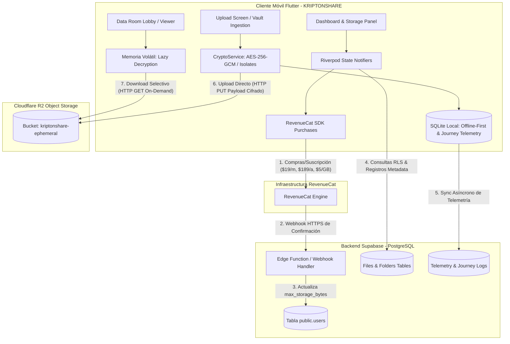
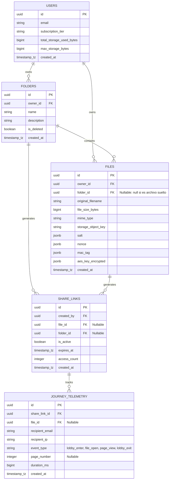
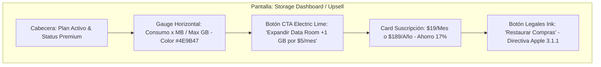
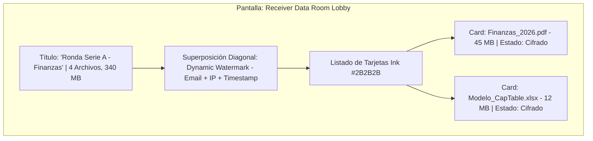

# KRIPTONSHARE — Módulo Suscripción Premium y Data Room (Carpeta Virtual 1 GB)
## Documento Maestro de Especificaciones para KIMI CODE CLI

**Versión:** 1.0
**Fecha:** 25 de julio de 2026
**Repositorio objetivo:** https://github.com/horaciomartinez-svg/kriptonshare
**Rol asumido:** Diseñador de Software, Arquitecto de Soluciones y Lead Developer de Élite.

---

## Tabla de Contenido

1. [Contexto y Misión](#1-contexto-y-misión)
2. [Estado Actual del Repositorio (Análisis del Código Existente)](#2-estado-actual-del-repositorio)
3. [Reglas de Negocio (Tier Matrix)](#3-reglas-de-negocio-tier-matrix)
4. [Stack Tecnológico](#4-stack-tecnológico)
5. [Arquitectura de Solución](#5-arquitectura-de-solución)
6. [Diseño de Datos — Esquema Relacional y DDLs](#6-diseño-de-datos)
7. [Estructura de Archivos — Clean Architecture](#7-estructura-de-archivos)
8. [Contratos de Dominio y Código Dart de Referencia](#8-contratos-de-dominio-y-código-dart)
9. [Gestión de RAM — Lazy Decryption Engine](#9-gestión-de-ram)
10. [Sistema de Diseño Institucional (Tokens UI/UX)](#10-sistema-de-diseño)
11. [Especificaciones de Pantallas](#11-especificaciones-de-pantallas)
12. [Enrutamiento (go_router)](#12-enrutamiento)
13. [Seguridad Perimetral y Telemetría](#13-seguridad-y-telemetría)
14. [Integración RevenueCat y Cumplimiento Normativo](#14-integración-revenuecat)
15. [Checklist de Implementación para KIMI CODE CLI](#15-checklist-de-implementación)
16. [Criterios de Aceptación](#16-criterios-de-aceptación)

---

## 1. Contexto y Misión

Se agrega a la suscripción premium de KRIPTONSHARE una **carpeta virtual (Data Room)** en la que el usuario almacena los archivos que decida con un **tamaño total de 1 GB**. La suscripción cuesta **$19 USD mensuales**, con opción de **pago anual de $189 USD** (ahorro de $39 USD/año). El usuario premium cifra y sube sus archivos; puede crear un link **por archivo o por la carpeta completa**; los links duran **máximo 30 días**; el tamaño máximo por archivo es **100 MB** y no puede superarse el total de la carpeta virtual. Si el usuario premium desea más espacio, **cada GB adicional cuesta $5 USD mensuales** (add-on recurrente).

**Misión:** Inyectar la infraestructura técnica, el modelo de datos relacional, la gestión de memoria RAM por descifrado perezoso (Lazy Decryption) y la interfaz de usuario (UI/UX) para la Suscripción Premium ($19/mes o $189/año), el Data Room (Carpeta Virtual de 1 GB con Add-ons de $5/GB) y el Lobby de Navegación de Carpetas Cifradas.

**Restricciones inalterables:**
- Modo Oscuro nativo e inalterable (previene fatiga visual).
- Sistema de diseño institucional KRIPTONSHARE (tokens cromáticos del §10).
- El dispositivo móvil **jamás** actualiza su propio límite de almacenamiento en la base de datos (anti-falsificación de GB por clientes modificados).
- Binarios cifrados viven en **Cloudflare R2**; metadatos y lógica relacional en **Supabase (PostgreSQL)**; persistencia offline en **SQLite (sqflite)**.

---

## 2. Estado Actual del Repositorio

Análisis del estado real del repositorio `horaciomartinez-svg/kriptonshare` (rama principal, commit `06e8f28`) previo a esta actualización. **KIMI CODE CLI debe leer estos archivos antes de escribir código nuevo.**

### 2.1 Estructura existente en `lib/`

```
lib/
├── main.dart                       # Bootstrap de la app
├── core/                           # Núcleo compartido (existe)
├── features/
│   ├── analytics/                  # Dashboard de telemetría del emisor (existe)
│   ├── data_room/                  # ⚠️ EXISTE pero INCOMPLETO (ver §2.3)
│   │   ├── data/
│   │   ├── domain/
│   │   ├── presentation/
│   │   └── utils/
│   ├── links/                      # Gestión de enlaces compartidos (existe)
│   ├── qna/                        # Módulo Q&A (existe)
│   ├── telemetry/                  # Telemetría local (existe)
│   └── upload/                     # Flujo de subida y cifrado (existe)
├── models/
│   ├── kripton_file.dart           # Entidad de archivo (reutilizar en FolderEntity)
│   └── user_model.dart             # Modelo de usuario (extender con campos de storage)
├── providers/
│   ├── auth_provider.dart          # Autenticación Supabase
│   ├── file_provider.dart          # Estado de archivos
│   ├── local_database_provider.dart
│   └── router_provider.dart        # go_router — EXTENDER (ver §12)
├── screens/                        # splash, onboarding, auth, dashboard, viewer, profile, biometric
├── services/
│   ├── biometric_service.dart      # local_auth
│   ├── crypto_service.dart         # AES-256-GCM via pointycastle (reutilizar decryptInIsolate)
│   ├── r2_signature_service.dart   # Firma de requests a Cloudflare R2
│   ├── screenshot_service.dart     # Anti-captura FLAG_SECURE
│   └── secure_credential_service.dart
├── utils/
└── widgets/
```

### 2.2 Dependencias actuales en `pubspec.yaml`

Ya instaladas y que **deben reutilizarse**: `supabase_flutter ^2.8.0`, `pointycastle ^3.7.4`, `encrypt ^5.0.3`, `pdfrx ^1.1.24`, `flutter_riverpod ^2.5.1`, `riverpod_annotation ^2.3.5`, `sqflite ^2.3.3+1`, `app_links ^6.1.0`, `go_router ^14.1.0`, `local_auth ^2.2.0`, `file_selector ^1.0.3`, `dio ^5.5.0+1`, `flutter_animate`, `shimmer`, `uuid`, `intl`, `crypto`, `path_provider`, `share_plus`, `google_mobile_ads ^7.0.0`, `dartz ^0.10.1`, `equatable ^2.0.5`, `logger`, `mocktail` (dev).

**Dependencia NUEVA obligatoria a agregar:**

```yaml
dependencies:
  purchases_flutter: ^8.0.0   # RevenueCat SDK — suscripciones y add-ons IAP
```

### 2.3 Brechas detectadas (qué falta construir)

| Componente | Estado | Acción requerida |
|---|---|---|
| Feature `data_room/` | Estructura de carpetas existe, lógica incompleta | Completar data/domain/presentation según §7 y §8 |
| `purchases_flutter` (RevenueCat) | No instalado | Agregar a `pubspec.yaml` y crear `revenue_cat_service.dart` |
| Rutas `/storage-management` y `/folder-room/:folderLinkId` | No existen en `router_provider.dart` | Inyectar según §12 |
| Tablas `folders`, `journey_telemetry` y columnas de storage en `users` | No existen en `supabase/schema.sql` | Ejecutar migración DDL del §6.3 |
| Columna `folder_id` en `files` y `share_links` | No existe | Migración DDL del §6.3 |
| Edge Function webhook RevenueCat | No existe | Crear en `supabase/functions/revenuecat-webhook/` (§14.3) |
| Visor Lobby con Lazy Decryption | No existe | Crear `data_room_lobby_screen.dart` (§9 y §11.2) |
| Pantalla Storage Dashboard / Upsell | No existe | Crear `storage_management_screen.dart` (§11.1) |

---

## 3. Reglas de Negocio (Tier Matrix)

```
+-----------------------------------+-----------------------+-----------------------+
| MATRIZ DE LÍMITES B2B                                     |
+-----------------------------------+-----------------------+-----------------------+
| Parámetro                   | Plan Freemium (Gratis) | Plan Premium ($19/mes) |
+-----------------------------------+-----------------------+-----------------------+
| Tamaño Máximo por Archivo   | 10 MB                  | 100 MB                 |
| Capacidad Total Bóveda      | N/A (enlaces sueltos)  | 1 GB base (+$5/GB)     |
| Duración Máxima del Enlace  | 48 horas (2 días)      | 30 días (720 horas)    |
| Concurrencia de Links       | Máximo 3 activos       | Ilimitados             |
| Cuota Mensual de Generación | 20 enlaces / mes       | Ilimitada              |
| Tipo de Compartición        | Solo archivo individual| Archivo o Carpeta      |
| Anuncios en Carga           | Sí (Native Ads)        | No (Zero Ads)          |
+-----------------------------------+-----------------------+-----------------------+
```

**Constantes a codificar en `lib/core/utils/constants.dart`:**

```dart
class PremiumLimits {
  static const int freemiumMaxFileBytes = 10485760;      // 10 MB
  static const int premiumMaxFileBytes = 104857600;      // 100 MB
  static const int premiumBaseStorageBytes = 1073741824; // 1 GB
  static const int gigabyteBytes = 1073741824;           // incremento por add-on
  static const int freemiumLinkTtlHours = 48;
  static const int premiumLinkTtlHours = 720;            // 30 días
  static const int freemiumMonthlyLinkQuota = 20;
  static const int freemiumMaxActiveLinks = 3;
}

class Pricing {
  static const double monthlyUsd = 19.0;
  static const double yearlyUsd = 189.0;   // ahorro $39/año (~17%)
  static const double addonPerGbMonthlyUsd = 5.0;
}
```

---

## 4. Stack Tecnológico

| Capa | Tecnología | Justificación |
|---|---|---|
| Frontend Mobile | Flutter 3.x (Dart 3.x) | Compilación AOT a ARM64 para bucles criptográficos pesados en Isolates independientes |
| State Management | Riverpod + `flutter_riverpod` | Estado reactivo, inyección de dependencias desacoplada e inmutabilidad estricta |
| In-App Purchases | RevenueCat (`purchases_flutter`) | Suscripciones recurrentes ($19/m, $189/a) y add-ons ($5/GB) compatibles con Google Play Billing Client 8 y App Store Kit 2 |
| Storage Binario (cifrado) | Cloudflare R2 (S3 API REST) | Blobs cifrados con $0 egress fees; evita que archivos de 100 MB colapsen Supabase |
| Metadata & Auth | Supabase (PostgreSQL + RLS + Webhooks) | Identidades JWT, metadatos relacionales, políticas RLS y eventos en tiempo real |
| Persistencia Local | SQLite (`sqflite`) | Offline-First; cola de telemetría de viaje (Journey Analytics) y caché |
| Renderizador PDF | `pdfrx` (tile-based) | Renderizado progresivo por mosaicos; RAM estable en archivos hasta 100 MB |

> **Nota crítica de plataforma:** Google Play Billing Client 8 suprimió el soporte para recuperar compras consumibles en sesiones anónimas. Por ello, el espacio adicional se modela **estrictamente como suscripciones recurrentes** (Tier 1: 2 GB, Tier 2: 3 GB, …) adheridas al App User ID normalizado del usuario autenticado.

---

## 5. Arquitectura de Solución



**Flujo de dinero (server-to-server, jamás confiar en el cliente):**
1. Usuario paga en la app vía pasarela biométrica nativa (FaceID / Fingerprint) → `Purchases.purchasePackage(package)`.
2. RevenueCat emite Webhook HTTPS firmado hacia la Edge Function de Supabase.
3. La Edge Function valida la firma y actualiza `public.users.max_storage_bytes` (+1,073,741,824 bytes por cada add-on activo).
4. Las políticas RLS (que evalúan `auth.uid()`) garantizan que solo el usuario con suscripción pagada pueda inyectar archivos que excedan el límite gratuito.

---

## 6. Diseño de Datos

### 6.1 Modelo Entidad-Relación



### 6.2 Script de Migración SQL (PostgreSQL / Supabase)

Crear archivo **`supabase/migrations/20260725000000_premium_dataroom.sql`** con el siguiente contenido íntegro:

```sql
-- =============================================================================
-- KRIPTONSHARE DDL: EXTENSIÓN PREMIUM, CARPETAS Y JOURNEY TELEMETRY
-- =============================================================================

-- 1. ACTUALIZACIÓN DE TABLA DE USUARIOS PARA ALMACENAMIENTO DINÁMICO
ALTER TABLE public.users
  ADD COLUMN IF NOT EXISTS total_storage_used_bytes BIGINT DEFAULT 0
    CHECK (total_storage_used_bytes >= 0),
  ADD COLUMN IF NOT EXISTS max_storage_bytes BIGINT DEFAULT 1073741824
    CHECK (max_storage_bytes >= 0); -- 1 GB por defecto para Premium

-- 2. TABLA DE CARPETAS VIRTUALES (DATA ROOMS)
CREATE TABLE IF NOT EXISTS public.folders (
  id UUID PRIMARY KEY DEFAULT uuid_generate_v4(),
  owner_id UUID NOT NULL REFERENCES public.users(id) ON DELETE CASCADE,
  name TEXT NOT NULL CHECK (char_length(trim(name)) > 0),
  description TEXT,
  is_deleted BOOLEAN DEFAULT FALSE,
  created_at TIMESTAMPTZ DEFAULT NOW()
);

-- Indexación para optimizar consultas de índice del emisor
CREATE INDEX IF NOT EXISTS idx_folders_owner
  ON public.folders(owner_id) WHERE is_deleted = FALSE;

-- 3. ACTUALIZACIÓN DE LA TABLA FILES PARA VINCULACIÓN A CARPETAS
ALTER TABLE public.files
  ADD COLUMN IF NOT EXISTS folder_id UUID REFERENCES public.folders(id)
    ON DELETE CASCADE;

CREATE INDEX IF NOT EXISTS idx_files_folder
  ON public.files(folder_id) WHERE is_deleted = FALSE;

-- 4. ACTUALIZACIÓN DE SHARE_LINKS PARA SOPORTAR CARPETAS COMPLETAS
ALTER TABLE public.share_links
  ADD COLUMN IF NOT EXISTS folder_id UUID REFERENCES public.folders(id)
    ON DELETE CASCADE,
  ALTER COLUMN file_id DROP NOT NULL;

-- Restricción Check: un enlace comparte un archivo O una carpeta, no ambos ni ninguno.
ALTER TABLE public.share_links
  ADD CONSTRAINT chk_share_link_target CHECK (
    (file_id IS NOT NULL AND folder_id IS NULL) OR
    (file_id IS NULL AND folder_id IS NOT NULL)
  );

-- 5. TABLA DE TELEMETRÍA DE VIAJE (JOURNEY ANALYTICS)
CREATE TABLE IF NOT EXISTS public.journey_telemetry (
  id UUID PRIMARY KEY DEFAULT uuid_generate_v4(),
  share_link_id UUID NOT NULL REFERENCES public.share_links(id) ON DELETE CASCADE,
  file_id UUID REFERENCES public.files(id) ON DELETE SET NULL,
  recipient_email TEXT,
  recipient_ip TEXT,
  event_type TEXT NOT NULL CHECK (event_type IN
    ('lobby_enter', 'file_open', 'page_view', 'lobby_exit')),
  page_number INTEGER CHECK (page_number > 0),
  duration_ms BIGINT DEFAULT 0 CHECK (duration_ms >= 0),
  created_at TIMESTAMPTZ DEFAULT NOW()
);

-- Compresión LZ4 para la columna de correos/IPs en TOAST
ALTER TABLE public.journey_telemetry
  ALTER COLUMN recipient_email SET COMPRESSION lz4;

-- Índice BRIN en series de tiempo para evitar hinchazón de memoria
CREATE INDEX IF NOT EXISTS brin_journey_created_at_idx
  ON public.journey_telemetry USING BRIN (created_at) WITH (pages_per_range = 64);

-- 6. REFACTORIZACIÓN DE LA FUNCIÓN DE VALIDACIÓN MULTI-TIER
CREATE OR REPLACE FUNCTION check_upload_limits(
  p_user_id UUID,
  p_file_size INTEGER,
  p_is_folder_upload BOOLEAN DEFAULT FALSE
)
RETURNS TABLE (
  can_upload BOOLEAN,
  message TEXT
) AS $$
DECLARE
  v_tier TEXT;
  v_links_used INTEGER;
  v_links_max INTEGER;
  v_file_size_max BIGINT;
  v_active_links_count INTEGER;
  v_storage_used BIGINT;
  v_storage_max BIGINT;
BEGIN
  SELECT subscription_tier, monthly_links_generated, max_links_monthly,
         max_file_size_bytes, total_storage_used_bytes, max_storage_bytes
    INTO v_tier, v_links_used, v_links_max, v_file_size_max,
         v_storage_used, v_storage_max
    FROM public.users
   WHERE id = p_user_id;

  -- VALIDACIÓN TIERS PREMIUM & ENTERPRISE
  IF v_tier IN ('premium', 'enterprise') THEN
    -- 1. Límite individual por archivo (100 MB)
    IF p_file_size > 104857600 THEN
      RETURN QUERY SELECT FALSE,
        'Premium: El archivo excede el límite de 100 MB por documento.'::TEXT;
      RETURN;
    END IF;

    -- 2. Capacidad global acumulada (1 GB base o más con Add-ons)
    IF (v_storage_used + p_file_size) > v_storage_max THEN
      RETURN QUERY SELECT FALSE,
        ('Premium: Capacidad de Bóveda saturada (' ||
         round((v_storage_used::numeric / 1073741824::numeric), 2) || ' GB / ' ||
         round((v_storage_max::numeric / 1073741824::numeric), 2) ||
         ' GB). Adquiere más espacio para continuar.')::TEXT;
      RETURN;
    END IF;

    RETURN QUERY SELECT TRUE, 'Validación Premium exitosa'::TEXT;
    RETURN;
  END IF;

  -- VALIDACIÓN TIER FREEMIUM (GRATUITO)
  IF p_is_folder_upload THEN
    RETURN QUERY SELECT FALSE,
      'Plan Gratis: La creación de Carpetas Virtuales (Data Rooms) es una función exclusiva Premium.'::TEXT;
    RETURN;
  END IF;

  IF p_file_size > 10485760 THEN -- 10 MB
    RETURN QUERY SELECT FALSE,
      'Plan Gratis: El archivo excede el límite de 10 MB.'::TEXT;
    RETURN;
  END IF;

  IF v_links_used >= 20 THEN
    RETURN QUERY SELECT FALSE,
      'Plan Gratis: Límite de 20 enlaces mensuales alcanzado.'::TEXT;
    RETURN;
  END IF;

  SELECT COUNT(*)::INTEGER INTO v_active_links_count
    FROM public.share_links
   WHERE created_by = p_user_id
     AND is_active = TRUE
     AND expires_at > NOW();

  IF v_active_links_count >= 3 THEN
    RETURN QUERY SELECT FALSE,
      'Plan Gratis: Límite de 3 enlaces activos simultáneos alcanzado.'::TEXT;
    RETURN;
  END IF;

  RETURN QUERY SELECT TRUE, 'Validación Freemium exitosa'::TEXT;
END;
$$ LANGUAGE plpgsql SECURITY DEFINER;
```

### 6.3 Políticas RLS obligatorias (agregar a la migración)

```sql
-- RLS en folders: solo el dueño gestiona sus Data Rooms
ALTER TABLE public.folders ENABLE ROW LEVEL SECURITY;

CREATE POLICY folders_owner_select ON public.folders
  FOR SELECT USING (auth.uid() = owner_id);
CREATE POLICY folders_owner_insert ON public.folders
  FOR INSERT WITH CHECK (auth.uid() = owner_id);
CREATE POLICY folders_owner_update ON public.folders
  FOR UPDATE USING (auth.uid() = owner_id);
CREATE POLICY folders_owner_delete ON public.folders
  FOR DELETE USING (auth.uid() = owner_id);

-- RLS en journey_telemetry: el dueño del share_link lee su telemetría;
-- el receptor (anónimo) solo inserta eventos sobre enlaces activos.
ALTER TABLE public.journey_telemetry ENABLE ROW LEVEL SECURITY;

CREATE POLICY telemetry_owner_read ON public.journey_telemetry
  FOR SELECT USING (
    EXISTS (
      SELECT 1 FROM public.share_links sl
      WHERE sl.id = journey_telemetry.share_link_id
        AND sl.created_by = auth.uid()
    )
  );

CREATE POLICY telemetry_recipient_insert ON public.journey_telemetry
  FOR INSERT WITH CHECK (
    EXISTS (
      SELECT 1 FROM public.share_links sl
      WHERE sl.id = journey_telemetry.share_link_id
        AND sl.is_active = TRUE
        AND sl.expires_at > NOW()
    )
  );
```

---

## 7. Estructura de Archivos

Estructura de directorios a inyectar/completar (la carpeta `data_room/` ya existe — completar su contenido):

```
lib/
├── core/
│   ├── services/
│   │   └── revenue_cat_service.dart      # SDK In-App Purchases & Add-ons (NUEVO)
│   └── utils/
│       ├── constants.dart                # Matrices de límites $19/m, $189/a, $5/GB (ACTUALIZAR)
│       └── theme.dart                    # Tokens Charcoal Black, Lime, Muted Green (ACTUALIZAR)
├── features/
│   ├── data_room/
│   │   ├── data/
│   │   │   ├── datasources/
│   │   │   │   └── folder_remote_datasource.dart   # Queries Supabase folders/files (NUEVO)
│   │   │   └── repositories/
│   │   │       └── folder_repository_impl.dart     # (NUEVO)
│   │   ├── domain/
│   │   │   ├── entities/
│   │   │   │   ├── folder_entity.dart              # (NUEVO)
│   │   │   │   └── journey_telemetry_entity.dart   # (NUEVO)
│   │   │   └── repositories/
│   │   │       └── i_folder_repository.dart        # (NUEVO)
│   │   └── presentation/
│   │       ├── notifiers/
│   │       │   ├── folder_notifier.dart            # LazyDecryptionNotifier (NUEVO)
│   │       │   └── storage_upsell_notifier.dart    # Estado de compra RevenueCat (NUEVO)
│   │       └── screens/
│   │           ├── data_room_lobby_screen.dart     # Lobby receptor con Lazy Decryption (NUEVO)
│   │           └── storage_management_screen.dart  # Dashboard expansión Add-ons (NUEVO)
└── providers/
    └── router_provider.dart              # AGREGAR 2 rutas (ver §12)
```

Backend (nuevo):

```
supabase/
├── migrations/
│   └── 20260725000000_premium_dataroom.sql   # DDL completo del §6.2 + §6.3
└── functions/
    └── revenuecat-webhook/
        └── index.ts                          # Edge Function webhook RevenueCat (NUEVO, §14.3)
```

---

## 8. Contratos de Dominio y Código Dart

### 8.1 Entidad de Carpeta (Data Room Entity)

```dart
// lib/features/data_room/domain/entities/folder_entity.dart
import 'package:flutter/foundation.dart';
import '../../../../models/kripton_file.dart';

@immutable
class FolderEntity {
  final String id;
  final String ownerId;
  final String name;
  final String? description;
  final List<KriptonFile> files;
  final int totalSizeBytes;
  final DateTime createdAt;

  const FolderEntity({
    required this.id,
    required this.ownerId,
    required this.name,
    this.description,
    this.files = const [],
    required this.totalSizeBytes,
    required this.createdAt,
  });

  bool get isOverLimit => totalSizeBytes > (1024 * 1024 * 1024); // > 1 GB
  int get fileCount => files.length;
}
```

### 8.2 Contrato de Servicio de Compras (RevenueCat Integration)

```dart
// lib/core/services/revenue_cat_service.dart
import 'package:purchases_flutter/purchases_flutter.dart';

abstract class IRevenueCatService {
  Future<void> initialize(String userId);
  Future<CustomerInfo> purchaseSubscriptionPackage(Package package);
  Future<CustomerInfo> purchaseStorageAddon(Package package);
  Future<CustomerInfo> restorePurchases();
  Future<CustomerInfo> getCustomerStatus();
}

class RevenueCatServiceImpl implements IRevenueCatService {
  @override
  Future<void> initialize(String userId) async {
    await Purchases.setLogLevel(LogLevel.info);
    PurchasesConfiguration configuration =
        PurchasesConfiguration("goog_or_apple_api_key")
          ..appUserID = userId;
    await Purchases.configure(configuration);
  }

  @override
  Future<CustomerInfo> purchaseSubscriptionPackage(Package package) async {
    try {
      return await Purchases.purchasePackage(package);
    } catch (e) {
      rethrow;
    }
  }

  @override
  Future<CustomerInfo> purchaseStorageAddon(Package package) async {
    try {
      // Compra de Add-on $5/GB recurrente asociado al App User ID
      return await Purchases.purchasePackage(package);
    } catch (e) {
      rethrow;
    }
  }

  @override
  Future<CustomerInfo> restorePurchases() async {
    return await Purchases.restorePurchases();
  }

  @override
  Future<CustomerInfo> getCustomerStatus() async {
    return await Purchases.getCustomerInfo();
  }
}
```

### 8.3 Secuencia Lógica de Conversión

1. **Obtención de Ofertas (Offerings):** al cargar el dashboard, la app consulta a RevenueCat los paquetes configurados previamente en la consola web (`Purchases.getOfferings()`).
2. **Transacción Nativa:** al presionar el botón Electric Lime, se invoca `Purchases.purchasePackage(package)` → despliega pasarela biométrica nativa de Apple (FaceID) o Google Play (Fingerprint).
3. **Restauración de Sesión:** si un usuario corporativo cambia de dispositivo o reinstala KRIPTONSHARE, el botón "Restaurar Compras" invoca `Purchases.restorePurchases()` para recertificar sus GB adicionales.
4. **Sincronización de límite:** el webhook del §14.3 actualiza `max_storage_bytes` en Supabase; la app solo **lee** este valor (nunca lo escribe).

---

## 9. Gestión de RAM — Lazy Decryption Engine

**Problema:** descargar y descifrar 1 GB simultáneamente en un dispositivo móvil colapsa la RAM (Memory OOM). **Solución:** "Lobby" de navegación con descifrado diferido (Lazy Decryption) y evaporación explícita de bytes.

**Principios operativos:**
1. **Descarga Selectiva:** al entrar a la carpeta, el sistema solo descarga los **metadatos** (nombres y pesos). Los binarios cifrados permanecen en Cloudflare R2.
2. **Aislamiento Celular (Isolate):** al tocar la tarjeta de un archivo, se descarga **solo ese documento** y se envía a un Isolate en segundo plano para aplicar desencriptación AES-256-GCM.
3. **Evaporación al Salir:** al presionar "Atrás" hacia el Lobby, el Garbage Collector de Dart evapora inmediatamente el `Uint8List` de la RAM. **Jamás habrá dos archivos pesados vivos en RAM al mismo tiempo.**

```dart
// lib/features/data_room/presentation/notifiers/folder_notifier.dart
import 'dart:typed_data';
import 'package:flutter_riverpod/flutter_riverpod.dart';
import '../../../../models/kripton_file.dart';
import '../../../../services/crypto_service.dart';
import 'package:dio/dio.dart';

final activeDecryptedFileBytesProvider =
    StateProvider.autoDispose<Uint8List?>((ref) => null);

class LazyDecryptionNotifier extends StateNotifier<AsyncValue<Uint8List?>> {
  final CryptoService _cryptoService;
  final Dio _dio;

  LazyDecryptionNotifier(this._cryptoService, this._dio)
      : super(const AsyncValue.data(null));

  /// Descarga y descifra ÚNICAMENTE el archivo seleccionado por el usuario
  Future<void> loadAndDecryptSingleFile({
    required KriptonFile file,
    required String password,
    required String r2Endpoint,
    required String secretToken,
  }) async {
    state = const AsyncValue.loading();
    try {
      final String downloadUrl =
          '$r2Endpoint/${file.bucketName}/${file.storageObjectKey}';

      // 1. Fetch de payload cifrado desde Cloudflare R2 via HTTP GET Stream
      final response = await _dio.get<List<int>>(
        downloadUrl,
        options: Options(
          responseType: ResponseType.bytes,
          headers: {'Authorization': 'Bearer $secretToken'},
        ),
      );
      final Uint8List encryptedBytes = Uint8List.fromList(response.data!);

      // 2. Aislamiento criptográfico en Isolate en segundo plano
      final Uint8List decryptedBytes = await _cryptoService.decryptInIsolate(
        encryptedBytes: encryptedBytes,
        password: password,
      );

      // 3. Inyección en estado volátil
      state = AsyncValue.data(decryptedBytes);
    } catch (e, st) {
      state = AsyncValue.error(e, st);
    }
  }

  /// Evaporación explícita de la memoria RAM al regresar al Lobby
  void purgeRAM() {
    state = const AsyncValue.data(null); // El Garbage Collector recicla el buffer
  }
}
```

---

## 10. Sistema de Diseño

Tokens cromáticos institucionales **inalterables** (WCAG 2.1 AA), a codificar en `lib/core/utils/theme.dart`:

| Token Visual | HEX | RGB | Propósito y Jerarquía UI | Contraste |
|---|---|---|---|---|
| Charcoal Black | `#121212` | 18, 18, 18 | Fondo base estructural inalterable | Base |
| Ink | `#2B2B2B` | 43, 43, 43 | Tarjetas (Cards), contenedores y divisores | 6.1:1 |
| Ink Deep | `#1A1A2E` | 26, 26, 46 | Superficies elevadas y cabeceras | 8.5:1 |
| Muted Krypton Green | `#4E9B47` | 78, 155, 71 | Indicadores de progreso (barra de consumo <90%) | 4.8:1 (AA) |
| Electric Lime | `#39FF14` | 57, 255, 20 | Botones de conversión (CTA), compras y acentos neón | 11.2:1 (AAA) |
| Platinum | `#E8E8E8` | 232, 232, 232 | Tipografía principal y encabezados | 15.1:1 (AAA) |
| Silver / Graphite | `#A0A0A0` | 160, 160, 160 | Texto secundario, badges y legales | 7.3:1 (AAA) |

**Reglas tipográficas y de comportamiento:**
- Fuentes sans-serif nativas exclusivamente (Inter o SF Pro) para legibilidad tabular de cifras.
- El medidor de consumo usa Muted Krypton Green; si el consumo supera el 90%, el color puede transicionar sutilmente para indicar proximidad al límite, **sin usar rojos alarmistas** (narrativa de divulgación progresiva, no alertas punitivas).
- Tema dark-first `#0A0A0F` / `#121212` inalterable (coincide con el splash `#0A0A0F` ya configurado en `pubspec.yaml`).

---

## 11. Especificaciones de Pantallas

### 11.1 Pantalla 1: Storage Dashboard & Add-on Upsell

**Descripción:** panel dentro del perfil del emisor para la compra de suscripción ($19/m, $189/a) y expansión de almacenamiento ($5/GB) mediante RevenueCat.



**Wireframe estructural (Atomic Design):**

```
+-------------------------------------------------------------+
|  [<-] BÓVEDA Y ALMACENAMIENTO DATA ROOM                     |
+-------------------------------------------------------------+
|                                                             |
|   [ BADGE: PREMIUM ACTIVO ]                                 |
|   Capacidad del Data Room: 850 MB / 1.00 GB Usados          |
|                                                             |
|   [========================================.......] 85%     |
|   Color: Muted Krypton Green (#4E9B47)                      |
|                                                             |
|   +-------------------------------------------------------+ |
|   |   EXPANDIR DATA ROOM (+1 GB por $5/mes)               | |
|   |   [ Botón Relleno: Electric Lime #39FF14 ]            | |
|   +-------------------------------------------------------+ |
|                                                             |
|   OPCIONES DE SUSCRIPCIÓN                                   |
|   +-------------------------------------------------------+ |
|   |  (o) Mensual: $19.00 / mes                            | |
|   |  ( ) Anual:   $189.00 / año (Ahorras $39 USD/año)     | |
|   +-------------------------------------------------------+ |
|                                                             |
|   [ Restaurar Compras ] (Texto Gris Ink #2B2B2B - Apple 3.1.1)|
|                                                             |
+-------------------------------------------------------------+
```

**Requisitos funcionales:**
- Botón de expansión: ghost button o con relleno de alta visibilidad en Electric Lime `#39FF14`, texto `Expandir Data Room (+1 GB por $5/mes)`.
- **Cumplimiento normativo obligatorio:** debajo de los módulos de compra, botón discreto en texto gris claro o Ink `#2B2B2B` con leyenda **Restaurar Compras**. Requisito inquebrantable de la Directiva 3.1.1 de Apple para evitar rechazo en App Store.

### 11.2 Pantalla 2: Data Room Lobby (Receptor de Carpeta)

**Descripción:** índice interactivo y seguro para el inversor receptor al abrir un enlace de carpeta virtual. **Cero publicidad.** Descarga diferida por archivo.



**Wireframe estructural:**

```
+-------------------------------------------------------------+
|  RONDA SERIE A - DUE DILIGENCE                              |
|  4 Archivos Cifrados | Tamaño Total: 340 MB                 |
+-------------------------------------------------------------+
|  \  \  \  \  \  \  \  \  \  \  \  \  \  \  \  \  \  \  \  \ |
|  \  \ WATERMARK DINÁMICO: inversor@fondo.com | 192.168.1.1 \|
|  \  \  \  \  \  \  \  \  \  \  \  \  \  \  \  \  \  \  \  \ |
|                                                             |
|   +-------------------------------------------------------+ |
|   | [PDF] Estado_Financiero_Auditado.pdf                  | |
|   | Peso: 48.5 MB | Estado: [ Cifrado AES-256 ]           | |
|   +-------------------------------------------------------+ |
|                                                             |
|   +-------------------------------------------------------+ |
|   | [XLS] CapTable_SeriesA_v2.xlsx                        | |
|   | Peso: 15.2 MB | Estado: [ Cifrado AES-256 ]           | |
|   +-------------------------------------------------------+ |
|                                                             |
|   +-------------------------------------------------------+ |
|   | [PDF] Escritura_Constitutiva.pdf                      | |
|   | Peso: 88.0 MB | Estado: [ Cifrado AES-256 ]           | |
|   +-------------------------------------------------------+ |
|                                                             |
|  [!] Selecciona un archivo para descifrar en memoria RAM    |
+-------------------------------------------------------------+
```

**Requisitos funcionales del Lobby:**
- **Encabezado Institucional:** título sobrio en Inter con nombre del Data Room, cantidad de archivos y tamaño total.
- **Listado de Tarjetas (Ink `#2B2B2B`):** cada archivo (hasta 100 MB) muestra icono por tipo (PDF, Excel, Imagen), nombre, peso y estado visual (Cifrado / Listo para leer).
- **Marca de Agua Global:** la Marca de Agua Dinámica Personalizada (correo, IP y timestamp exacto) se superpone en diagonal sobre **toda** la pantalla del índice, disuadiendo fotografías de la lista de documentos.

**Visor individual (dentro de la carpeta):**
- **Motor `pdfrx` (tile-based rendering):** desplazamiento virtual progresivo; renderiza solo la página en pantalla para estabilizar la huella de memoria.
- **Navegación:** AppBar institucional con botón "Cerrar Documento" o flecha de retroceso para volver al índice de la carpeta.
- **Inhabilitación de extracción:** el texto no se puede seleccionar ni copiar al portapapeles global del sistema operativo.

---

## 12. Enrutamiento

Extender `lib/providers/router_provider.dart` (conservar todas las rutas existentes: `/`, `/auth`, `/onboarding`, `/dashboard`, `/upload`, `/links`, `/viewer`, `/room/:id`, `/profile`, `/analytics`, `/biometric`):

```dart
// lib/providers/router_provider.dart (Inyección de rutas Data Room)
final routerProvider = Provider<GoRouter>((ref) {
  return GoRouter(
    initialLocation: '/splash',
    routes: [
      // ... mantener rutas existentes ...

      // NUEVA RUTA: GESTIÓN DE BÓVEDA Y ADD-ONS PREMIUM
      GoRoute(
        path: '/storage-management',
        builder: (context, state) => const StorageManagementScreen(),
      ),

      // NUEVA RUTA: LOBBY RECEPTOR DE DATA ROOM (CARPETA VIRTUAL)
      GoRoute(
        path: '/folder-room/:folderLinkId',
        builder: (context, state) {
          final folderLinkId = state.pathParameters['folderLinkId']!;
          return DataRoomLobbyScreen(folderLinkId: folderLinkId);
        },
      ),
    ],
  );
});
```

**Notas de integración con el router existente:**
- La ruta `/folder-room/:folderLinkId` debe integrarse en la lógica `redirect` actual al igual que `/room/:id`: receptores no autenticados deben poder abrirla (preservar el deep link si se requiere autenticación para algunos flujos).
- Los deep links entrantes (vía `app_links`) que resuelvan a un enlace de carpeta deben enrutarse a `/folder-room/` en lugar de `/room/`.

---

## 13. Seguridad y Telemetría

### 13.1 Blindaje Envolvente (SO Nivel Núcleo)

Las directivas anti-captura de pantalla (`FLAG_SECURE` en Android y `UITextField` con `isSecureTextEntry` en iOS — ya implementadas en `screenshot_service.dart`) **no deben aplicarse solo al visor de PDF**, sino que deben **envolver todo el contenedor del enrutador (Navigator)**. Si el inversor intenta capturar el Lobby para mostrar qué archivos componen la debida diligencia, la pantalla se oscurecerá o devolverá un cuadro negro.

### 13.2 Telemetría de Viaje (Journey Analytics)

El motor local SQLite (`sqflite`) registra un rastro relacional más profundo que la telemetría por página existente:

1. `lobby_enter` — hora de ingreso al Lobby del Data Room.
2. `file_open` — qué archivo específico abrió (y en qué orden).
3. `page_view` — duración en microsegundos de cada página dentro de ese archivo (con `page_number`).
4. `lobby_exit` — hora de retorno al Lobby.

**Sincronización (Heartbeats):** mientras el usuario navega entre archivos, el sistema empaqueta estos registros en JSON y los transmite asíncronamente a Supabase (tabla `journey_telemetry`, §6.2) para nutrir la consola del emisor (`/analytics`).

---

## 14. Integración RevenueCat

### 14.1 Configuración en Consola RevenueCat (pasos manuales previos)

1. Crear proyecto KRIPTONSHARE en RevenueCat y vincular App Store Connect + Google Play Console.
2. Configurar **Entitlements**: `premium` (suscripción base) y `storage_addon` (add-on).
3. Configurar **Offerings/Packages**: `$19/mes`, `$189/año`, y tiers de add-on `$5/GB/mes` (Tier 1: 2 GB, Tier 2: 3 GB, etc.).
4. Registrar el **Webhook** apuntando a la Edge Function de Supabase (§14.3) con el header de autorización compartido.
5. Copiar las API keys públicas (`goog_…` / `appl_…`) en la configuración de la app.

### 14.2 Modelado de productos (restricción Billing Client 8)

Debido a que Google Play Billing Client 8 suprimió la recuperación de compras consumibles en sesiones anónimas, el espacio adicional se modela **estrictamente como suscripciones recurrentes** adheridas al App User ID normalizado del usuario autenticado. No usar consumibles ni in-app no renovables.

### 14.3 Edge Function Webhook (Supabase)

Crear **`supabase/functions/revenuecat-webhook/index.ts`** (Deno) con esta lógica mínima:

```typescript
// supabase/functions/revenuecat-webhook/index.ts
import { serve } from "https://deno.land/std@0.224.0/http/server.ts";
import { createClient } from "https://esm.sh/@supabase/supabase-js@2";

const GIGABYTE = 1073741824;
const WEBHOOK_AUTH = Deno.env.get("REVENUECAT_WEBHOOK_AUTH")!;

serve(async (req) => {
  // 1. Validar autenticidad del webhook (Authorization header compartido)
  if (req.headers.get("Authorization") !== `Bearer ${WEBHOOK_AUTH}`) {
    return new Response("Unauthorized", { status: 401 });
  }

  const event = await req.json();
  const supabase = createClient(
    Deno.env.get("SUPABASE_URL")!,
    Deno.env.get("SUPABASE_SERVICE_ROLE_KEY")! // service_role: bypasea RLS
  );

  const userId = event.event?.app_user_id;
  if (!userId) return new Response("OK", { status: 200 });

  // 2. Resolver estado de suscripciones y add-ons activos
  const entitlementIds: string[] =
    event.event?.entitlement_ids ?? [];

  const isPremium = entitlementIds.includes("premium");
  const addonCount = entitlementIds.filter((e) =>
    e.startsWith("storage_addon")
  ).length;

  // 3. Actualizar tier y límite de almacenamiento (1 GB base + 1 GB por add-on)
  if (["INITIAL_PURCHASE", "RENEWAL", "UNCANCELLATION", "PRODUCT_CHANGE"]
      .includes(event.event?.type)) {
    await supabase
      .from("users")
      .update({
        subscription_tier: isPremium ? "premium" : "free",
        max_storage_bytes: isPremium
          ? GIGABYTE + addonCount * GIGABYTE
          : 0,
      })
      .eq("id", userId);
  }

  // 4. Expiración / reembolso: revertir a tier gratuito
  if (["EXPIRATION", "REFUND", "CANCELLATION"].includes(event.event?.type)
      && !isPremium) {
    await supabase
      .from("users")
      .update({ subscription_tier: "free", max_storage_bytes: 0 })
      .eq("id", userId);
  }

  return new Response("OK", { status: 200 });
});
```

**Regla de oro:** el dispositivo móvil jamás actualiza su propio `max_storage_bytes`. La orquestación es asíncrona de servidor a servidor, blindando contra clientes modificados que falsifiquen gigabytes.

---

## 15. Checklist de Implementación para KIMI CODE CLI

Orden de ejecución sugerido (cada paso compila antes de continuar):

**Fase 0 — Preparación**
- [ ] `git pull` del repositorio y crear rama `feature/premium-dataroom`.
- [ ] Agregar `purchases_flutter: ^8.0.0` a `pubspec.yaml` y ejecutar `flutter pub get`.

**Fase 1 — Base de datos**
- [ ] Crear `supabase/migrations/20260725000000_premium_dataroom.sql` con el DDL completo (§6.2) y las políticas RLS (§6.3).
- [ ] Crear `supabase/functions/revenuecat-webhook/index.ts` (§14.3).
- [ ] Extender `lib/models/user_model.dart` con `totalStorageUsedBytes`, `maxStorageBytes` y `subscriptionTier`.

**Fase 2 — Dominio y servicios**
- [ ] Crear `lib/core/utils/constants.dart` (o actualizar) con `PremiumLimits` y `Pricing` (§3).
- [ ] Crear `lib/core/services/revenue_cat_service.dart` (§8.2) y registrarlo como provider Riverpod.
- [ ] Crear entidades `folder_entity.dart` y `journey_telemetry_entity.dart` (§8.1).
- [ ] Crear `i_folder_repository.dart`, `folder_repository_impl.dart` y `folder_remote_datasource.dart` (queries Supabase: carpetas del usuario, archivos por `folder_id`, creación de `share_links` con `folder_id`).

**Fase 3 — Presentación**
- [ ] Actualizar `lib/core/utils/theme.dart` con los tokens del §10 (sin romper el tema existente).
- [ ] Crear `storage_management_screen.dart` + `storage_upsell_notifier.dart` (§11.1) con gauge de consumo, CTA Electric Lime, pricing card y botón "Restaurar Compras".
- [ ] Crear `folder_notifier.dart` (`LazyDecryptionNotifier`, §9) y `data_room_lobby_screen.dart` (§11.2) con watermark diagonal global, tarjetas Ink y descarga selectiva.
- [ ] Integrar el visor `pdfrx` existente como visor individual dentro de la carpeta, con `purgeRAM()` al hacer pop.

**Fase 4 — Enrutamiento y seguridad**
- [ ] Extender `router_provider.dart` con `/storage-management` y `/folder-room/:folderLinkId` (§12), respetando la lógica `redirect` existente.
- [ ] Extender `screenshot_service.dart` para envolver el Navigator completo (blindaje envolvente, §13.1).
- [ ] Extender el feature `telemetry/` con los 4 eventos de viaje (`lobby_enter`, `file_open`, `page_view`, `lobby_exit`) y su sincronización a `journey_telemetry`.

**Fase 5 — Validación**
- [ ] `flutter analyze` sin errores; `flutter test` con casos nuevos (mocktail) para `LazyDecryptionNotifier`, `check_upload_limits` (vía RPC mock) y `RevenueCatServiceImpl`.
- [ ] Prueba E2E manual (guía en `E2E_TEST_GUIDE.md`): flujo de compra sandbox → webhook → actualización de `max_storage_bytes` → subida de archivo >10 MB exitosa con tier premium.

---

## 16. Criterios de Aceptación

El plano técnico satisface integralmente los requerimientos comerciales y de seguridad:

1. **Modelado Monetario:** soporta cobro recurrente de $19/mes, $189/año y add-ons de $5/GB mediante Webhooks de RevenueCat hacia PostgreSQL.
2. **Data Room 1 GB:** controla la cuota máxima acumulada y previene la saturación del motor relacional desviando las descargas directamente a Cloudflare R2.
3. **Lazy Decryption & Memory Safety:** aísla la descarga de archivos individuales en Isolates de Dart y fuerza la evaporación explícita de los `Uint8List` de la RAM al regresar al Lobby, neutralizando errores OOM en dispositivos móviles.
4. **Cumplimiento Normativo:** inyecta el botón de restauración de compras según la Directiva 3.1.1 de Apple.
5. **Seguridad perimetral escalada:** FLAG_SECURE/isSecureTextEntry envuelve todo el Navigator; watermark dinámico en Lobby y visor; extracción de texto inhabilitada.
6. **Telemetría profunda:** Journey Analytics relacional con 4 tipos de evento sincronizados a Supabase vía heartbeats JSON.

---

*Documento generado a partir de "Modificacion Arquitectura KRIPTONSHARE usuario premium 23Jul26.pdf" y del análisis del repositorio github.com/horaciomartinez-svg/kriptonshare (commit 06e8f28).*
