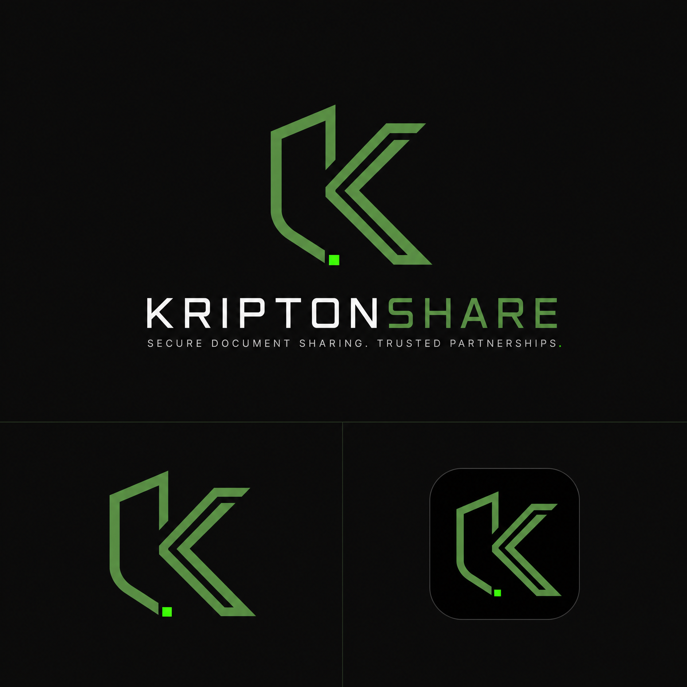

# KRIPTONSHARE

<p align="center">
  
</p>

<p align="center">
  <strong>Intercambio seguro y efímero de archivos, con cifrado de extremo a extremo.</strong>
</p>

<p align="center">
  <a href="#descripción">Descripción</a> •
  <a href="#características">Características</a> •
  <a href="#planes">Planes</a> •
  <a href="#stack">Stack</a> •
  <a href="#seguridad">Seguridad</a> •
  <a href="#instalación">Instalación</a>
</p>

---

## Descripción

**KRIPTONSHARE** te permite compartir archivos con una vida limitada. Cada archivo
se cifra **en tu dispositivo antes de subirse**, se almacena de forma efímera y se
auto-destruye al vencer. Ni siquiera nosotros podemos leer su contenido.

Diseñado para compartir documentos confidenciales: contratos, estados financieros,
resultados de laboratorio, material de inversión y cualquier información sensible
que no debe quedarse para siempre en los dispositivos de terceros.

---

## Características

- **Cifrado de extremo a extremo** AES-256-GCM en memoria, antes de subir nada.
- **Zero-knowledge absoluto**: el servidor solo guarda el objeto cifrado; la clave
  se deriva de tu contraseña (PBKDF2) y nunca viaja.
- **Enlaces efímeros** con duración configurable según tu plan (7, 30 o 60 días).
- **Formato protegido**: los archivos se visualizan dentro de la app; no se guardan
  en el dispositivo del receptor.
- **Formato restringido**: solo se aceptan archivos que la app puede mostrar de
  forma segura (ver [Formatos soportados](#formatos-soportados)).
- **14 días de Premium gratis** para todo usuario nuevo, sin tarjeta.
- **Sin anuncios** en ningún plan.
- **Internacionalización**: es, en, pt, fr, de.

## Formatos soportados

| Categoría | Formatos |
|-----------|----------|
| Documentos | PDF |
| Imágenes | JPG, JPEG, PNG, GIF, WEBP, BMP, HEIC, HEIF |
| Texto | TXT, MD, CSV, LOG |
| Video | MP4, MOV, WEBM, MKV, M4V, 3GP |

> Los documentos Office (Word, Excel, PowerPoint) **no se aceptan**: el diálogo
> de bloqueo muestra esta lista y recomienda convertirlos a PDF. No existe
> conversión de formatos en el servidor.

## Planes

| | Free | Premium | Business |
|---|---|---|---|
| **Precio** | $0 | $12.99/mes · $103.99/año | $29.99/mes · $239.99/año |
| **Archivo máx.** | 20 MB | 100 MB | 200 MB |
| **Links/mes** | 20 | Ilimitados | Ilimitados |
| **Links activos** | 3 | Ilimitados | Ilimitados |
| **Duración del link** | 7 días | 30 días | 60 días |
| **Almacenamiento** | — | 1 GB | 5 GB |
| **Anuncios** | No | No | No |

- **Trial**: cada cuenta nueva recibe Premium por 14 días sin tarjeta.
- Los precios de referencia para UI/marketing viven en
  `lib/utils/constants.dart`; la fuente de verdad de cobro es RevenueCat/Store
  (ver `REVENUECAT_SETUP.md`).

## Stack

| Capa | Tecnología |
|------|-----------|
| Framework | Flutter 3.x |
| Lenguaje | Dart |
| Backend | Supabase (PostgreSQL + Auth + RPCs) |
| Almacenamiento | Cloudflare R2 (S3-compatible), cifrado cliente |
| Facturación | RevenueCat (Google Play / App Store / Stripe) |
| Estado | Riverpod |
| Routing | GoRouter |
| UI | Material Design 3 + tema propio |
| Localización | `flutter gen-l10n` — 5 ARB: es, en, pt, fr, de |

## Seguridad

- ✅ Cifrado **AES-256-GCM** de extremo a extremo; la clave se deriva en el cliente.
- ✅ **Zero-knowledge**: el servidor nunca ve claves ni contenido en claro; los
  objetos se borran tras la expiración del link (más lifecycle rule de R2).
- ✅ **TLS 1.3** en tránsito.
- ✅ El archivo se descifra **en memoria** para visualizarse; no se persiste en el
  dispositivo receptor.
- ✅ Formato protegido: los tipos no visualizables se rechazan en origen; nunca se
  sube contenido ejecutable u Office.

Reporta vulnerabilidades a [security@kriptonshare.com](mailto:security@kriptonshare.com).

## Arquitectura

```
Dispositivo (Flutter)
  │  cifra AES-256-GCM en RAM  +  genera link
  ▼
Supabase (Auth · PostgreSQL · RPC de límites/expiración)
  ▼
Cloudflare R2  ── objeto cifrado efímero, se auto-elimina al expirar
```

- **Upload**: cifrado local → verificación de límites (RPC `check_upload_limits`)
  → subida del objeto cifrado a R2.
- **Link**: URL temporal; el servidor valida destinatario, expiración y vigencia.
- **View**: descifrado en memoria y renderizado in-app (PDF, imagen, texto, video).
- **Destroy**: el objeto se elimina al vencer el link (72 h post-expiración).

La app no depende de servicios de conversión de documentos ni de SDKs de
publicidad: cifra el archivo en el dispositivo y sube el objeto cifrado.

## Instalación

```bash
flutter pub get
flutter gen-l10n
flutter run          # modo desarrollo
```

- Requiere las credenciales de Supabase y R2 por `--dart-define` o los defaults
  de `lib/utils/constants.dart` (solo dev).
- Aplica las migraciones de `supabase/migrations/` en tu proyecto Supabase.
- Para pruebas manuales del flujo completo, ver `E2E_TEST_GUIDE.md`.
- Para configurar RevenueCat y los 4 productos (`premium_*_v2`,
  `business_*_v2`), ver `REVENUECAT_SETUP.md`.

## Contribuir

Envía un PR desde un fork. Antes de abrirlo verifica:

```bash
dart format --set-exit-if-changed lib test
flutter analyze
flutter test
flutter gen-l10n   # sin claves faltantes en los 5 ARB
```

---

<p align="center">
  <strong>🔒 Seguridad. ⚡ Velocidad. 🕐 Temporalidad.</strong>
</p>
