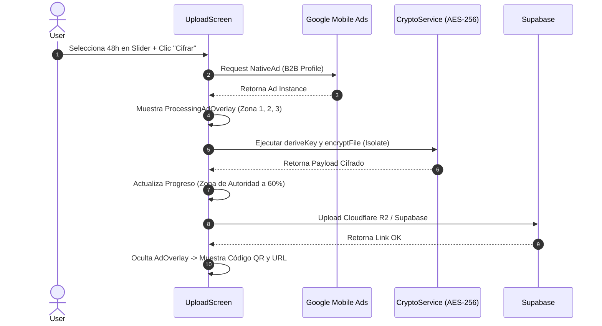

# Flujo de Estado: Cifrado + Anuncio Nativo en UploadScreen

El siguiente diagrama de secuencia garantiza que el ciclo de vida del anuncio nativo coincida con el procesamiento del cifrado pesado.

## Descripción de zonas del overlay

1. **Zona de Autoridad (40% superior):** indica progreso de cifrado y confianza técnica.
2. **Zona de Anuncio Nativo B2B (40% central):** renderiza el `NativeAd` de AdMob con estilo `NativeTemplateStyle`.
3. **Zona de Escape (20% inferior):** upsell a KRIPTONSHARE Premium para eliminar publicidad.
